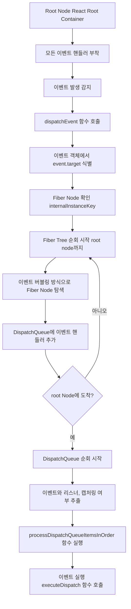

<details>
<summary>목차</summary>

- [16 - 17 변경 사항 요약](#16---17-변경-사항-요약)
  - [이벤트 위임](#이벤트-위임)
  - [이벤트 풀링 제거](#이벤트-풀링-제거)
  - [새로운 JSX transform](#새로운-jsx-transform)
  - [useEffect의 cleanup 함수가 비동기로 변경](#useeffect의-cleanup-함수가-비동기로-변경)
  - [undefined 처리](#undefined-처리)
- [17 - 18 변경 사항 요약](#17---18-변경-사항-요약)
  - [새로 추가된 훅](#새로-추가된-훅)
    - [useId](#useid)
    - [useTransition](#usetransition)
    - [useDeferredValue](#usedeferredvalue)
    - [useSyncExternalStore](#usesyncexternalstore)
    - [useInsertionEffect](#useinsertioneffect)
  - [react-dom/client](#react-domclient)
    - [createRoot](#createroot)
    - [automatic batching?](#automatic-batching)
    - [hydrateRoot과 react-dom/server](#hydrateroot과-react-domserver)
    - [strict mode](#strict-mode)
    - [Suspense](#suspense)
    - [IE 지원 중단](#ie-지원-중단)
- [18 - 19 변경 사항 빠르게 요약](#18---19-변경-사항-빠르게-요약)
  - [React 19 Compiler](#react-19-compiler)
    - [Ref](#ref)
    - [Form Action](#form-action)
    - [useActionState](#useactionstate)
    - [useOptimistic](#useoptimistic)
    - [useFormStatus](#useformstatus)
    - [use](#use)
  - [React Server Components](#react-server-components)
    - [Server Actions](#server-actions)
    - [waterfall issue?](#waterfall-issue)
- [React 20](#react-20)
  - [참고자료](#참고자료)

</details>

# 16 - 17 변경 사항 요약

semantic version으로 배포하게 되면 메이저 버전이 바뀌었을 때, 이전의 버전은 제공이 중단돼 사용이 어려워진다. 하지만, 리액트는 점진적인 업그레이드 지원을 하고 이전 버전과 최신 버전이 한 코드 베이스에 존재할 수 있다. (하지만, 두 개의 애플리케이션 루트를 만들어 관리하는 리소스 낭비가 있음)

```tsx
import React from "react";
import ReactDOM from "react-dom";

import ThemeContext from "./shared/ThemeContext";

export default function createLegacyRoot(container) {
  return {
    // 렌더링
    render(Component, props, context) {
      ReactDOM.render(
        <ThemeContext.Provider value={context.theme}>
          <Component {...props} />
        </ThemeContext.Provider>,
        container
      );
    },
    // 이 컴포넌트의 부모 컴포넌트가 제거될 때 호출될 unmount
    unmount() {
      ReactDOM.unmountComponentAtNode(container);
    },
  };
}

import React, { useContext, useMemo, useRef, useLayoutEffect } from "react";

import ThemeContext from "./shared/ThemeContext";

const rendererModule = {
  status: "pending",
  promise: null,
  result: null,
};

export default function lazyLegacyRoot(getLegacyComponent) {
  const componentModule = {
    status: "pending",
    promise: null,
    result: null,
  };

  return function Wrapper(props) {
    // legacy/createLegacyRoot 를 promise 로 layzy 하게 불러온다.
    const createLegacyRoot = readModule(
      rendererModule,
      () => import("../legacy/createLegacyRoot")
    ).default;

    const Component = readModule(componentModule, getLegacyComponent).default;
    // 구 리액트를 렌더링할 위치
    const containerRef = useRef(null);
    // 구 리액트의 루트 컴포넌트
    const rootRef = useRef(null);

    const theme = useContext(ThemeContext);
    const context = useMemo(
      () => ({
        theme,
      }),
      [theme]
    );
    useLayoutEffect(() => {
      // 루트 컴포넌트가 없다면
      if (!rootRef.current) {
        // 루트 컴포넌트를 만든다.
        rootRef.current = createLegacyRoot(containerRef.current);
      }
      const root = rootRef.current;

      // cleanUp 시에 unmount
      return () => {
        root.unmount();
      };
    }, [createLegacyRoot]);

    useLayoutEffect(() => {
      if (rootRef.current) {
        // 루트 컴포넌트가 존재하면 적절한 props와 context로 렌더링한다.
        rootRef.current.render(Component, props, context);
      }
    }, [Component, props, context]);

    return <div style={{ display: "contents" }} ref={containerRef} />;
  };
}

function readModule(record, importStatement) {
  // promise가 없으면 아직 import 하지 못한 것이므로 import 를 실행한다.
  if (!record.promise) {
    /* eslint-disable */
    record.promise = importStatement().then(
      (value) => {
        if (record.status === "pending") {
          record.status = "fulfilled";
          record.promise = null;
          // 성공시 import 반환 값
          record.result = value;
          return value;
        }
      },
      (error) => {
        if (record.status === "pending") {
          record.status = "rejected";
          record.promise = null;
          // 실패시 에러
          record.result = error;
        }
      }
    );
  }

  // 성공 또는 실패시에 결과를 반환한다.
  if (record.status === "fulfilled" || record.status === "rejected") {
    return record.result;
  }

  throw record.promise;
}

// AboutPage
import React, { useContext } from "react";

import Clock from "./shared/Clock";
import ThemeContext from "./shared/ThemeContext";
import lazyLegacyRoot from "./lazyLegacyRoot";

const Greeting = lazyLegacyRoot(() => import("../legacy/Greeting"));

export default function AboutPage() {
  const theme = useContext(ThemeContext);
  return (
    <>
      <h2>src/modern/AboutPage.js</h2>
      <h3 style={{ color: theme }}>
        This component is rendered by the outer React ({React.version}).
      </h3>
      <Clock />
      <Greeting />
      <br />
    </>
  );
}
```

위와 같이 한 개의 코드 베이스에 여러 버전의 리액트 앱 트리를 만들 수 있지만(Context 같은 것도 충분히 지원이 가능함), 추천하는 방식은 아니라고 함.

> 이 접근 방식은 어디까지나 일반적인 접근 방식이 아닌 임시방편이라는 것을 알아두어야 한다. 대부분 가능한 하나의 리액트 버전을 쓰는 것이 좋다.

---

### 이벤트 위임

리액트 17부터는 이벤트 핸들러를 DOM에 할당했을 때의 동작이 다르다.

16버전까지는 이벤트가 `document`에 부착이 돼서 리액트가 해당 이벤트를 `document`에서 캡처한 후, 이벤트가 실제로 발생한 DOM 요소에 매핑하는 방식으로 작동

17버전 부터는 `root`에 부착이 돼서, document를 더럽히지 않고 사용할 수 있다. (기존에는 document에 할당이 되기 때문에 document로부터 전파되는 이벤트들을 처리하기 어려운 문제들이 있었음)



요약하면, 버블링 방식으로 이벤트를 root에서 처리함. → root에서 관리함으로써 각각의 element에서 관리할 필요가 줄음(메모리 향상, 할당 감소)

### 이벤트 풀링 제거

`Synthetic Event`는 리액트가 브라우저 돔을 가상 돔으로 추상화한 것 처럼, 이벤트도 기본 DOM을 사용하지 않고 추상화한 객체를 **Synthetic Event**라고 함. 하지만, 래핑한 것이라 결국 브라우저 이벤트 메서드(preventDefault 등)을 그대로 사용할 수 있음.

다른 점으로는 이벤트 풀링이 존재하는데, 이벤트가 생성될 때마다 `Synthetic Event`로 만드는 것이 리소스 낭비이므로, 이벤트 풀에 저장해놨다가 필요할 때 이벤트 풀에서 꺼내서 사용하게 해 메모리 할당을 줄임. (근데 null로 초기화해서 넣어두므로, 비동기 작업을 할 때 응답이 온 시점엔 이미 null로 초기화돼 이벤트 풀로 들어가는 문제가 있었음)

17버전부터는 이벤트 풀링을 없애고 그냥 이벤트마다 **Synthetic Event**를 만들어 사용하고 뒷 처리는 가비지 컬렉터에게 맡김.

https://gist.github.com/romain-trotard/76313af8170809970daa7ff9d87b0dd5

### 새로운 JSX transform

```tsx
// 구버전
// before transpile
const Component = () => <div>hello World</div>;

// after transpile
// ERROR! createElement 메서드를 호출하기 위한 React가 없음. (그래서 기존엔 import React from 'react'가 필요했음.)
var Component = React.createElement("div", null, "hello world");

// 신버전
// after transpile
var _jsxRuntime = require("react/jsx-runtime");
var Component = (0, _jsxRuntime.jsx)("div", {
  children: (0, _jsxRuntime.jsx)("hello world", {}),
});
```

위와 같이 `트랜스파일`시 자동으로 추가되는 것으로 변경돼 불필요한 코드를 쓰지 않아도 됨.

### useEffect의 cleanup 함수가 비동기로 변경

16버전에서는 cleanup이 동기적이라 다음 렌더링까지 영향을 주었음.

17버전에서는 커밋 단계가 완료될 때까지 지연하고 실행함.

### undefined 처리

16, 17에서는 컴포넌트에서 undefined를 반환하는게 에러라고 판단하고 에러로 처리하였음.

하지만, 18버전에서는 에러가 아니게 바뀌었다.

# 17 - 18 변경 사항 요약

## 새로 추가된 훅

### useId

리액트에서 모든 컴포넌트가 유니크한 값을 갖게 하는 것이나 서버사이드렌더링에서도 렌더링 결과가 일치하기는 쉽지 않은 일이라, 리액트 측에서 제공하는 랜덤한 32글자 이진 문자열을 반환하는 훅

### useTransition

UI 변경을 가로막지 않고 상태를 업데이트할 수 있는 훅

```tsx
import React, { useState, useTransition } from 'react';

function App() {
  const [activeTab, setActiveTab] = useState('tab1');
  const [list, setList] = useState([]);
  const [isPending, startTransition] = useTransition();

  const handleTabClick = (tab) => {
    setActiveTab(tab);

    if (tab === 'tab2') {
      startTransition(() => {
        // 무거운 연산: 대규모 리스트 생성 (예: 만만개 아이템)
        const newList = Array(10000만개)
          .fill(0)
          .map((_, index) => `Item ${index + 1}`);
        setList(newList);
      });
    }
  };

  return (
    <div>
      <div style={{ marginBottom: '20px' }}>
        <button onClick={() => handleTabClick('tab1')}>Tab 1</button>
        <button onClick={() => handleTabClick('tab2')}>Tab 2</button>
      </div>

      <div>
        {activeTab === 'tab1' && <p>This is Tab 1 content.</p>}
        {activeTab === 'tab2' && (
          <>
            {isPending ? <p>Loading heavy content...</p> : <ul>{list.map((item) => <li key={item}>{item}</li>)}</ul>}
          </>
        )}
      </div>
    </div>
  );
}

export default App;

```

- **사용자가 탭을 클릭**하면, 탭 전환은 **즉시 처리**됩니다. 탭 전환 자체는 고우선순위 작업이기 때문에, UI가 즉시 반응하게 됩니다.
- **탭 전환 후 무거운 작업**(예: 큰 데이터를 렌더링하는 작업)은 **`startTransition`** 안에서 저우선순위로 처리됩니다. 이 작업이 완료될 때까지 UI는 즉각적인 반응을 보여주고, 무거운 작업이 끝난 후에 상태가 변경됩니다.

이해하기 쉽게 설명하면, UI 반영을 먼저하고 상태처리를 한다고 생각하면 됨.

### useDeferredValue

리액트 컴포넌트 트리에서 리렌더링이 급하지 않은 부분을 지연할 수 있게 도와주는 훅

1. 디바운스
   **특정 이벤트가 연속적으로 발생할 때, 마지막 이벤트가 발생하고 일정 시간 동안 추가 이벤트가 없으면 실행**되는 방식
2. 쓰로틀
   **특정 이벤트가 계속 발생하더라도, 일정 시간 내에는 한 번만 실행**되는 방식입니다. 주기적으로 이벤트를 제한하여 일정 간격으로만 실행하는 방식

```tsx
import React, { useState, useDeferredValue, useMemo } from 'react';

function FilterComponent() {
  const [input, setInput] = useState('');
  const deferredInput = useDeferredValue(input);  // 입력값 지연 처리

  const filteredList = useMemo(() => {
    return Array(10000만개)
      .fill(0)
      .map((_, index) => `Item ${index + 1}`)
      .filter((item) => item.includes(deferredInput));  // 지연된 입력값 사용
  }, [deferredInput]);

  return (
    <div>
      <input
        value={input}
        onChange={(e) => setInput(e.target.value)}
        placeholder="검색어를 입력하세요"
      />
      <ul>
        {filteredList.map((item) => (
          <li key={item}>{item}</li>
        ))}
      </ul>
    </div>
  );
}

export default FilterComponent;
```

마찬가지로, UI 반영은 그대로 되고, 무거운 작업은 나중으로 미룸.

> useTransition vs useDeferredValue?
> 지연을 언제하느냐가 중요한 문젠데, useDeferredValue는 지연된 값을 사용할 때이고 useTransition은 작업을 지연시키는 차이가 있음.

### useSyncExternalStore

데이터는 리액트 내부에만 존재하는게 아님(localStorage, window 객체, javascript 변수 등)

하지만, **상태**가 아니므로 리렌더링을 발생시키지 않음. → 그러면 상태랑 연결해서(구독해서) 해결!

```tsx
import React, { useState, useEffect } from "react";
import { useSyncExternalStore } from "react";

function subscribe(callback) {
  // 창 크기 변경 시 이벤트를 등록하고 콜백을 호출
  window.addEventListener("resize", callback);
  return () => window.removeEventListener("resize", callback);
}

function getSnapshot() {
  // 현재 브라우저 창 크기 반환
  return { width: window.innerWidth, height: window.innerHeight };
}

function getServerSnapshot() {
  // 서버사이드 렌더링 시 고정된 크기를 반환 (선택 사항)
  return { width: 1024, height: 768 };
}

function WindowSize() {
  const size = useSyncExternalStore(subscribe, getSnapshot, getServerSnapshot);

  return (
    <div>
      <p>Window width: {size.width}px</p>
      <p>Window height: {size.height}px</p>
    </div>
  );
}

export default WindowSize;
```

### useInsertionEffect

- useEffect
  화면에 컴포넌트를 렌더링 한 후
- useLayoutEffect
  DOM 변경 작업이 다 끝난 이후에 실행 (실제 렌더링 전)
- useInsertionEffect
  DOM 변경 작업이 실행되기 이전에 실행 (DOM에 삽입하기 전)

## react-dom/client

### createRoot

동시성 모드를 활성화하는 새로운 DOM API → automatic batching이 적용됨

<aside>
💡

### automatic batching?

여러 상태 업데이트를 하나의 렌더링 작업으로 묶어서 처리하는 방식

```tsx
// 리액트 18의 동작: 동기적 상태 업데이트
function handleClick() {
  setCount((c) => c + 1); // 첫 번째 상태 업데이트
  setToggle((t) => !t); // 두 번째 상태 업데이트
  // 두 상태 업데이트는 자동으로 배치 처리됨 -> 렌더링 1번만 발생
}
```

</aside>

### hydrateRoot과 react-dom/server

- renderToPipeableStream
  HTML을 점진적으로 렌더링, Suspense랑 사용하면 환상의 궁합
- renderToReadableStream
  웹 스트림을 사용해서 렌더링하게 함. 저자가 정말 쓸 일이 없다고 함.

### strict mode

- class형 컴포넌트를 사용하는 것에 제약을 많이 추가해서, 사용하지 않도록 가이드 해줌.
- 구 React API를 사용하는 것도 제약을 추가해 자제하도록 함.
- useEffect로 인한 race condition 검사 등 side effect 점검

### Suspense

18 이전의 Suspense는 fallback보다 자식 컴포넌트의 useEffect가 먼저 실행되거나 서버에서 사용할 수 없었던 문제가 있었지만 현재는 해결됨.

### IE 지원 중단

리액트 내부 코드에서도 promise, symbol, Object.assign을 사용하면서 이제 해당 API를 지원하지 않는 브라우저를 위해서는 폴리필해야 함.

# 18 - 19 변경 사항 빠르게 요약

https://react.dev/blog/2024/04/25/react-19

리액트 18버전 릴리즈가 2022년 3월에 됐는데, 약 2년 반만의 업데이트.

## React 19 Compiler

이전에 3장에서 react-hook을 공부하면서 메모이제이션의 트레이드오프에 대해서 고민했었는데, 리액트 19가 되면서 모든 것이 메모이제이션되게 됐음. (함수, 컴포넌트 등)

이전의 배드 패턴들로 코드를 작성해도, 모두 메모이제이션 됐기 때문에 렌더링에 영향을 주지 않게 됨.

```tsx
// bad
const Component = () => {
  const [isOpen, setIsOpen] = useState(false);

  return (
    <>
      <Button onClick={() => setIsOpen(true)}>open dialog</Button>
      {isOpen && <ModalDialog />}
      <VerySlowComponent />
    </>
  );
};

// good
const ButtonWithDialog = () => {
  const [isOpen, setIsOpen] = useState(false);

  return (
    <>
      <Button onClick={() => setIsOpen(true)}>open dialog</Button>
      {isOpen && <ModalDialog />}
    </>
  );
};

const Component = () => {
  return (
    <>
      <ButtonWithDialog />
      <VerySlowComponent />
    </>
  );
};

// 하지만, React Compiler가 도입되면서 무의미 해짐.
```

정리하면, 리액트 애플리케이션을 빌드할 때 함수나 컴포넌트 memo 작업을 추가하는 기능이 생긴 것.

하지만, 리액트 컴포넌트가 useMemo나 useCallback을 쓰는 것은 메모리를 쓰는 작업임. 게다가 클로저를 곁들이기 때문에 메모리 큰 변수가 생긴다면 재생성되지 않도록 유의해야 함.

리액트 컴파일러 플레이그라운드 https://playground.react.dev/#N4Igzg9grgTgxgUxALhASwLYAcIwC4AEwBUYCAyngIZ4IA0JZAwlQDasBGVcA1gQL4EAZjAgYCAHRAwE3PFIDcEgHYq4rKmDAEAQmgDmAeQ4ArBHELAVBAligdWaOARlUAJhGWsAngTc0qAgBeAmUEAHcCAFU0ZTwADgBBGBgqbwAKAEYABgAmABYCACoCHILi0uyASiVlfhUVBAAPHHxhKGULNE8CRKwsdKqiawI4TzBCAG0xjrxEhjI8Jmg4xIBdYMYKalp06tqbMeUJgmmVvB0FhCXznQ2Q0m2aBD2akaOTjgMAEQDNsMieiMpnMeEGCgIAHpIZUALI6AgQIR+AINZSHcaEAAWVGUblYCCYjl4iU2jxY7C4vHSg2CAD5huibARFstZol0jNVgQANSlN5M-gMM7stYC96Ygg4vEEolOHgIh7MNicbg8GlDIIMqxMmys26c268-kHATCrkXMW1EbQggAFSxaG0nh8BGaTrw2jwED8CAwmNStAIeCxCFsogcfolx2xuPxhOJCogIc2tK1jOZUrjssTHIFmel8blvB04JGGOOEAJADpWBB9OkvvpftRq-5WwTlPoQ-mBNamTI8LB0elywQADxuNAANzpY5s444UDw3vRnmLPCCwELOfliX4dIAkp0ZBgEHFeuPIUuV5457rmYvl6vEcoN1udwn5ToD8e4Kfz0IHQrxvVd70zBdQJ6ddEw-bMvxLZMsV-E8-UA3QkJA5873nCcsHAiCbESZAiAtfcGB0EjgAtH9cKvfCxyvKdZxGAV+AUEB+CAA

### Ref

forwardRef 안써도 ref를 전달할 수 있게 됨.

### Form Action

기존의 react에서는 비동기 액션을 처리하기 위해서 로딩 상태, 에러 상태, 낙관적 업데이트를 수동으로 처리했어야 하지만, 19부터는 Actions로 자동화할 수 있게 됨.

### useActionState

- 옛날의 못생긴 문법

  ```tsx
  // Using pending state from Actions
  function UpdateName({}) {
    const [name, setName] = useState("");
    const [error, setError] = useState(null);
    const [isPending, startTransition] = useTransition();

    const handleSubmit = () => {
      startTransition(async () => {
        const error = await updateName(name);
        if (error) {
          setError(error);
          return;
        }
        redirect("/path");
      });
    };

    return (
      <div>
        <input value={name} onChange={(event) => setName(event.target.value)} />
        <button onClick={handleSubmit} disabled={isPending}>
          Update
        </button>
        {error && <p>{error}</p>}
      </div>
    );
  }
  ```

19버전부터인 잘생긴 문법

```tsx
function ChangeName({ name, setName }) {
  const [error, submitAction, isPending] = useActionState(
    async (previousState, formData) => {
      const error = await updateName(formData.get("name"));
      if (error) {
        return error;
      }
      redirect("/path");
      return null;
    },
    null
  );

  return (
    <form action={submitAction}>
      <input type="text" name="name" />
      <button type="submit" disabled={isPending}>
        Update
      </button>
      {error && <p>{error}</p>}
    </form>
  );
}
```

### useOptimistic

**비동기 작업이 완료되기 전**에 사용자에게 **즉각적인 피드백**을 제공하는 UI 패턴

```tsx
function ChangeName({ currentName, onUpdateName }) {
  const [optimisticName, setOptimisticName] = useOptimistic(currentName);

  const submitAction = async (formData) => {
    const newName = formData.get("name");
    setOptimisticName(newName); // 낙관적 업데이트
    const updatedName = await updateName(newName); // 실제 API 요청
    onUpdateName(updatedName); // 최종적으로 업데이트된 값 반영
  };

  return (
    <form action={submitAction}>
      <p>Your name is: {optimisticName}</p>
      <p>
        <label>Change Name:</label>
        <input
          type="text"
          name="name"
          disabled={currentName !== optimisticName}
        />
      </p>
    </form>
  );
}
```

### useFormStatus

react-hook-form에서의 [useFormContext](https://react-hook-form.com/docs/useformcontext)을 훅으로도 사용할 수 있게 됨.

```tsx
import { useFormStatus } from "react-dom";

function DesignButton() {
  const { pending } = useFormStatus(); // 폼의 상태를 확인
  return (
    <button type="submit" disabled={pending}>
      Submit
    </button>
  );
}
```

### use

`use`훅은 비동기 데이터를 컴포넌트에서 동기적으로 처리할 수 있게 하는 훅

```tsx
import { use } from "react";

function Comments({ commentsPromise }) {
  const comments = use(commentsPromise); // Promise가 완료될 때까지 대기
  return comments.map((comment) => <p key={comment.id}>{comment.text}</p>);
}

function Page({ commentsPromise }) {
  return (
    <Suspense fallback={<div>Loading comments...</div>}>
      <Comments commentsPromise={commentsPromise} />
    </Suspense>
  );
}
```

Suspense를 쓰기 위해서는 기존 컴포넌트에서 promise를 throw했어야 하는데, 요것을 간단하게 해주는 훅임.

## React Server Components

Next.js나 Remix같은 프레임워크를 사용하면 renderToPipeableStream과 같은 API를 사용해서 서버에서 렌더링하고 클라이언트는 받아서 화면에 그리기만 하도록 지원하였음.

### Server Actions

**Server Actions**는 클라이언트 컴포넌트가 서버에서 실행되는 **비동기 함수**를 호출할 수 있게 해줍니다. `use server` 지시어를 사용하여 클라이언트에서 서버 액션을 호출하면, 서버에서 함수가 실행되고 결과를 반환함

- **서버에서 비동기 작업 실행** 및 결과 반환
- 클라이언트 컴포넌트에서 쉽게 서버 함수를 호출하여 처리 가능
- 서버 액션은 **데이터를 실시간으로 서버에서 처리**하고 그 결과를 클라이언트로 전달하여 상태 업데이트

아래와 같은 기행이 클라이언트의 javascript단이 아닌 서버에서 실행되므로, 번들 사이즈 줄이고 보안도 up

API를 위해 JWT를 곁들이거나 하는 것을 모두 서버에게 위임이 가능함. 클라이언트가 신경써야 하는 것은 오로지 view만 남게 됨.

```tsx
"use server";

import { sql } from "@vercel/postgres";
import { revalidatePath } from "next/cache";

export type Tweet = {
  id: string;
  tweet: string;
  likes: number;
  created_at: Date;
  sending?: boolean;
};

const delay = (ms: number) => new Promise((resolve) => setTimeout(resolve, ms));

type Result =
  | {
      success: true;
    }
  | {
      success: false;
      error: string;
    };

const maxDailyTweets = 10;
let tweetCount = 0;

export async function addTweet(tweet: string): Promise<Result> {
  "use server";
  if (tweetCount > maxDailyTweets) {
    return {
      success: false,
      error: "Exceeds the number of tweets possible per day",
    };
  }

  try {
    await sql`INSERT INTO tweets (tweet, likes) VALUES (${tweet}, ${0})`;
  } catch (error) {
    console.error(error);
    return { success: false, error: "Failed to add tweet" };
  }

  tweetCount++;

  revalidatePath("/");
  return { success: true };
}

export async function likeTweet(id: string) {
  try {
    await sql`UPDATE tweets SET likes = likes + 1 WHERE id = ${id}`;
  } catch (error) {
    console.error(error);
  } finally {
    revalidatePath("/");
  }
}
```

### waterfall issue?

```tsx
export default function App() {
	return (
	  <Suspense fallback={<p>...</p>}>
	    <RepoData name="tanstack/query" /> -> 1
	    <RepoData name="tanstack/table" /> -> 2
	  </Suspense>
	)
}
```

원래는 위와 같이 코드를 작성했을 때, 병렬적으로 API를 fetching하고 promise를 확인해서 렌더링했으나 19버전부터는 이를 직렬적으로 데이터를 가져옴.

변경의 의도는, 첫 번째 컴포넌트가 데이터 페칭을 하고 있을 때 형제 컴포넌트들을 렌더링하는 것은 성능 낭비(렌더링한다는 것은 DOM에 화면을 그린다는 말이 아니라 컴포넌트 내부의 동작을 하는 것들 등)이기 때문에 Suspense안에서 어떤 컴포넌트가 suspend됐을 때 형제 컴포넌트의 렌더링을 중단하여 성능을 최적화 하자는 것이었음.

하지만, 실제로는 render 페이즈를 실행하지 않으면 fetching이 직렬로 실행돼 waterfall을 만들어 더 느리게 동작하는 결과가 발생.

최종적으로는 fetching 시점을 앞으로 땡겨서 최적화하려는 의도였음.

```tsx
// fetching 시점을 router에게 위임
const router = createBrowserRouter([
  {
    path: "/",
    element: <App />,
    loader: () => {
      // 데이터 페칭을 미리 시작
      queryClient.prefetchQuery("dataA", fetchDataA);
      queryClient.prefetchQuery("dataB", fetchDataB);
    },
  },
]);

// fetching 시점을 상위 컴포넌트에게 위임
function App() {
  const dataAPromise = queryClient.prefetchQuery("dataA", fetchDataA);
  const dataBPromise = queryClient.prefetchQuery("dataB", fetchDataB);

  return (
    <Suspense fallback={<p>Loading...</p>}>
      <ComponentA />
      <ComponentB />
    </Suspense>
  );
}
```

하지만, 상위 레벨에 fetching을 위임하고 자식이 받아서 렌더링하는 것은 React스럽지 않음.

모든 상황에 적용이 어려울 뿐더러 컴포넌트 내부에서 필요한 데이터 페칭을 수행하여, 컴포넌트가 자신의 데이터 의존성을 명확하게 표현이 어려워짐. → 부모 컴포넌트에서 필요없는 데이터들을 미리 땡겨와야 함.

https://github.com/facebook/react/pull/26380

https://tkdodo.eu/blog/react-19-and-suspense-a-drama-in-3-acts

https://medium.com/yourssu/tanstack-query-사용-중-발생하는-request-waterfall-해결하기-09a20db6659d

# React 20

https://www.youtube.com/watch?v=tQfuf27xUXQ

### 참고자료

https://www.intelligencelabs.tech/062b17fe-7b82-4bae-ba7f-0c17baca1bab
