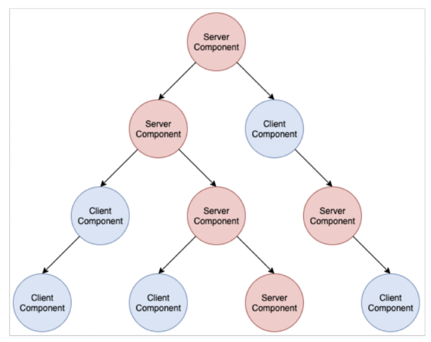
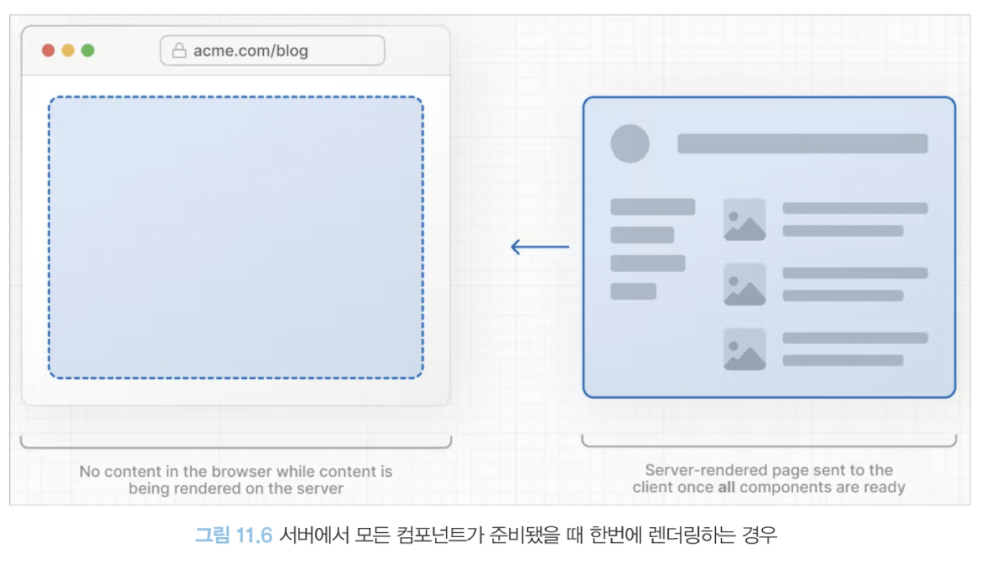
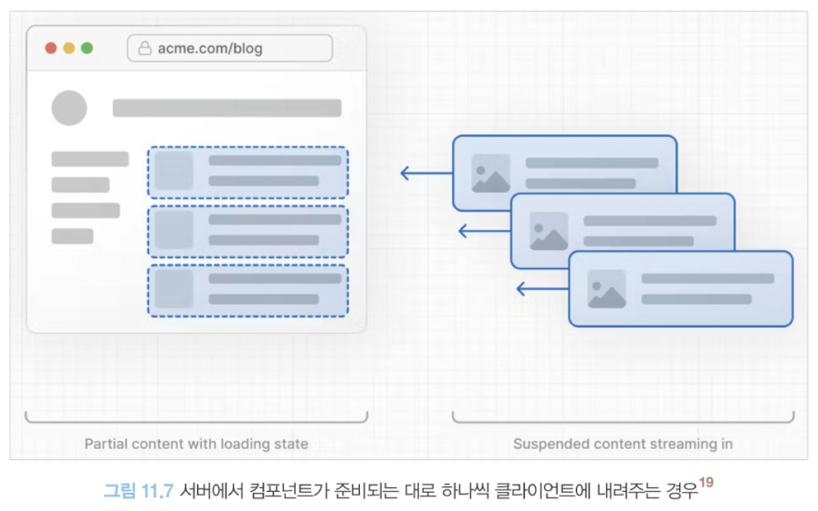

Next.js 릴리스 역사를 통틀어 가장 큰 변화가 있는 릴리스.

특히, 서버 사이드 렌더링의 구조에 많은 변화가 있는 리액트 18을 채택했으며, next.js의 큰 약점이었던 레이아웃 지원을 본격적으로 지원 시작.

바벨을 대체할 러스트 기반 SWC를 뒤이어 웹팩을 대체할 Turbopack까지 출시.

# app 디렉터리의 등장

Next.js의 아쉬운 점 => 레이아웃의 존재

공통 헤더와 공통 사이드바가 대부분의 페이지에 필요하다고 해보자.

- react-router-dom을 사용한 예시
  ```tsx
  import { Routes, Route, Outlet, Link } from "react-router-dom";

  export default function App() {
    return (
      <div>
        <div>Routes 외부의 공통 영역</div>

        <Routes>
          <Route path="/" element={<Layout />}>
            <Route index element={<Home />} />
            <Route path="/menu1" element={<Menu1 />} />
            <Route path="/menu2" element={<Menu2 />} />
            <Route path="*" element={<NoMatch />} />
          </Route>
        </Routes>
      </div>
    );
  }

  function Layout() {
    return (
      <div>
        <nav>
          <ul>
            <li>
              <Link to="/">Home</Link>
            </li>
            <li>
              <Link to="/menu1">menu1</Link>
            </li>
            <li>
              <Link to="/menu2">menu2</Link>
            </li>
          </ul>
        </nav>

        <hr />
        <div>/ path 하위의 공통 영역</div>

        <Outlet />
      </div>
    );
  }

  function Home() {
    return (
      <div>
        <h2>Home</h2>
      </div>
    );
  }

  function Menu1() {
    return (
      <div>
        <h2>Menu1</h2>
      </div>
    );
  }

  function Menu2() {
    return (
      <div>
        <h2>Menu2</h2>
      </div>
    );
  }

  function NoMatch() {
    return (
      <div>
        <h2>Nothing to see here!</h2>
        <p>
          <Link to="/">Go to the home page</Link>
        </p>
      </div>
    );
  }
  ```
  Routes를 활용하여 주소가 바뀌어도 공통 영역을 지정해주는 것이 가능하다.

### NextJS 에서는?

13버전 이전까지 모든 파일은 물리적으로 구별된 파일에 독립되어 있었음

공통으로 무언가를 넣을 수 있는 곳은 **\_document, \_app**이 유일!

- **\_document**: 페이지에 사용되는 html, body 태그를 수정하거나 CSS-in-JS를 지원하기 위한 코드를 넣는 등의 제한적 용도로만 사용된다. 오직 서버에서만 작동.
- **\_app** : 페이지를 초기화 하기 위한 용도로 사용되며 아래와 같은 작업이 가능하다고 명시되어 있다.
- 페이지 변경시에 유지하고 싶은 레이아웃
- 페이지 변경 시 상태 유지
- componentDidCatch를 활용한 에러 핸들링
- 페이지간 추가적인 데이터 삽입
- global CSS 삽입

즉, 이전의 NextJS 12 버전까지 공통 레이아웃을 유지하려면 \_app이 유일했다.

\_app에서밖에 할 수 없어 제한적이고 각 페이지별로 서로 다른 레이아웃을 유지하기는 힘들었다.

이러한 레이아웃의 한계를 극복하기 위해 13버전에 나온 것 => **app 레이아웃**

## 라우팅

기존에 /pages로 정의하던 라우팅 방식이 **/app 디렉터리로 이동하며 파일명으로 라우팅하는 것이 불가능**해졌다.

기본적으로 Next.js의 라우팅은 파일 시스템을 기반으로 하고 있다. 이번에 등장한 /app라우팅은 /pages와는 약간의 차이가 있다.

1. **/pages/a/b.tsx or /pages/a/b/index.tsx는 모두 동일한 주소로 변환된다. (파일명이 index라면 내용이 무시된다.)**
2. **/app/a/b는 /a/b로 변환되며 파일명은 무시되게 된다. 폴더명으로 주소 변환!**

즉, app 디렉터리 내부의 파일명은 라우팅에 아무 영향 없음.

Next.js 13부터는 app 디렉터리 내부의 폴더명이 라우팅이 되며 파일명이 제한되어있다.

app 내부에서 가질 수 있는 파일명은 예약어로 제한된다.

이 예약어 파일들은 모두 **.js, .ts, .jsx, .tsx 확장자를 사용**해야 한다!

### 파일명 예약어

**layout.js**

페이지의 기본적인 레이아웃을 구성하는 요소

페이지의 기본적인 레이아웃을 구성하며 하위폴더 및 주소에 모두 영향을 미치게 된다.

```tsx
// app/layout.tsx
import { ReactNode } from "react";

export default function AppLayout({ children }: { children: ReactNode }) {
  return (
    <html lang="ko">
      <head>
        <title>안녕하세요!</title>
      </head>
      <body>
        <h1>웹페이지에 오신 것을 환영합니다.</h1>
        <main>{children}</main>
      </body>
    </html>
  );
}
```

루트에는 단 하나의 layout만! 모든 페이지에 영향을 미치는 공통 레이아웃! 웹 페이지를 만드는데 공통적인 내용 (html, head)등을 다룰 수 있다!

\_app, \_document를 하나로 대체할 수 있음. 꼭 공통 레이아웃이 필요하지 않더라도 기본 정보들만 담아둬도 유용할 것 같다.

- \_document가 없어진 후, CSS-in-JS 초기화는 어떻게 할까? => 루트 레이아웃에 적용하는 방식
  ```tsx
  "use client";

  import { ReactNode, useState } from "react";
  import { useServerInsertedHTML } from "next/navigation";
  import { ServerStyleSheet, StyleSheetManager } from "styled-components";

  export default function StyledComponentsRegistry({
    children,
  }: {
    children: ReactNode;
  }) {
    const [styledComponentsStyleSheet] = useState(() => new ServerStyleSheet());

    useServerInsertedHTML(() => {
      const styles = styledComponentsStyleSheet.getStyleElement();
      styledComponentsStyleSheet.instance.clearTag();
      return <>{styles}</>;
    });

    if (typeof window !== "undefined") {
      return <>{children}</>;
    }

    return (
      <StyleSheetManager sheet={styledComponentsStyleSheet.instance}>
        <>{children}</>
      </StyleSheetManager>
    );
  }

  // app/layout.tsx
  import StyledComponentsRegistry from "./lib/StyledComponentsRegistry";

  export default function RootLayout({
    children,
  }: {
    children: React.ReactNode;
  }) {
    return (
      <html>
        <body>
          <StyledComponentsRegistry>{children}</StyledComponentsRegistry>
        </body>
      </html>
    );
  }
  ```
  +++ 'use client' : 클라이언트 컴포넌트를 의미하는 지시자(리액트 18에서 새롭게 등장! 자세한 내용은 뒤에서~)

이처럼 layout은 주소별 공통 레이아웃을 포함할 수 있을 뿐만 아니라, \_app과 \_document를 대신하여 웹페이지를 시작하는데 필요한 공통 코드를 가질 수 있다.

\_document.jsx 에서만 처리할 수 있었던 부자연스러움이 사라짐.

기존에 html이나 body 태그에 무언가 스타일을 추가하는 등의 작업을 하려면 \_document.jsx를 사용해야 했을 뿐만 아니라 <Html />, <Body /> <Head /> 태그처럼 NextJS에서 제공하는 태그를 사용해야만 했다.

```jsx
import { Fragment } from "react";
import Document, {
  DocumentContext,
  Head,
  Html,
  Main,
  NextScript,
} from "next/document";
import { ServerStyleSheet } from "styled-components";

export default class MyDocument extends Document {
  static async getInitialProps(ctx: DocumentContext) {
    const sheet = new ServerStyleSheet();
    const originalRenderPage = ctx.renderPage;

    try {
      ctx.renderPage = () =>
        originalRenderPage({
          enhanceApp: (App) => (props) =>
            sheet.collectStyles(<App {...props} />),
        });

      const initialProps = await Document.getInitialProps(ctx);
      return {
        ...initialProps,
        styles: [
          <Fragment key="1">
            {initialProps.styles}
            {sheet.getStyleElement()}
          </Fragment>,
        ],
      };
    } finally {
      sheet.seal();
    }
  }

  render() {
    return (
      <Html>
        <Head />
        <body>
          <Main />
          <NextScript />
        </body>
      </Html>
    );
  }
}
```

하지만?! 이제는 기본으로 제공하는 <html /> 등의 태그를 추가하고 수정하므로써 별도의 import를 안해줘도 돼서 자연스럽고 더욱 편리해짐!

**layout에서 주의할 사항**

1. layout은 app 디렉터리 내부에서는 예약어이므로 layout 목적 이외에 사용이 불가능하다.

2. layout은 children을 props로 받아서 렌더링해야 한다.

3. layout 내부에는 export default가 있어야 한다.

4. layout 내부에서 API 요청과 같은 비동기 작업이 가능하다.

**page.js**

page는 루트 layout과 같은 폴더 안에 있는 layout 기반으로 보여진다.

```jsx
app/blog/layout.tsx
import { ReactNode } from "react";

export default function BlogLayout({ children }: { children: ReactNode }) {
  return <section>{children}</section>;
}

app/blog/page.tsx
export default function BlogPage() {
  return <>여기에 블로그 글</>;
}
```

**page가 받는 props**

- params: [...id]와 같은 동적 라우트 파라미터를 가져올 수 있다. (/products/[id] → /products/123에서 id 값이 params로 전달)
- searchParams: URL의 ?a=1과 같은 URLSearchParams를 가져올 수 있다. 이 값은 layout에서는 제공되지 않으니 주의하자. layout은 최초 렌더링 말고는 렌더링이 되지 않는다. 그러므로 페이지 탐색 중에는 리렌더링을 수행하지 않는다!

(/products/123?sort=asc&category=books에서 sort와 category 값이 searchParams로 전달)

**page에서 주의할 사항**

1. page는 app 디렉터리 내부에서는 예약어이므로 layout 목적 이외에 사용이 불가능하다.

3. page 내부에는 export default가 있어야 한다.

**error.js**

해당 라우팅 영역에서 사용되는 공통 에러 컴포넌트

특정 라우팅별로 다른 에러 UI를 띄워줄 수 있음!

```jsx
"use client";

import { useEffect } from "react";

export default function Error({
  error,
  reset,
}: {
  error: Error,
  reset: () => void,
}) {
  useEffect(() => {
    console.log("logging error", error);
  }, [error]);
  return (
    <div>
      <h1>Error: {error.message}</h1>
      <button onClick={() => reset()}>Reset</button>
    </div>
  );
}
```

**error가 받는 props**

- error : Error 객체 (에러 정보를 담고 있는 객체)
- reset: () => void (에러 바운더리 초기화할 함수)

해당 에러 바운더리는 클라이언트에서만 작동하여 error 컴포넌트도 클라이언트 컴포넌트여야 한다.

- 같은 위치의 layout 파일에서 에러가 발생한다면 해당 같은 위치의 error 컴포넌트로 이동하지 않게 된다.

‼️But, 루트(/app)에 있는 error 파일은 전역 에러 컴포넌트이기에 루트에 있는 layout.js에서 에러가 났을 때 같은 위치에 있어도 에러 처리를 할 수 있다.

만약 같은 위치의 layout의 에러 처리를 하려고 한다면...

```jsx
<Layout>
  <Error>{children}</Error>
</Layout>
```

위 코드처럼 자식 컴포넌트인 Error 컴포넌트가 Layout의 컴포넌트에서 발생한 error를 처리할 수 없으므로 처리하기 위해선 상위 컴포넌트의 error를 사용해야 한다!

결론, layout에서 발생한 에러를 처리하고 싶다면, 상위 컴포넌트의 error.js를 사용하거나, app의 루트 에러 처리 파일을 만들자!

**not-found.js**

특정 라우팅 하위 주소를 찾을 수 없을 때의 404 페이지를 렌더링할 때 사용

```jsx
export default function NotFound() {
  return (
    <>
      <h1>너가 찾는 페이지는 없단다</h1>
    </>
  );
}
```

**loading.js**

리액트 Suspense를 기반으로 컴포넌트가 불러오는 중임을 나타내는 경우 사용

```jsx
export default function Loading() {
  return "Loading...";
}
```

**route.js**

/app/api를 기준으로 디렉터리 라우팅을 지원하며 /api에도 파일명 라우팅이 사라졌으며 디렉터리가 라우팅 주소를 담당하게 됨!

=> 파일명은 **route.js**로 통일!!

route.ts 파일 내부에 REST API 메서드명을 예약어로 선언해 두면 HTTP 요청에 맞게 해당 메서드를 호출하게 된다.

```jsx
// apps/internal-api/hello/route.ts
import { NextRequest } from "next/server";

export async function GET(request: NextRequest) {
  return new Response(JSON.stringify({ name: "hello" }), {
    status: 200,
    headers: {
      "content-type": "application/json",
    },
  });
}
```

app/api 외에 다른 곳에 선언해도 작동함!

route.ts와 page.tsx가 같은 폴더 내부에 공존할 수 없다! 만약 공존한다면 다음과 같은 경고 메세지를 띄워줌.

```
error - [next app] app
	An issue occurred while preparing your Next.js app
    Conflicting route at /internal-api/hello
```

route.ts 내 함수가 받을 수 있는 파라미터

- request
- context

```tsx
//app/api/users/[id]/route.ts
import { NextRequest } from "next/server";

export async function GET(
  request: NextRequest,
  context: { params: { id: string } }
) {
  const response = await fetch(
    `https://jsonplaceholder.typicode.com/users/${context.params.id}`
  );

  return new Response(JSON.stringify(response), {
    status: 200,
    headers: {
      "content-type": "application/json",
    },
  });
}
```

# 리액트 서버 컴포넌트

먼저 리액트 컴포넌트란 클라이언트에서 작동하며, 브라우저에서 JS 코드 처리가 이루어진다.

웹사이트를 방문하면 리액트 실행할 코드를 다운로드 -> 리액트 컴포넌트 트리를 만든 후 DOM에 렌더링

react, nextjs에서의 서버 사이드 렌더링의 경우, 서버에서 DOM을 생성 -> 클라이언트에서 만들어진 DOM을 기준으로 하이드레이션 -> 브라우저에서 상태 추적 -> 이벤트 핸들러 DOM에 추가 -> 응답에 따라 렌더링 트리 변경

### **서버 사이드 렌더링의 한계**

- **자바스크립트 번들 크기가 0인 컴포넌트를 만들 수 없다** : SSR에서 HTML을 서버에서 미리 생성하여 클라이언트로 보내지만, 클라이언트 측에서 하이드레이션을 위해 여전히 자바스크립트 번들을 다운로드하고 실행해야 함.
- **백엔드 리소스에 대한 직접적인 접근이 불가능하다** : 클라이언트에서 백엔드 데이터에 접근하려면 REST API와 같은 방법을 사용한다. 이는 백엔드에서 항상 클라이언트에서 데이터를 접근하기 위한 방법을 제공해야 한다는 불편함이 있음.
- **자동 코드 분할(code split)이 불가능하다** : 코드 분할(거대한 코드 번들 대신 코드를 여러단위로 나누어 필요할때만 동적으로 지연 로딩하는 기법) 불가능. => 초기 로딩 시 모든 코드를 불필요하게 함께 로드함. 시간 오래 걸림!
- **연쇄적으로 발생하는 클라이언트와 서버의 요청을 대응하기 어렵다** : 최초 컴포넌트의 요청과 렌더링이 끝나기 전까지는 하위 컴포넌트의 요청과 렌더링이 끝나지 않는다는 크나큰 단점
- **추상화에 드는 비용이 증가한다** : 추상화가 복잡해질수록 코드의 양은 많아지고 런타임 시, 오버헤드 발생함.

전체적으로 리액트가 클라이언트 중심으로 돌아가기에 나타나는 한계점이다.

정적 콘텐츠를 빠르게 제공하고 서버 데이터를 손쉽게 제공할 수 있는 SSR의 장점, 다양한 사용자 인터렉션을 제공할 수 있는 CSR의 장점을 모두 갖고자 만들어진 것이 바로 "**리액트 서버 컴포넌트**"이다.

## 서버 컴포넌트란?

하나의 언어, 하나의 프레임워크, 그리고 하나의 API와 개념을 사용하면서 서버와 클라이언트 모두에서 컴포넌트를 렌더링할 수 있는 기법

**서버가 할 수 있는 일은 서버가, 할 수 없는 일은 클라이언트가!** 서버와 클라이언트가 나누어서 서버 컴포넌트를 렌더링한다.

클라이언트 컴포넌트는 서버 컴포넌트를 import할 수 없음

(서버 환경이 브라우저에 없으므로 실행할 방법이 없기 때문)

```tsx
// ClientComponent.jsx

"use client";

import ServerComponent from "./ServerComponent.server"; // 불가능
export default function ClientComponent() {
  return (
    <div>
      <ServerComponent />
    </div>
  );
}
```



모든 컴포넌트는 서버 컴포넌트가 될 수도 있고 클라이언트 컴포넌트가 될 수도 있다.

```tsx
// ClientComponent.jsx
"use client";
export default function ClientComponent({ children }) {
  return (
    <div>
      <h1>클라이언트 컴포넌트</h1>
      {children}
    </div>
  );
}

// ServerComponent.jsx
export default function ServerComponent() {
  return <span>ServerComponent</span>;
}

// ParentServerComponent.jsx
// 서버 컴포넌트일 수도, 클라이언트 컴포넌트일 수도 있다.
import ClienntComponent from "./ClientComponent";
import ServerComponent from "./ServerComponent";

export default function ParentServerComponent() {
  return (
    <ClienntComponent>
      <ServerComponent />
    </ClienntComponent>
  );
}
```

위 코드는 서버 컴포넌트를 기반으로 리액트 컴포넌트 설계할 때 어떤 제한이 있는지를 알려준다.

**서버 컴포넌트, 클라이언트 컴포넌트, 공용 컴포넌트**가 존재!!

### 서버 컴포넌트

- 요청이 오면 서버에서 딱 한번 실행되며 상태를 가질수 없다. (useState, useReducer 등의 훅 사용 X )
- 렌더링 생명주기를 사용할 수 없어 useEffect나 useLayoutEffect를 사용 X
- 서버에서만 실행되기 때문에 DOM API & document & window 사용이 불가능
- DB,내부서비스 등 서버에만 있는 데이터를 async/await으로 접근할 수 있다.
- 다른 서버 컴포넌트를 렌더링하거나 div,span, p 같은 요소를 렌더링하거나 클라이언트 컴포넌트를 렌더링할 수 있다.

### 클라이언트 컴포넌트

- 브라우저 환경에서만 실행되므로 서버 컴포넌트 및 서버 전용 훅이나 유틸을 부를 수 없음
- 서버 컴포넌트가 클라이언트 컴포넌트를 렌더링하는경우 클라이언트 컴포넌트가 자식으로 서버 컴포넌트를 갖는 것은 가능

### 공용 컴포넌트

- 서버 & 클라이언트에서 모두 사용 가능, 두 컴포넌트의 제약을 모두 받는다.

리액트는 모든 컴포넌트를 서버에서 실행 가능한 것으로 보는데, 클라이언트 컴포넌트라는 것을 명시적으로 선언하려면 **use client**라고 작성하자. **작성 안할 시, 서버 컴포넌트로 동작하게 됨!**(클라이언트와 상호작용 불가능, 상태관리 및 훅 등 사용 불가능)

## 서버 사이드 렌더링과 서버 컴포넌트의 차이

| **렌더링 위치**            | 서버에서 HTML 생성 후 클라이언트에서 하이드레이션 필요           | 서버에서만 실행되며 클라이언트로 HTML만 전달                      |
| -------------------------- | ---------------------------------------------------------------- | ----------------------------------------------------------------- |
| **클라이언트 상호작용**    | 하이드레이션 후 상호작용 가능 (자바스크립트 번들 필요)           | 상호작용은 클라이언트 컴포넌트에서만 처리 (자바스크립트 필요 X)   |
| **자바스크립트 번들 크기** | 클라이언트로 자바스크립트 번들 전달됨                            | 클라이언트로 자바스크립트 번들 전달되지 않음                      |
| **상호작용**               | 클라이언트에서 자바스크립트로 하이드레이션 및 이벤트 핸들러 동작 | 클라이언트 컴포넌트에서만 상호작용, 서버 컴포넌트는 상호작용 없음 |
| **데이터 페칭**            | 서버에서 HTML 생성 시 데이터 페칭 후 클라이언트로 전달           | 서버 컴포넌트에서 데이터 페칭 가능                                |
| **SEO**                    | SEO에 유리 (HTML을 서버에서 미리 생성)                           | SEO에 유리 (서버에서 생성된 HTML 제공)                            |
| **적용 가능한 기술**       | Next.js의 getServerSideProps, getInitialProps 사용               | React 18의 서버 컴포넌트 기능 사용                                |

리액트 서버 컴포넌트 날 것을 맛보고 싶다면?

[GitHub - prisma/server-components-demo: Demo app of React Server Components.](https://github.com/prisma/server-components-demo)

### 서버 컴포넌트 작동 방식

1. 서버가 렌더링 요청을 받는다. 서버가 렌더링을 수행하므로 리액트 서버 컴포넌트를 사용하는 모든 페이지는 서버에서 시작한다. 즉, 루트에 있는 컴포넌트는 항상 서버 컴포넌트이다.
2. 서버는 받은 요청에 따라 컴포넌트를 JSON으로 직렬화(서버에서 렌더링할 수 있는 것)한다. 클라이언트 컴포넌트로 표시된 부분은 해당 공간을 플레이스홀더 형식으로 비워둔다.
3. 브라우저가 리액트 컴포넌트 트리를 구성한다. 브라우저가 서버로 스트리밍으로 받은 JSON 구문을 다시 파싱하여 트리를 재구성한다. 클라이언트 컴포넌트를 받았다면 클라이언트에서 렌더링을 진행하고 서버에서 만들어진 결과물을 받았다면 이를 기반으로 리액트 트리를 그대로 만든다.

### 서버 컴포넌트의 특별한 점

- 서버 -> 클라이언트 시, 스트리밍 형태로 정보를 보내 클라이언트가 JSON 줄 단위로 읽고 컴포넌트를 바로 렌더링 할 수 있어 되도록 빨리 사용자에게 결과물을 보여줄 수 있다.
- 각 컴포넌트 별로 번들링이 되어 있어 지연해서 받고 따로 받는 작업이 가능해짐
- SSR과 다르게 HTML이 아닌 JSON 형태로 보내진 것.(클라이언트 컴포넌트가 리액트 컴포넌트 트리의 구성을 빠르게 하기 위해)

- 서버 -> 클라이언트로 props 넘길 시, 반드시 직렬화 가능한 데이터를 넘겨야 하는 이유
  getServerSideProps에서 페이지로 props를 넘길 때를 생각해보면 된다.
  서버에서 클라이언트로 데이터를 보내는 것은 JSON을 통해 이뤄지기 때문에 JSON으로 직렬화할 수 없는 데이터(class나 Date 등)는 서버에서 클라이언트로 넘겨줄 방법이 없다.
  이는 자바스크립트 고유 객체이기 때문이다. 따라서 서버 컴포넌트에서 클라이언트 컴포넌트로 props를 넘길 때는 반드시 주의를 기울여야 한다.
  이러한 특징은 Next.js에서 getServerSideProps가 JSON 직렬화 가능한 데이터를 반환해야만 했던 이유와 동일하다.

## Next.js에서의 리액트 서버 컴포넌트

루트에 있는 컴포넌트는 항상 서버 컴포넌트여야 하므로 Next.js에서 각 페이지에 있는 page.js와 layout.js는 서버 컴포넌트이다.

### 새로운 fetch 도입, getServerSideProps, getStaticProps, getInitialsProps 삭제

```tsx
// 서버 사이드에서 데이터 페칭
export async function getServerSideProps() {
  const result = await fetch("https://api.example.com");
  const data = await result.json();

  return {
    props: {
      data, // 컴포넌트에 동기적으로 전달
    },
  };
}

// 컴포넌트는 동기적으로 렌더링
export default function Page({ data }) {
  return (
    <main>
      <Children data={data} />
    </main>
  );
}
```

```tsx
// 비동기 데이터 페칭
async function getData() {
  const result = await fetch("https://api.example.com");
  if (!result.ok) {
    throw new Error("실패");
  }
  return result.json();
}

// async 서버 컴포넌트
export default async function Page() {
  const data = await getData(); // 비동기적으로 데이터 로드
  return (
    <main>
      <Children data={data} />
    </main>
  );
}
```

위처럼 컴포넌트가 비동기적으로 작동하는게 가능해진다. 이제 서버 컴포넌트는 데이터가 불러오기 전까지 기다렸다가 데이터가 불러와지면 페이지가 렌더링되어 클라이언트로 전달되게 된다.

++ fetch API를 확장해 서버 컴포넌트 트리 내에 동일한 요청이 있는 경우 재요청이 불가능하도록 요청 중복 방지.(렌더링이 한 번 끝날 때까지 캐싱)

### 정적 렌더링과 동적 렌더링

과거 Next.js에서는 getStaticProps를 활용하여 정적으로 페이지를 만들어서 제공했었다. 해당 기능을 활용하면 주소에 들어오는 결과물이 변하지 않기 때문에 기존 서버사이드 렌더링보다 더 빠르게 데이터를 제공할 수 있었다.

13 버전에서는 정적인 라우팅은 빌드 타임에 렌더링을 미리 해두고 캐싱하여 재사용할 수 있게끔 해두었으며 동적인 라우팅에 대해서는 서버에 요청이 올 때마다 컴포넌트를 렌더링하도록 변경했다.

```tsx
// app/Page.tsx

async function fetchData() {
  const res = await fetch(`https://jsonplaceholder.typicode.com/posts`);
  const data = await res.json();
  return data;
}

export default async function Page() {
  const data: Array<any> = await fetchData();

  return (
    <ul>
      {data.map((item, key) => (
        <li key={key}>{item.id}</li>
      ))}
    </ul>
  );
}
```

fetch 옵션에 따른 작동 방식을 정리하면 다음과 같다

```
- **fetch(URL, { cache: 'force-cache' })**:
기본값으로 getStaticProps와 유사하게 불러온 데이터를 캐싱해 해당데이터로만 관리한다.

- **fetch(URL, { cache: 'no-store' }), fetch(URL, { next: {revalidate: 0} })**:
getServerSideProps와 유사하게 캐싱하지 않고 매번 새로운 데이터를 불러온다.

- **fetch(URL, { next: { revalidate: 10 } })**:
getStaticProps에 revalidate를 추가한 것과 동일하며, 정해진유효시간 동안에는 캐싱하고,
이 유효시간이 지나면 캐시를 파기한다.
```

### 캐시와 mutating, revalidating

Next.js는 fetch의 기본 작동을 재정의하여 **{next : {revalidate? : number | false}}** 를 제공한다. 해당 데이터의 유효시간을 정해두고 시간이 지나면 페이지를 렌더링한다.

루트에 다음과 같이 코드를 선언해두면 하위에 있는 모든 라우팅에서는 페이지를 60초 간격으로 갱신하여 새로 렌더링하게 된다.

```tsx
// app/page.tsx
export const revalidate = 60;
```

캐시를 무효화하고 싶다면? => router.refresh();

### 스트리밍을 활용한 점진적 페이지 불러오기

서버 사이드 렌더링 => 요청 받은 페이지를 모두 렌더링하기 전까지 사용자에게 아무것도 보여줄 수 없다. (렌더링 끝나도 사용자가 인터렉션 X)

서버 컴포넌트에서 HTML을 작은 단위로 쪼개서 완성되는대로 클라이언트에게 점진적으로 보내는 스트리밍 방식 도입! 로딩 끝난 순으로 하이드레이션 진행

1. 경로에 loading.tsx 배치

2. Suspense 배치





## 서버 액션(alpha)

[Server Functions – React](https://19.react.dev/reference/rsc/server-functions)

⇒ server functions로 바뀌었다고 함!

API를 굳이 생성하지 않더라도 함수 수준에서 서버에 직접 접근하여 데이터 요청을 수행하는 기능

서버 컴포넌트와 다르게, 특정 함수 실행 그 자체만을 서버에서 수행할 수 있다.

```tsx
/** type {import('next').NecxtConfig} */
// 서버 액션 활성화
const nextConfig = {
  experimental: {
    serverActions: true,
  },
};

module.exports = nextConfig;
```

서버 액션을 만들려면 함수 내부 또는 파일 상단에 'use server' 지시자를 선언해야 하며 함수는 async 함수여야 한다.

```tsx
async function serverAction() {
  "use server";
  //서버에 바로 접근하는 코드
}
```

### form의 action

<form/>은 action props를 추가하여 데이터를 처리할 URI를 넘겨줄 수 있다. 아래 예제를 보자.

```tsx
export default function Page() {
  async function handleSubmit() {
    "use server";

    console.log("해당 작업은 서버에서 수행하기에 CORS 이슈가 없음");

    const response = await fetch("https://jsonplaceholder.typicode.com/posts", {
      method: "POST",
      body: JSON.stringify({
        title: "foo",
        body: "bar",
        userId: 1,
      }),
      headers: {
        "Content-Type": "application/json; charset=UTF-8",
      },
    });

    const result = await response.json();
    console.log(result);
  }

  return (
    <form action={handleSubmit}>
      <button type="submit">form 요청 보내보기</button>
    </form>
  );
}
```

해당 요청의 페이로드를 보면 post 요청이 아닌 ACTION_ID라는 액션 구분자만 있다.


해당 post 요청은 어떻게 되었을까? 이를 처리하는 서버를 보면 미리 빌드되어 있다.

즉, 서버액션을 실행하면 클라이언트에서는 현재 라우트 주소와 ACTION_ID를 보내고 아무것도 실행하지 않고 이를 바탕으로 실행해야 할 내용을 서버에서 직접 실행한다.

'use server'로 선언되어 있는 내용은 빌드 시점에서 클라이언트와 분리되며 클라이언트 번들링 결과물에는 포함되지 않게 된다.

추가적으로 폼과 실제 노출하는 데이터가 연동되어 있는 경우 더욱 효과적으로 사용할 수 있다.

<서버에서만 접근할 수 있는 Redis스토리지인 @vercel/kv를 기반으로 양식 데이터를 다루는 방법>

```tsx
import kv from "@vercel/kv";
import { revalidatePath } from "next/cache";

interface Data {
  name: string;
  age: number;
}

export default async function Page({ params }: { params: { id: string } }) {
  const key = `test:${params.id}`;
  const data = await kv.get<Data>(key);

  async function handleSubmit(formData: FormData) {
    "use server";

    const name = formData.get("name");
    const age = formData.get("age");

    await kv.set(key, {
      name,
      age,
    });

    revalidatePath(`/server-action/form/${params.id}`);
  }

  return (
    <>
      <h1>form with data</h1>
      <h2>
        서버에 저장된 정보 : {data?.name} {data?.age}
      </h2>

      <form action={handleSubmit}>
        <label htmlFor="name">이름 : </label>
        <input
          type="text"
          id="name"
          name="name"
          defaultValue={data?.name}
          placeholder="이름을 입력해 주세요"
        />

        <label htmlFor="age">나이 :</label>
        <input
          type="number"
          id="age"
          name="age"
          defaultValue={data?.age}
          placeholder="나이를 입력해 주세요"
        />

        <button type="submit">submit</button>
      </form>
    </>
  );
}
```

Page컴포넌트는 서버 컴포넌트로 직접 서버 요청을 수행하여 JSX를 렌더링

- > form 태그에 서버 액션인 handleSubmit을 추가하여 formData를 기반으로 데이터를 가져와 DB인 kv를 업데이트
- > revalidatePath를 통하여 캐시 데이터를 갱신

=> 이 일련의 과정이 새로고침 없이 데이터 스트리밍으로 수행

### server mutation(서버에서의 데이터 수정)

- redirect: import { redirect } from 'next/navigation'으로 사용할 수 있으며, 특정 주소로 리다이렉트할 수 있다.
- revalidatePath: import { revalidatePath } from 'next/cache'로 사용할 수 있으며, 해당 주소의 캐시를 즉시 업데이트한다.
- revalidateTag: import { revalidateTag } from 'next/cache'로 사용할 수 있다. 캐시 태그는 fetch 요청 시에 다음과 같이 추가할 수 있다.

```
fetch('https://localhost:8080/api/something', { next: { tags: [''] } })
```

이렇게 태그를 추가해 두면 여러 다양한 fetch 요청을 특정 태그 값으로 구분할 수 있으며, revalidateTag를 사용할 경우 이 특정 태그가 추가된 fetch 요청을 모두 초기화한다.

### input의 submit과 image의 formAction, startTransition과의 연동, server mutation이 없는 작업 ...

### 서버 액션 사용 시 주의할 점

1. 서버 액션은 클라이언트 컴포넌트 내에서 정의될 수 없다. 클라이언트에서 쓰고 싶을 땐? **use server**로 서버 액션만 모여 있는 파일을 별도로 import 해서 사용하자.

2. 서버액션을 import하는 것 뿐 아니라 props형태로 클라이언트 컴포넌트에 넘기는 것은 가능하다.

3. 즉, 서버에서만 실행될 수 있는 자원은 꼭 파일 단위로 분리해야 한다.

## 그 밖의 변화

- 프로젝트 전체 라우트에서 쓸 수 있는 미들웨어 강화
- SEO를 쉽게 작성할 수 있는 기능
- 정적으로 내부 링크를 분석할 수 있는 기능

등등

더 궁금하다면?

[Next.js 13](https://nextjs.org/blog/next-13)

## NextJS 13 코드 맛보기

[GitHub - wikibook/react-deep-dive-example: 《모던 리액트 Deep Dive》 예제 코드](https://github.com/wikibook/react-deep-dive-example)

### ++ NextJS 14에서의 변화

[Next.js 14](https://nextjs.org/blog/next-14)
