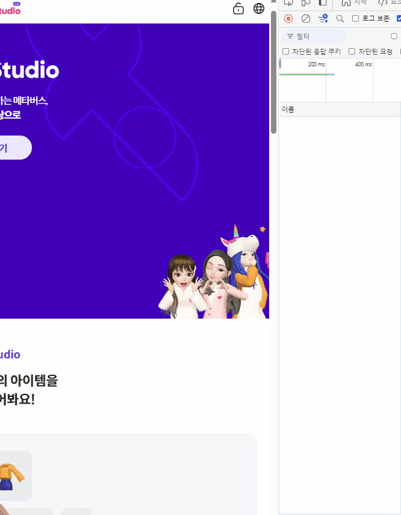
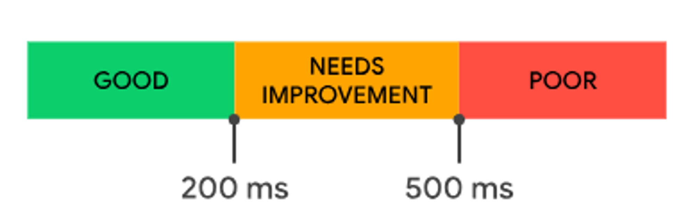
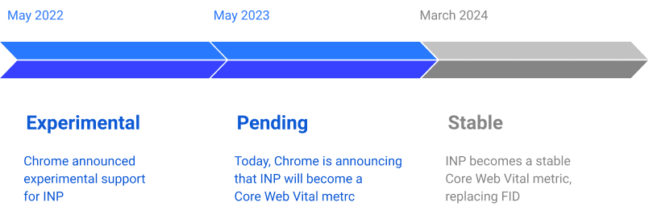

# 12장 - 모든 웹 개발자가 관심을 가져야 할 핵심 웹 지표

담당자: Bori [Web FE Lead]
날짜: 2024년 10월 9일
상태: 완료

# 12.1 웹사이트와 성능


로딩이 1초 → 10초 / 이탈 확률은 123% 증가


성능 평가에 사용되는 객관적 지표 = CWV

아무리 멋지고 화려한 웹사이트여도 로딩이 느리고 버벅거리면…… 구리다는 인상을 줄 수 밖에……….

# 12.2 핵심 웹 지표(Core Web Vitals)란?

- 구글에서 만든 지표
- `얼마나 뛰어난 사용자 경험을 제공하는가?` 에 초점
- CWV는 검색 엔진의 검색 순위 알고리즘에 반영됨 ⇒ CWV 개선은 SEO 과정 중 하나로 볼 수 있음
    
    

| LCP | 사용자에게 **처음** 보여지는 **가장 큰 영역의 content가 얼마나 빨리 로딩되냐** |
| --- | --- |
| FID | 사용자가 **처음** input(스크롤, 터치 등)을 넣었을 때, **사이트가 얼마나 빨리 반응하냐** |
| CLS | 레이아웃의 누적 이동치 (**로딩**되면서 광고로 인해 **위치** 밀려나거나 하면 CLS가 커짐) |
| TTFB | 브라우저가 웹 페이지의 **첫 번째 바이트 (최초 응답) 수신하는데 걸리는 시간**  |
| FCP | **웹 페이지에 뭐라도 뜨기 시작하는 순간**까지 걸리는 시간 |
| INP | 사용자의 **모든** input에 대한 지연을 수집, **사이트가 얼마나 빨리 반응하는지**의 평균 |
| RUM | 브라우저 캐시 데이터를 반영한 데이터 (Real User Monitoring) |
| TTI | INP와 유사하나, [web.dev에서는 INP 측정을 권장](https://web.dev/articles/tti?hl=ko)함 |
| TBT | FCP와 TTI 사이에서 기본 스레드가 차단된 시간의 합 (Total Blocking Time) |

<aside>
💭

**지금 뭐가 이렇게 많냐고 생각하셨나요**

근데 싹 다 외우기보단 걍 필요할 때 공부해도 되는 거고…. 

완전 쟤네가 다 독립적인 지표도 아니거든요?? 알고 보면 막 엮여있음

그러니까 대략적인 관계 정도만 알아둬도 될 거 같다는 게 제 생각

외운다면 말리진 않습니다

</aside>

# 12.3 LCP

https://www.youtube.com/watch?v=fWoI9DXmpdk

https://web.dev/articles/optimize-lcp?hl=ko#optimal_sub-part_times

## 12.3.1 정의

<aside>
💡 **뷰포트** 내의 **가장 큰 크기의 요소**가 렌더링 되기까지 걸리는 시간

(이때, **가장 큰 크기의 요소**는 로딩 과정 중 계속해서 변한다)

</aside>

`` `<svg> 내부 <image>` `poster 속성이 있는 <video>` 

`url()로 배경 이미지를 부르는 요소` `인라인 텍스트를 포함하는 블록 요소`

## 12.3.2 의미

`DomContentLoaded`는 HTML 문서 파싱 기준이므로 체감 로딩 시간과 다를 수 있다

➡️ 사용자가 보고있는 영역(= 뷰포트)의 메인 콘텐츠가 완전히 전달되는 속도를 보는 것이 더 비슷함

> `DOMContentLoaded` 이벤트는 HTML 문서가 완전히 구문 분석되고 모든 지연된 스크립트(`<script defer src="…">`와 `<script type="module">`)가 다운로드되고 실행될 때 발생합니다. 이미지, 서브프레임, 비동기 스크립트와 같은 다른 항목의 로드가 끝날 때까지 기다리지 않습니다. - https://developer.mozilla.org/ko/docs/Web/API/Document/DOMContentLoaded_event
> 

## 12.3.4 기준 점수


## 12.3.5 개선 방안

- 뷰포트 최대 영역에는 로딩이 빠른 텍스트를 넣어라

- 그럼에도 이미지를 넣어야 한다면 `` 태그를 쓰자
    
    > `` 태그를 사용하면 Pre-load Scanner가 이미지를 검색하도록 허용하면서 표시 영역에 적절한 이미지를 로드하는 것을 더 세밀하게 제어할 수 있습니다. - https://web.dev/articles/preload-scanner?hl=ko
    > 
    
    `<svg> 내부 <image>` 프리로드 스캐너에 발견되지 않음 → 병렬 다운 X → 👎👎
    
    `url()로 배경 이미지를 부르는 요소` CSS 리소스 요청은 후순위로 미뤄지므로 → 느리다 → 👎👎 
    
    <aside>
    🔍 **Pre-load Scanner**
    
    중요한 리소스 발견을 위한 보조 **HTML** 파서
    
    (HTML 파서니까 CSS와 같은 리소스 유형은 검사하지 않는다)
    
    리소스를 참조하는 곳에 도달하기 전에 미리 요청을 보내므로, 준비 시간이 줄어들게 됨
    
    </aside>
    
- 이미지는 최소한의 용량으로 서빙하자 (압축, 확장자 수정 등)

- `loading=lazy` 를 LCP에 사용하지 말자 (리소스 로드 시작 시점이 느려짐)
    
    
    
    이미지를 처음부터 다운 받는 게 아니라 스크롤 위치에 기반해서 다운 받는 속성 
    
- 애니메이션 남발하지 않기
    
    넣어야 하면 빠르게 처리될 수 있게 transform / opacity 등의 속성으로 하드웨어 가속을 사용해보는 것도 방법이지 않을까요? 이건 그냥 저의 뇌피셜임
    

# 12.4 FID

https://web.dev/articles/fid?hl=ko#analyzing_and_reporting_on_fid_data

## 12.4.1 정의

<aside>
💡 웹 사이트의 **반응성**을 측정하는 지표

**사용자의 첫 상호작용**에 응답하기까지(이벤트 핸들러 처리를 시작) 걸리는 시간

</aside>

<aside>
🔍

**FID를 해석할 땐 값의 분포를 살펴야 한다**

같은 사이트라고 해도 사용자가 상호작용을 시도하는 시점에 따라 FID가 다를 수 있다

그래서 평균값보단 분포가 중요하다네요

| 시점 | FID |
| --- | --- |
| 아예 상호작용을 시도하지 않음 | 없음 |
| 스레드 바쁠 때 상호작용 시도 | 높음 |
| 스레드 유휴 상태일 때 상호작용 시도 | 낮음 |
</aside>

## 12.4.2 의미

LCP가 낮아서 로딩 시간이 짧다고 해도 상호작용할 수 없다면 사용자 이탈 가능성 ⬆️

만약 브라우저의 메인 스레드가 처리해야 할 작업이 많다면 그걸 다 끝내야 핸들러를 실행할 것

 / FCP는 RAIL 성능 모델 중에서도 `Response`에 초점을 맞춘다](../../imgs/12장-Bori/the-4-parts-the-rail-per-0bf45984bc75a_856.png)

[RAIL 모델을 사용한 성능 측정  |  Articles  |  web.dev](https://web.dev/articles/rail?hl=ko) / FCP는 RAIL 성능 모델 중에서도 `Response`에 초점을 맞춘다

## 12.4.4 기준 점수


## 12.4.5 개선 방안

- 큰 태스크를 작은 단위의 태스크로 쪼갠다
    
    쪼갠다고 병렬 수행되는 건 아니지만? 태스크 사이 틈에 다른 동작을 할 수 있다는 장점이 있음
    
    <aside>
    🔍
    
    **유어슈 코드로 알아보는 React.lazy를 활용한 Code Splitting**
    
    ```tsx
    const Drawer = **lazy**(() => import(path).then(...));
    const Search = **lazy**(() => import(path).then(...));
    
    const Router = () => {
      return 
    	  <Suspense>
    	    <Routes>
    	     <Route path='/drawer' element={<Drawer />} />
    	     <Route path='/search' element={<Search />} />
    	    </Routes>
    	  </Suspense>
    }
    ```
    
    사용자가 접속하는 경로에 따라 필요한 리소스만 로딩하도록 `lazy` 를 적용
    
    
    
    분할했으니 빌드했을 때 파일 개수도 늘어남 
    
    </aside>
    
- JS 코드 최소화 (불필요한 JS 줄이기)
    
    `불필요하다` 는 판단의 근거로는 개발자도구 - coverage를 사용할 수 있음 (라인 단위 사용률)
    
- 타사 자바스크립트 코드 실행을 지연시키기
    
    사용자 정보 트래킹하는 Google Analytics, Sentry 같은 스크립트 말하는 것임
    
    지표가 확보된 부분의 태그는 제거하거나 실행 시점을 조절합시다
    

## 12.4.6 FID를 대체하는 INP

- FID의 한계
    
    첫 상호작용에 대한 지연만 측정하므로, **전체 상호작용 반응성을 대표하는 데이터라 보기 어렵다**
    
- INP는 `모든 상호작용` 에 대한 측정을 진행, 가장 느린 상호작용 중 하나를 보고함
    
    
    
- 차이점
    
    
    |  | FID | INP |
    | --- | --- | --- |
    | 측정 대상 | 첫 상호작용 | 모든 상호작용 |
    | 타이밍 | 최초 이벤트 발생~ 이벤트 핸들러 실행 | 상호작용 발생~ 화면에 변화가 반영되기(Next paint)까지 시간 |
- 대체 시점
    
    사실 이미 대체됐습니다 
    
    
    
    책이 나온 23.11에는 pending이었지만 지금은 stable임 
    
    > 오늘부터 INP는 더 이상 실험용이 아니며 대신 *대기 중*인 Core Web Vitals 측정항목으로 간주됩니다. (…) 생태계에 적응할 시간을 제공하기 위해 **INP는 2024년 3월에 공식적으로 Core Web Vitals 측정항목이 될 예정**입니다. - [상호작용을 다음 페인트로 진행  |  Blog  |  web.dev](https://web.dev/blog/inp-cwv?hl=ko)
    > 

# 12.5 CLS

https://web.dev/articles/optimize-cls?hl=ko

## 12.5.1 정의

<aside>
💡

**뷰포트 내**에서 일어나는 **예기치 않은** **레이아웃 이동**을 점수화하여 합산한 지표

뷰포트는 기기마다 다르니까 당연히 같은 밀림(?)이어도 기기마다 점수가 상이할 수 있음

</aside>

## 12.5.2 의미

- 예기치 않은 레이아웃 이동은 사용자를 열받게 만드는 걸 넘어서 원래 하려던 동작까지 방해함
- 사용자가 인지하고 있는 레이아웃 변동은 CLS에 포함되지 않음
- `영향분율` * `거리분율` 공식으로 계산한다
    - 영향분율: `레이아웃 이동이 발생한 요소의 전체 높이` / `뷰포트 높이`
    - 거리분율: `레이아웃 이동이 발생한 요소의 이동거리` / `뷰포트 높이`

## 12.5.4 기준 점수


## 12.5.5 개선 방안

- 동적 요소 삽입을 지양하자
    - 그래도 해야 한다면…..
        - 미리 영역을 확보해두자 (스켈레톤 UI 활용)
        - 최초 뷰포트 외부에 위치시키자
- 폰트 로딩 최적화
    
    
    
    **FOIT (flash of invisible text)**
    
    폰트 스타일이 적용될 때까지 안 보이는 문제
    
    `font-display: block`
    
    **FOUT (flash of unstyled text)**
    
    폰트 스타일이 뒤늦게 적용되는 문제
    
    `font-display: swap`
    
    이런 문제들이 생기지 않게
    
    - `<link rel=preload>` 로 폰트 파일 먼저 불러오기
    - `font-family` 로 대체 폰트 설정하기
        
        
- 이미지 크기를 명확하게 설정
    
    `width` `height` attribute에 실제 이미지 크기에 맞게 비율 설정해두면 알아서 면적 할당함
    

## 12.5.6 핵심 웹 지표는 아니지만 성능 확인에 중요한 지표들

- TTFB : 최초 응답까지 걸리는 시간 (서버 사이드 렌더링에서 유심히 봐야 할 지표)
    - 페이지 생성 작업을 최소화
    - 주 방문객의 위치와 물리적으로 가까운 곳으로 리전 변경
    - 스트리밍 API 사용
    
- FCP : 화면에 뭐라도 나타나기까지 걸리는 시간
    - TTFB 개선 (최초 응답이 빨리 오면 그만큼 렌더링 시점도 당겨지니까)
    - DOM 크기 최소화
    - 렌더링에 지연을 주는 리소스 최소화
    - 최초 뷰포트에는 동적 렌더링 지양하기