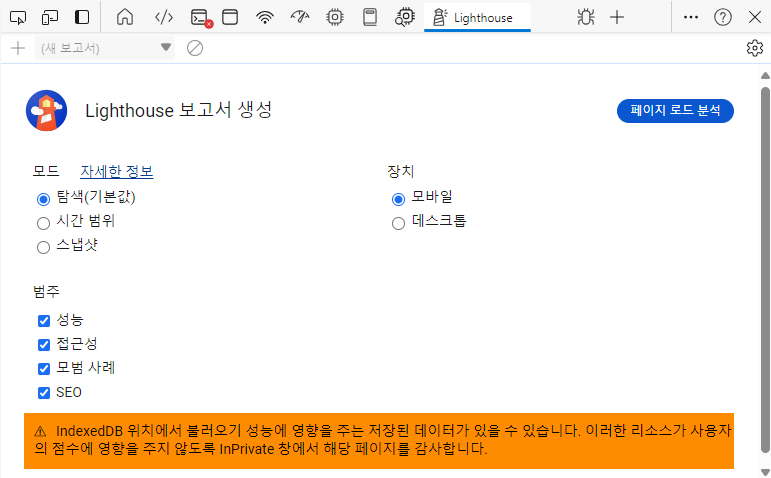
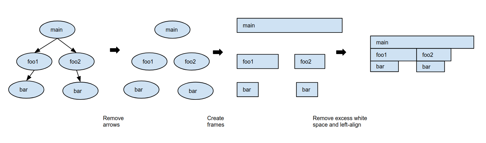
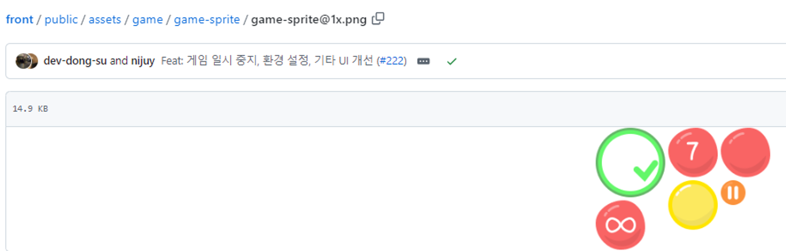
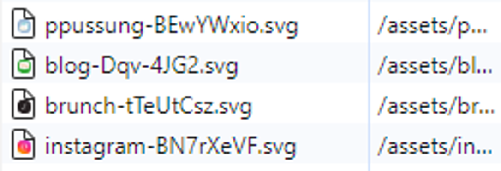

# 13장 - 웹페이지의 성능을 측정하는 다양한 방법-

담당자: Bori [Web FE Lead]
날짜: 2024년 10월 9일
상태: 완료

# 13.1 애플리케이션에서 확인하기

## 13.1.1 cra

- 프로젝트 생성 시에 자동으로 만들어지는 `reportWebVitals.js` | https://github.com/nijuy/todo_list/blob/master/src/reportWebVitals.js
    
    ```jsx
    // 이렇게 만든 함수를 index.js에서 호출하는 형태
    const reportWebVitals = onPerfEntry => {
      if (onPerfEntry && onPerfEntry instanceof Function) {
        import('web-vitals').then(({ getCLS, getFID, getFCP, getLCP, getTTFB }) => {
          getCLS(onPerfEntry);
          getFID(onPerfEntry);
          getFCP(onPerfEntry);
          getLCP(onPerfEntry);
          getTTFB(onPerfEntry);
        });
      }
    };
    
    export default reportWebVitals;
    ```
    

## 13.1.2 cna

- `next/app` 에서 제공하는 `NextWebVitalsMetric` 메서드 사용하기
    
    ```tsx
    // pages/_app.js
    import { NextWebVitalsMetric } from 'next/app'
    
    export function reportWebVitals(metric: NextWebVitalsMetric) {
      console.log(metric);
    }
    ```
    
    ```tsx
    // NextWebVitalsMetric 타입에는 이런 정보들이 있다
    export declare const WEB_VITALS: readonly ["CLS", "FCP", "FID", "INP", "LCP", "TTFB"];
    export type NextWebVitalsMetric = {
        id: string;
        startTime: number;
        value: number;
        attribution?: {
            [key: string]: unknown;
        };
    } & ({
        label: 'web-vital';
        name: (typeof WEB_VITALS)[number]; // 지표 이름 
    } | {
        label: 'custom';
        name: 'Next.js-hydration' | 'Next.js-route-change-to-render' | 'Next.js-render';
    });
    ```
    

- 찾아보니까 `useReportWebVitals` 훅도 있네요 | https://nextjs.org/docs/app/api-reference/functions/use-report-web-vitals
    
    ```tsx
    'use client'
     
    import { useReportWebVitals } from 'next/web-vitals'
    
    // 기본 예제 
    export function WebVitals() {
      useReportWebVitals((metric) => {
        console.log(metric)
      })
    }
    
    // 외부 전송하는 예제
    export function WebVitals() {
    	useReportWebVitals((metric) => {
    	  const body = JSON.stringify(metric)
    	  const url = 'https://example.com/analytics'
    	 
    	  if (navigator.sendBeacon) {
    	    navigator.sendBeacon(url, body)
    	  } else {
    	    fetch(url, { body, method: 'POST', keepalive: true })
    	  }
    	})
    }
    ```
    
    ```tsx
    import { WebVitals } from './_components/web-vitals'
     
    export default function Layout({ children }) {
      return (
        <html>
          <body>
            <WebVitals />
            {children}
          </body>
        </html>
      )
    }
    ```
    

# 13.2 Google Lighthouse



각각의 모드에 대해 알아보는 챕터

## 13.2.1 탐색 모드

- 처음 페이지에 접속~ 페이지 로딩이 완료될 때까지 성능 측정하는 모드
    
    
    

## 13.2.2 기간 모드 (시간 범위)

- 측정 시작 시점~ 종료 시점을 임의로 설정할 수 있는 모드. 시작-종료 사이에 자유롭게 탐색 가능
    
    
    
    - `트리맵 보기`
        
        페이지를 불러올 때 로딩한 리소스를 모아볼 수 있게 제공하는 페이지로 이동
        
        
        
        트리맵은 이런 네모네모를 말해요 네모 크기가 클 수록 용량 큰 거
        
        <aside>
        🔍
        
        **번들 분석용 라이브러리**
        
        cra로 만든 프로젝트면 → [cra-bundle-analyzer - npm (npmjs.com)](https://www.npmjs.com/package/cra-bundle-analyzer)
        
        next.js로 만든 프로젝트면 → https://www.npmjs.com/package/@next/bundle-analyzer
        
        </aside>
        
    - `흔적 보기`
        
        
        
        개발자도구의 성능 탭으로 이동합니다
        
        - `네트워크` 서비스 로드 과정에서 발생한 네트워크 요청을 시간 순서대로 보여주는 섹션
            
            
            
            펼쳐서 확대해보면 요청 1개당 박스플롯 하나가 그려지는 걸 확인할 수 있는데요
            
            
            
            이렇게 해석하면 됩니다
            
            
            
            박스플롯 하나 클릭하면 요약 섹션에서 관련 정보도 보여
            
        - `프레임` 화면 변화가 생길 때마다 스냅샷 찍어서 보여주는 섹션
            
            
            
        
        - `타이밍` User Timing API로 기록된 정보 보여주는 섹션
            
            
            
            
            
            React 16까지는 여기서 컴포넌트별 렌더링 시간도 보여줬는데요 17부터 지원 중단됨
            
            <aside>
            🔍
            
            **User Timing API |** https://www.w3.org/TR/user-timing/
            
            성능 측정을 위한 API. 마이크로초 단위로 시간을 기록하는 high precision timestamp를 사용하기 때문에 Date() 객체를 사용해서 측정하는 것보다 정확도가 높다 
            
            </aside>
            
        
        - `기본` 메인 스레드에서 실행되는 작업을 플레임 차트로 보여주는 섹션
            
            <aside>
            🔍
            
            **플레임 차트 |** https://cloud.google.com/profiler/docs/concepts-flame?hl=ko
            
            “함수 호출 순서 트리”를 사용해서 만든다고 생각하면 쉬움
            
            
            
            </aside>
            
            
            
            
            
            개발 환경이 아니라서 난독화 때문에 알아보기 힘들긴 한데 파일 정도는 알 수 있네요
            
            근데 엠제이가 굳이.. 이런 힘든 길 가지 말라고 했던 기억이.. 
            
        - `요약`
            
            
            
            
            
            도넛 차트에서 유휴 상태가 너무 압도적이라면 네트워크 속도 제한을 걸어보세요 그럼 좀 나음
            
        

## 13.2.3 스냅샷

- **현재 페이지 상태**에서의 성능 분석하는 모드. 엄청 빨리 끝나고 결과도 제한적으로 보임

<aside>
🔍

**왜 Lighthouse로 성능 측정하면 내 컴퓨터 속도보다 느린 거 같지?**

기분 탓이 아닙니다….. 

실행 결과 가장 아래에 있는 `custom throttling` 위에 커서를 올려보면 사진처럼 뜨는데요


툴팁의 내용을 보면 네트워크 속도가 10,240 kb/s로 제한되는 걸 확인할 수 있어요

감이 안 오신다면 실제 네트워크 속도와 비교해보세요! ➡️ https://fast.com/ko/#

(1 Mb/s = 1,000 kb/s니까 결과에 0 3개 붙이면 됨)

모바일 장치로 성능 분석할 경우에는 더욱 제한된 환경에서 측정합니다

이는 모바일이 상대적으로 데스크톱보다 느린 것을 재현하기 위해서입니다


RTT도 커지고~ 처리량도 6.25배 낮아짐  

</aside>

# 13.3 WebPageTest | https://www.webpagetest.org/

webpagetest에서 제공하는 view 메뉴들을 설명하는 챕터

## 13.3.1 Performance Summary~Opportunities & Experiments

](../../imgs/13장-Bori/image%2016.png)

[네이버로 한번 돌려봤습니다… 대충 3분 정도 걸린듯?!?!](https://www.webpagetest.org/result/240905_AiDcN3_4T4/)

각 요소를 클릭하면 구체적인 요인과 개선 방안도 알려줍니다

**사이트가 충분히 빠른가?**

- TTFB
- LCP

**사이트의 사용성이 좋은가?**

- CLS
- 메인 스레드 blocking time
- 접근성 이슈 췍
- DOM 사이즈 차이

**사이트의 보안 취약점은?**

- SPOF
- Snyk에 의해 감지되는 취약


이렇게 3번 실행해주고, video를 누르면


시간대별 로딩 프로세스도 보여줍니다 짱이다…

## 13.3.3 Filmstrip

웹사이트가 그려지는 과정을 확인할 수 있는 메뉴

<aside>
🔍

**CSS 스프라이트 기법**

CSS Sprite 생성 사이트 : https://www.toptal.com/developers/css/sprite-generator/

> .svg 파일의 개별 요청이 수행되고 있는데, `CSS 스프라이트 기법`으로 하나의 이미지로 묶으면 요청 개수를 줄일 수 있을 것 - 843p
> 


구글 메뉴의 관련 애플리케이션 이미지도


CSS Sprite 기법으로 관리되고 있고


background-position으로 지정해서 씀



제가 참여 중인 스낵게임에서도 게임 특성상 제공할 이미지가 많아서 잘 활용하고 있어요



숨쉴은 svg 요청이 각각 가고 있는데


합치면 요청이 줄겠죠?!

</aside>

## 13.3.4 Details

Filmstrip의 디테일한 버전이라고 생각하면 됨

## 13.3.5 Web Vitals

웹 지표에 대한 설명이 나오는 메뉴


## 13.3.6 Optimizations

리소스별 최적화 현황을 보여주는 메뉴

<aside>
🔍

**Progressive JPEG**


이렇게 픽셀을 서서히 불러오는 게 아니라


전체 불러놓고! 해상도를 올리는 기법의 렌더링을 말함

적용하는 방법은

- 이미지 편집 툴의 설정 ([링크](https://fullest-sway.tistory.com/2))
- javascript library로도 가능 한 거 같네요 ([Sharp](https://www.npmjs.com/package/sharp))
</aside>

## 13.3.7 Content

에셋을 종류별로 분류해 통계를 보여주는 메뉴 (종류별 크기/로딩 과정/…)


네이버 메인은 이미지가 많더라고요 (언론사 로고, 배너 이미지, 코스피 차트 등)

## 13.3.8 Domains

에셋의 출처를 도메인별로 분류해서 보여주는 메뉴


## 13.3.9 Console Log

console.log 내용을 모아서 보여주는 메뉴


이게 측정 당시의 console.log가 아니어서 정확히 일치하지는 않아요 


## 13.3.10 Detected Technologies

웹사이트 개발에 사용된 기술을 확인할 수 있는 메뉴


이 기능만 써보고 싶다면 분석 오래 걸리니까 크롬 확장 쓰세요 >> https://chromewebstore.google.com/search/wappalyzer


이렇게 분석해줌!

## 13.3.11 Processing

- **`Processing Breakdown`**
    
    메인 스레드가 하는 일을 알려주는 메뉴 (유휴시간은 집계에서 제외)
    
    
    

- **`Timing Breakdown`**
    
    processing breakdown과 동일한데 여기는 유휴시간 포함
    
    
    
    왜 따로 제공하나 했더니.. idle 비중이 높을 때는 이거 거르고 보는 게 편하니까 그런 거 같아요
    

## 13.3.12 Lighthouse Report

라이트하우스로 측정한 지표를 보여준다는데 지금은…. 그런 메뉴가 없던데요!??!?!

그냥 개발자도구 켜고 셀프로 하십시오 

## 13.3.13 🎸

- **`Image Analysis`**
    
    이미지 최적화 시 절약할 수 있는 리소스를 알려주는 cloudinary로 이동
    
    
    
- **`Request Map`**
    
    요청을 시각화한 페이지… 근데 좀 징그러운 거 같기도….
    
    
    
- **`Data cost`**
    
    웹사이트 로딩에 드는 비용을 나라별 가장 저렴한 요금제 기준으로 보여줌
    
    
    
    우리나라는 $0.1 정도로 나옴 
    
- **`Security Score`**
    
    보안 취약점 알려주는 메뉴인데 지금은 안 보이네요
    
    [Snyk에 의해 감지되는 취약](https://www.notion.so/Snyk-0c26f03ea7634fd0bcade314ba05d1c7?pvs=21) 에서 보여주는 거 같아요
    

# 13.4 크롬 개발자 도구

## 13.4.1 성능 통계

](../../imgs/13장-Bori/image%2035.png)

24.09 기준 중단 예정 | [2024년 이후의 성능 도구  |  Blog  |  Chrome for Developers](https://developer.chrome.com/blog/perf-tooling-2024?hl=ko)

## 13.4.2 성능


기기 사양을 바꿔가며 테스트 할 수 있음