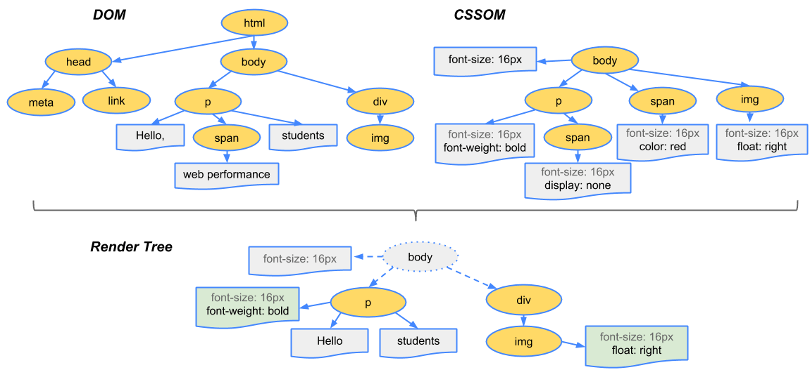
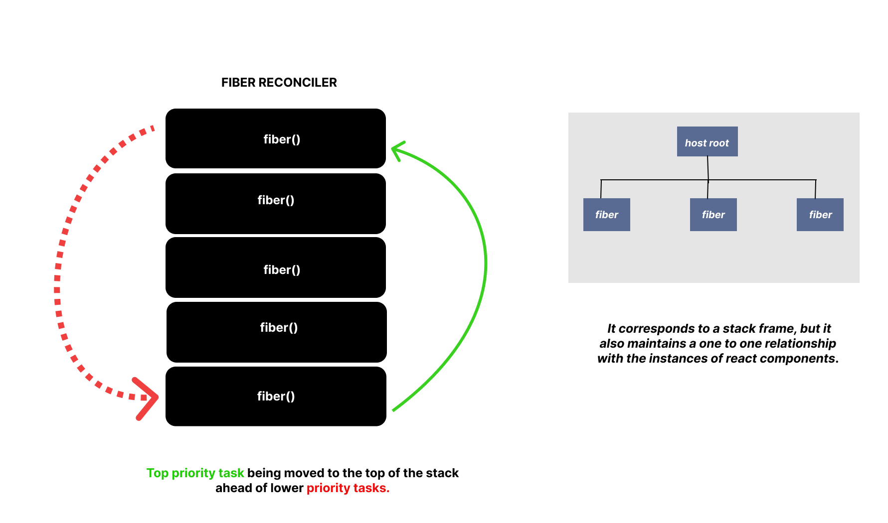
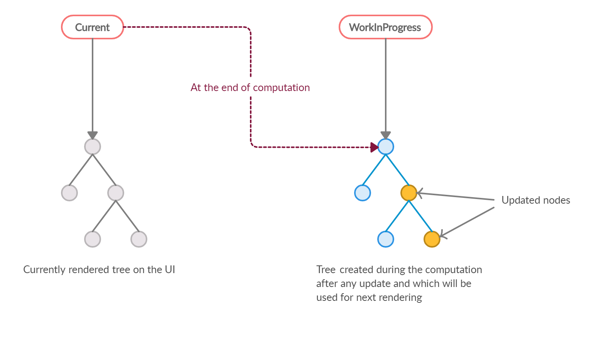
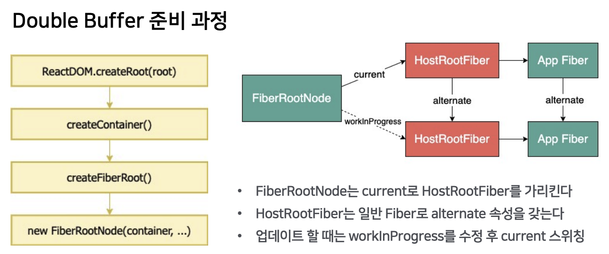
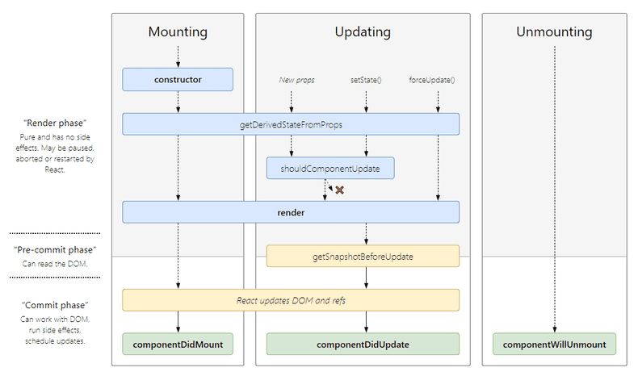

# 리액트 핵심 요소 깊게 살펴보기

- 토글 내의 목차를 통해 원하는 곳으로 바로 이동할 수 있습니다.

<details>
<summary>목차</summary>
<div>

- [리액트 핵심 요소 깊게 살펴보기](#리액트-핵심-요소-깊게-살펴보기)
  - [JSX란](#jsx란)
  - [JSX는 어떻게 자바스크립트에서 변환될까?](#jsx는-어떻게-자바스크립트에서-변환될까)
  - [가상 DOM과 리액트 파이버](#가상-dom과-리액트-파이버)
    - [브라우저 렌더링 과정](#브라우저-렌더링-과정)
    - [가상 DOM](#가상-dom)
      - [리액트 DOM에 대한 오해](#리액트-dom에-대한-오해)
    - [리액트 Fiber](#리액트-fiber)
      - [파이버 재조정자 (fiber reconciler)](#파이버-재조정자-fiber-reconciler)
      - [파이버 노드](#파이버-노드)
      - [리액트 파이버 트리](#리액트-파이버-트리)
      - [파이버 작업 순서](#파이버-작업-순서)
      - [파이버와 가상돔](#파이버와-가상돔)
      - [추천하는 레퍼런스](#추천하는-레퍼런스)
  - [클래스 컴포넌트와 함수 컴포넌트](#클래스-컴포넌트와-함수-컴포넌트)
    - [클래스형 컴포넌트](#클래스형-컴포넌트)
      - [클래스형 컴포넌트의 생명주기 메서드](#클래스형-컴포넌트의-생명주기-메서드)
      - [중요한 생명주기 메서드만 살펴보기](#중요한-생명주기-메서드만-살펴보기)
        - [getDerivedStateFromError()](#getderivedstatefromerror)
        - [componentDidCatch()](#componentdidcatch)
        - [ErrorBoundary](#errorboundary)
      - [클래스형 컴포넌트의 한계](#클래스형-컴포넌트의-한계)
    - [함수형 컴포넌트](#함수형-컴포넌트)
  - [렌더링은 어떻게 일어나는가?](#렌더링은-어떻게-일어나는가)
    - [리액트의 렌더링이란?](#리액트의-렌더링이란)
      - [언제 렌더링이 되나요?](#언제-렌더링이-되나요)
      - [렌더링 프로세스](#렌더링-프로세스)
      - [렌더](#렌더)
      - [커밋 단계](#커밋-단계)
  - [메모이제이션](#메모이제이션)
    - [주장1: 섣부른 최적화는 독이다, 꼭 필요한 곳에만 메모이제이션을 추가하자.](#주장1-섣부른-최적화는-독이다-꼭-필요한-곳에만-메모이제이션을-추가하자)
    - [주장2: 렌더링 과정의 비용은 비싸다, 모조리 메모이제이션해 버리자.](#주장2-렌더링-과정의-비용은-비싸다-모조리-메모이제이션해-버리자)
  - [JSX 추가로 알아보기](#jsx-추가로-알아보기)
    - [참조](#참조)
    - [infreno](#infreno)
  - [리액트 파이버 추가로 알아보기](#리액트-파이버-추가로-알아보기)
    - [참조](#참조-1)
    - [리액트 파이버](#리액트-파이버)
    - [동시성 스케줄링](#동시성-스케줄링)
      - [React의 동작 단계](#react의-동작-단계)
    - [virtual DOM은?](#virtual-dom은)
    - [리액트 파이버의 역할 두 줄 요약](#리액트-파이버의-역할-두-줄-요약)

</div>
</details>

<br>

## JSX란

자바스크립트로 표현하기 어려웠던 트리 구문을 XML 스타일로 작성할 수 있게 도와준다.

- JSX는 리액트의 전유물이 아닌 독자적인 문법으로도 볼 수 있다.
- JSX는 리액트 트랜스파일러를 거쳐야 자바스크립트 코드로 변환된다.

**JSXElement**

- Opening
- Closing
- Self Closing
- Fragment

**JSXElementName**은 JSXElement 이름으로 쓸 수 있는 것을 의미

- JSXIdentifier: ($)(\_)는 가능, 자바스크립트 변수처럼 숫자로 시작하거나 다른 특수문자 시작 안됨.
- ~~JSXNamespacedName: (JSXIdentifier:JSXIdentifier)과 같이 :(콜론)으로 서로 다른 식별자를 이어준다. 현재 리액트에서 사용하지 않는다.~~
- ~~JSXMemberExpression:(JSXIdentifier.JSXIdentifier)과 같이 .(dot)으로 서로 다른 식별자를 이어준다. 현재 리액트에서 사용하지 않는다.~~

**JSXAttributes**

- JSXSpreadAttributes: js의 spread 연산자
- JSXAttributeName, JSXAttributeValue: props를 표현한다. 문자열은 js의 문자열과 같고, value는 표현식이 들어간다.
- JSXElement: 값으로 다른 JSX 요소가 들어갈 수 있다.

**JSXChildren**

- JSXChild: JSXChildren의 기본 단위로, Text, Element, Fragment, Expression이 될 수 있다.

- JSXString: HTML을 그대로 사용할 수 있게 HTML에서 표현 가능한 문자열을 모두 사용할 수 있다. 다만, 자바스크립트의 이스케이프 문자는 \\와 같이 표현해야 한다.

```tsx
// JSXSpreadAttributes
<A {...{ required: true }} />
// JSXAttributeName
<A required />
<A required={false} />
<B text="리액트" />
// JSXElement
<B optionalChildren={<>안녕하세요.</>} />
```

## JSX는 어떻게 자바스크립트에서 변환될까?

@babel/plugin-transfom-react-jsx 플러그인을 통해 JSX가 자바스크립트로 변환된다.

리팩터링 예시로 JSX가 React.createElement로 귀결되기 때문에 그냥 createElement를 사용하고 attributes와 children을 변경해서 사용할 수 있다.

```jsx
// before
function TextOrHeading({ isHeading, children }: PropsWithChildren<{ isHeading:boolean }>) {
	return isHeading (
		<h1 className="text">{children}</h1>
	)	: (
		<span className="text">{children}</span>
	)
}

// after
function TextOrHeading({ isHeading, children }: PropsWithChildren<{ isHeading:boolean }>) {
    return createElement(
        isHeading ? 'h1' : 'span',
        { className: 'text' }
        children
    )
}

```

그리고 jsx는 react만의 전유물이 아니기 때문에, 다른 라이브러리에서도 사용할 수 있다고 함.

> 다른 라이브러리에서의 jsx 알아보기 [JSX 추가로 알아보기](#JSX-추가로-알아보기)

## 가상 DOM과 리액트 파이버

### 브라우저 렌더링 과정



DOM + CSSOM = Render Tree

### 가상 DOM

사용자와 인터랙션으로 발생하는 레이아웃과 리페인팅은 비용이 큰 작업이다.
그리고 DOM의 모든 변경 사항을 추적하는 것은 개발자에게 많은 업무를 부담하게 한다.
`가상DOM`은 메모리에 DOM처럼 생긴 오브젝트를 저장하고, 모든 과정을 가상 DOM에서 처리하고 변경에 대한 준비가 완료 됐을 때 실제 DOM에 반영한다.

> 리액트 18 버전부터는 batching이 추가돼 상태 변경을 일괄 처리해줍니다! (batching은 특정한 주기로 업데이트를 몰아서 해주는건데, 이제는 promise나 setTimeout도 처리해줌! )

#### 리액트 DOM에 대한 오해

가상 DOM이 일반 DOM보다 빠르다는 것은 잘 알려진 오해 중 하나이다.

> If you've used JavaScript frameworks in the last few years, you've probably heard the phrase 'the virtual DOM is fast', often said to mean that it's faster than the real DOM. It's a surprisingly resilient **meme** — for example people have asked how Svelte can be fast when it doesn't use a virtual DOM. - svelete 공식 문서

그것은 밈일 뿐이다!

### 리액트 Fiber

여러 번의 렌더링 과정을 압축해 렌더링 최적화를 해준다.

#### 파이버 재조정자 (fiber reconciler)

- reconciliation: 가상 DOM과 실제 DOM을 비교하는 작업(알고리즘) (https://ko.legacy.reactjs.org/docs/reconciliation.html)

파이버는 웹 애플리케이션에서 발생하는 애니메이션, 레이아웃, 그리고 사용자 인터랙션에 올바른 결과물을 만드는 반응성 문제를 해결하는 것이다.

과거에는 stack으로 재조정 과정을 거쳤다

싱글 스레드에서 스택은 중단할 수 없었기 때문에 비효율성까지 이어졌다. (글자 입력에 이어지는 작업들을 모두 스택에 쌓으면 글자 입력에 딜레이가 걸릴 수 있다)

#### 파이버 노드

```tsx
function FiberNode(tag, pendingProps, key, mode) {
  // Instance
  this.tag = tag; // fiber의 종류를 나타냄
  this.key = key;
  this.type = null; // 추후에 React element의 type을 저장
  this.stateNode = null; // 호스트 컴포넌트에 대응되는 HTML element를 저장 (파이버 관련 상태를 저장하고 있다)

  // Fiber 리액트 컴포넌트 트리처럼 파이버도 트리 형식을 갖는다.
  this.return = null; // 부모 fiber
  this.child = null; // 자식 fiber
  this.sibling = null; // 형제 fiber
  this.index = 0; // 형제들 사이에서의 자신의 위치
  this.ref = null; // ref
  this.refCleanup = null; // ref 정리를 위한 콜백 함수
  this.pendingProps = pendingProps; // workInProgress는 아직 작업이 끝난 상태가 아니므로 props를 pending으로 관리 (아직 작업을 미처 처리하지 못한 props)
  this.memoizedProps = null; // Render phase가 끝나면 pendingProps는 memoizedProps로 관리 (작업을 다 처리하고 나서 memoization한 props)
  this.updateQueue = null; // 컴포넌트 종류에 따라 element의 변경점 또는 라이프사이클을 저장 (업데이트에 관련된 상태, 콜백, DOM의 작업을 담아둔다)
  this.memoizedState = null; // 함수형 컴포넌트는 훅을 통해 상태를 관리하므로 hook 리스트가 저장된다.
  this.dependencies = null; // 함수형 컴포넌트에서 사용하는 의존성 배열

  this.mode = mode; // 컴포넌트의 동작 모드 (예: ConcurrentMode, BlockingMode 등)

  // Effects
  this.flags = NoFlags; // 현재 fiber의 side effect 플래그
  this.subtreeFlags = NoFlags; // 서브 트리에 존재하는 side effect 플래그의 비트 마스크
  this.deletions = null; // 삭제된 fiber 서브 트리를 가리키는 포인터
  this.effectTag = NoEffect; // fiber가 가지고 있는 side effect를 기록
  this.nextEffect = null; // side effect list
  this.firstEffect = null; // side effect list
  this.lastEffect = null; // side effect list

  this.expirationTime = NoWork; // 컴포넌트 업데이트 발생 시간을 기록
  this.childExpirationTime = NoWork; // 서브 트리에서 업데이트가 발생할 경우 기록

  this.lanes = NoLanes; // 현재 fiber와 관련된 lanes (업데이트 우선순위)
  this.childLanes = NoLanes; // 자식 fiber들의 lanes 비트 마스크

  this.alternate = null; // 반대편 fiber를 참조
}
```

보다시피 매우 많은 속성을 가지고 있고, 파이버 노드는 최초 마운트 시점에 파이버 생성 함수들로 생성을 하고 이후로 가급적 재사용된다.

생성 함수 종류

- **createFiber:** 새로운 Fiber 노드를 생성하는 함수
- **createFiberFromElement:** React Element로부터 Fiber 노드를 생성하는 함수
- **createFiberFromTypeAndProps:** 주어진 타입과 props로부터 Fiber 노드를 생성하는 함수
- **createFiberFromFragment:** Fragment로부터 Fiber 노드를 생성하는 함수

이렇게 생성된 파이버는

- state 변경
- DOM의 변경
- 생명주기 메서드 (class형 컴포넌트)
  등 의 변경이 필요한 시점에 실행된다.

파이버는 이런 노드들의 변경사항에 대해 우선순위를 정하고 처리하게 하는 스케쥴링 능력까지 갖췄다.

#### 리액트 파이버 트리

파이버 트리는 2가지가 존재하는데, 위에서 설명한 `파이버 트리`와 상태를 나타내는 `workInProgress 트리` 이다.


리액트 파이버는 파이버 트리의 작업이 끝나면 **커밋 단계**에서 포인터를 변경해 workInProgress 트리를 현재 트리로 변경하는 `더블 버퍼링` 방식을 사용한다.


간단하게, current와 workInProgress가 계속 swap 된다. (swap에는 비용이 들기 때문에 당연히 메모리를 더 사용!)

#### 파이버 작업 순서

1. beginWork()
   파이버 노드를 만드는데, 자식없는 딩크 노드를 만날 때까지 탐색
2. completeWOrk()
   위 작업이 완료되면 호출
3. 형제가 있다면 형제로 넘어감.
4. return으로 돌아가 작업이 완료됨을 알린다.


#### 파이버와 가상돔

파이버: 리액트 컴포넌트에 대한 정보를 1:1로 가지고 있는 것, 리액트 아키텍처 내부에서 비동기로 이뤄짐

> 실제 브라우저 구조인 DOM에 반영하는 것은 동기적으로 일어나야 함, 따라서 메모리 상에서 먼저 수행해서 최종적인 결과물만 DOM에 적용한다.

#### 추천하는 레퍼런스

[리액트 까보기 시리즈](https://www.youtube.com/watch?v=JadWu4Ygnyc&list=PLpq56DBY9U2B6gAZIbiIami_cLBhpHYCA)

## 클래스 컴포넌트와 함수 컴포넌트

### 클래스형 컴포넌트

레거시 방식의 컴포넌트로 클래스를 사용해서 컴포넌트를 선언한다.

#### 클래스형 컴포넌트의 생명주기 메서드

생명주기는

- mount: 컴포넌트가 생성되는 시점
- update: 생성된 컴포넌트의 내용이 변경되는 시점
- unmount: 컴포넌트가 더이상 존재하지 않는 시점
  3가지로 구분할 수 있다.

클래스형 컴포넌트에서는 생명주기 메서드로 3가지 생명주기의 앞뒤로 메서드를 호출할 수 있다. 혹은 특정 상황에 동작하는 생명주기 메서드가 존재한다.

#### 중요한 생명주기 메서드만 살펴보기

##### getDerivedStateFromError()

자식 컴포넌트에서 에러가 발생했을 때 호출되는 에러 메서드이다.
대표적으로 ErrorBoundary 컴포넌트가 사용하는 생명주기 메서드이다.
static 키워드를 사용하고, 에러가 발생했을 때 어떻게 표시할 것인지 결정하기 때문에 부수효과 없이 정해둔 state를 반환해야 한다.

##### componentDidCatch()

자식 컴포넌트에서 에러가 발생했을 때 호출되는 에러 메서드이다.
getDerivedStateFromError에서 에러를 잡고 state를 결정한 이후에 실행된다.
error와 errorInfo라는 인수를 받고, 부수효과를 처리할 수 있다.

##### ErrorBoundary

리액트 컴포넌트 트리에서 에러가 전파되는 것을 방지하는 용도로 사용하는 컴포넌트이다.

> ErrorBoundary에서 componentDidCatch는 개발모드와 프로덕션 모드에서 다르게 동작한다.
> 개발모드일 때에는 에러가 window까지 전파돼 window 이벤트 핸들러에서 처리할 수 있다.
> 프로덕션모드일 때에는 componentDidCatch로 잡히지 않은 에러만 window에 전파됨.
> 즉, window까지 차단이 되고 안되고의 차이!

> componentDidCatch의 errorInfo 인수에는 에러가 발생한 컴포넌트의 정보를 제공한다. 표기되는 이름은 displayName이나 Function.name을 따른다. React.memo 함수를 쓰면 추적하기 어렵지만 displayName 속성을 추가해주면 추적이 가능해진다! (shadcn-ui 라이브러리를 보면 displayName이 항상 추가돼 있다!)

#### 클래스형 컴포넌트의 한계

- state의 흐름을 추적하기 어렵다
- 내부 로직 재사용이 어렵다
- 많은 생명주기 함수로 인해 컴포넌트의 크기가 커진다.
- 트리쉐이킹도 되지 않기 때문에 번들링에서도 불리하다.
- 핫리로딩 될 때 인스턴스를 새로 만들지 않고서 수정된 render 메서드를 반영할 수 없기 때문에 값이 초기화되는 문제도 있다.

### 함수형 컴포넌트

클래스형 컴포넌트의 한계들을 해결하고, 개발자가 의도한대로 동작하는 컴포넌트 방식이다.
클래스형 컴포넌트의 this는 mutable이기 때문에 this를 참조하는 경우 동작 중 값이 변경되면 변경된대로 읽게된다.
hooks를 통해 라이프사이클과 상태를 관리할 수 있게돼 클래스형 컴포넌트보다 직관적으로 사용할 수 있다.

## 렌더링은 어떻게 일어나는가?

### 리액트의 렌더링이란?

리액트 트리안에 있는 모든 컴포넌트들이 현재 자신들이 가지고 있는 props와 state의 값을 기반으로 어떻게 UI를 구성하고 이를 바탕으로 DOM 결과를 브라우저에 제공할 것인지 계산하는 일련의 과정을 의미한다.

#### 언제 렌더링이 되나요?

1. 최초 렌더링
   사용자가 처음 애플리케이션에 진입했을때 확인하는 UI

2. 리렌더링
   최초 렌더링 이후로 발생하는 모든 렌더링

- useState의 setState가 실행되는 경우
- useReducer의 dispatch가 실행되는 경우
- `key` props가 변경되는 경우 (데이터의 변경이 있을 때, 어떤 데이터가 변경됐는지 식별하기 위함)
- props가 변경되는 경우 (부모로부터 받는 데이터가 변경됐기 때문에 자식 컴포넌트에서도 변경이 필요하다)
- 부모 컴포넌트가 렌더링될 경우

#### 렌더링 프로세스

컴포넌트 함수 자체를 처음으로 호출하여, 결과물을 저장한다.

> React.createElement 함수를 통해 자식 컴포넌트들을 하나 둘 호출하여 리액트 트리를 만든다. 이렇게 만들어진 트리를 가상 DOM과 비교해 실제 DOM에 변경하기 위한 모든 변경 사항을 차례차례 수집한다.

#### 렌더

리액트에서 렌더 단계는

- 컴포넌트를 렌더링하고
- 변경 사항을 계산하는 모든 작업 (diffing)
  을 말한다

#### 커밋 단계

렌더 단계에서의 변경 사항을 실제 DOM에 반영한다.
커밋 단계가 끝나야지만 브라우저 렌더링이 일어난다.

> 리액트의 렌더링만으로 DOM이 업데이트되지는 않는다.
> 예를 들어, memo로 래핑해둔 컴포넌트는 props가 변경되지 않는 한 리렌더되지 않는다.

## 메모이제이션

리액트에서 렌더링이 자주 일어나는 컴포넌트를 어떻게 식별하고 최적화할 수 있을까? 어떤 연산이 무거운 연산일까? 메모이제이션을 무조건 하는것이 좋을까? 아니면 섣불리 메모이제이션을 해서는 안될까?

### 주장1: 섣부른 최적화는 독이다, 꼭 필요한 곳에만 메모이제이션을 추가하자.

메모이제이션에도 비용이 든다.

- 값을 비교하고
- 렌더링 또는 재계산이 필요한지 확인하고
- 이전에 결과물을 저장해 두었다가 다시 꺼내와야 하는 작업

이 포함된다.
위의 비용이 리렌더링 비용보다 저렴하다고 판단할 수 있어야 의미있는 최적화를 수행할 수 있다.

> 이 주장의 방증은 리액트 자체에서 왜 개발자에게 메모이제이션 권한을 넘겨주었는지로 증명할 수 있다.

### 주장2: 렌더링 과정의 비용은 비싸다, 모조리 메모이제이션해 버리자.

개발을 하면서 모든 케이스에 대한 성능을 검토하기는 쉽지 않다.
역으로 메모이제이션이 도움이 안되는 경우에서의 비용은 props의 얕은 비교가 이루어지는 비용이다. (props가 크다면 비용이 커질 수도 있다)
하지만, 메모이제이션을 놓침으로써 발생하는 문제는

- 렌더링을 함으로써 발생하는 비용
- 컴포넌트 내부의 복잡한 로직의 재실행
- 그리고 위 두 가지가 모든 자식에서 반복해서 일어남
- 리액트가 구 트리와 신규 트리를 비교

로 메모이제이션 안했을 때의 잠재적 비용이 더 크다.

```tsx
// 이 훅은 객체 내부의 값은 같지만, 참조가 변경된다.
function useMath(number: number) {
  const [double, setDouble] = useState(0);
  const [triple, setTriple] = useState(0);

  useEffect(() => {
    setDouble(number * 2);
    setTriple(number * 3);
  }, [number]);

  // No memoization
  return { double, triple };
  // Memoization
  return useMemo(() => ({ double, triple }), [double, triple]);
}
```

## JSX 추가로 알아보기

inferno라는 라이브러리도 jsx를 사용한다.

### 참조

https://www.infernojs.org/docs/guides/components

### infreno

```js
import { render } from "inferno";

const MyComponent = ({ name, age }) => (
  <span>
    My name is: {name} and my age is: {age}
  </span>
);

// usage
render(<MyComponent name="Inferno" age={2} />, container);
```

JSX 문법을 읽고 js로 변환할 수 있으면 어떤 라이브러리던 JSX 문법을 사용할 수 있다. (JSX의 핵심 개념들을 알고 있다면, 다른 라이브러리를 배우기도 쉬워진다)

## 리액트 파이버 추가로 알아보기

### 참조

https://d2.naver.com/helloworld/2690975
https://www.youtube.com/watch?v=0ympFIwQFJw
https://velog.io/@intersoom/TSL-React-Fiber%EB%9E%80

### 리액트 파이버

> 파이버는 애니메이션과 반응성에 중점을 둔 자바스크립트 오브젝트이다.
> 작업을 작게 나누고 우선순위를 정하고, 멈췄다가 돌아올 수도 있다  
> 작업을 재사용하거나 필요하지 않은 경우 없앨 수도 있다.
> 비동기이다. (stack 방식이면 모든 콜스택을 비워야 하기 때문에 지연이 생길 수 있다)

파이버도 결국에는 작업 단위이다. 파이버를 해결하면 finished work를 commit하고, DOM에 반영한다음에 다음 작업을 수행한다.

파이버는 24개의 속성과 1대1 관계를 갖고 있다. (마치 React Element와 비슷하다. 하지만 React element는 매번 재생성하지만, 파이버는 initial mount때 생성하여 재사용한다.)

React Element가 트리를 만들 듯, 파이버도 트리를 형성한다.
단, 파이버 트리의 노드는 자식 하나만 갖고, 형제나 부모를 가리키는 포인터를 갖고 있고 반환은 상위 노드로 한다.

### 동시성 스케줄링

파이버가 기존의 스택 재조정자(리액트 v16 이전 가상돔 시절)와 근본적으로 다른 점은 동시성이다. DOM 업데이트, 렌더링 로직을 작업 단위로 구분하고 이를 비동기로 실행하여 최대 실행 시간이 16ms가 넘지 않도록 제어한다. (requestAnimationFrame을 사용하거나 requestIdleCallback을 사용한다)

#### React의 동작 단계



Render 단계(processing): 사용자 이벤트, 상태 변경 등으로 컴포넌트 트리의 업데이트가 필요할 때 시작된다.
JSX 선언 또는 React.createElement()를 통해 일반 객체인 Reat 엘리먼트를 생성한다.
렌더링 단계에서는 보이지 않는 비동기식 동작을 한다. (사용자에게 보이지 않을 때 실행해야 함) 스케쥴링 작업을 하고 beginWork(트리 만들기)나 completeWork를 통해 작업을 수행한다. (파이버를 생성해서 작업 큐에 넣는다, 비동기적으로 스케쥴러가 우선순위에 알맞게 rAF에 잘끼워맞춤)

Reconcile 단계: 이전에 렌더링된 실제 DOM 트리와 새로 렌더링할 React 엘리먼트를 비교하여 변경점을 적용한다.
Commit 단계(committing): 새로운 DOM 엘리먼트를 브라우저 뷰에 커밋한다. (mutation phase)
commitWork를 호출하고 동기식이기 때문에 중단될 수 없다. 모든 effect를 살펴보고 컴포넌트 인스턴스에 적용한다. 변경 사항이 사용자에게 보여지기 때문에 동기적인 것이다.
커밋 단계가 끝나면 라이프사이클 메서드나(특정 라이프사이클 메서드이다, DOM이 변경된 이후), useEffect 등을 실행한다. (DOM이 갱신됐기 때문에 부수 효과를 실행해도 된다, layout phase라고도 한다)

Update 단계: props, state 변경 시 해당 컴포넌트와 하위 컴포넌트에 대해 위 과정을 반복한다.

### virtual DOM은?

여기까지 분석하고 나서 한 가지 의문이 들었다. React의 핵심 개념이라고 할 수 있는 virtual DOM이 결국 무엇을 칭하는 것인가? React 엘리먼트인가? FiberNode인가? 아니면 Commit 단계의 updateQueue인가?

여러 분석 자료를 살펴보았지만 통일된 의견이 없고 마찬가지로 재조정 과정을 자세하게 분석할수록 virtual DOM에 대해 혼란스러워 하는 사람들이 많았다. 심지어 React 팀 내부에서도 다르게 호칭하는 경우도 있었다.

이미 React 개발자인 Dan Abramov가 virtual DOM이라는 용어 자체를 폐기할 것을 권고하고 있었다. virtual DOM은 React가 렌더링할 때마다 DOM을 생성하지 않는다는 점을 명확히 하기 위해 도입했지만 현재는 사용자들이 더 이상 그러한 오해를 하지 않으며 오히려 DOM의 이슈를 극복하기 위해 virtual DOM을 도입했다는 오해를 하고 있어 React의 의도와 다르게 해석되고 있기 때문이라고 한다. 대신에 UI를 값으로 다룬다는 의미에서 “value UI”라 표현하기를 권고한다.
(https://d2.naver.com/helloworld/2690975)

### 리액트 파이버의 역할 두 줄 요약

- Reconciliation 및 Scheduling
  Reconciliation은 이전 트리와 현재 트리의 차이를 계산하는 알고리즘이다.
  Scheduling은 작업을 언제 수행할지 결정하는 과정이다.

React 애플리케이션이 렌더링될 때, JSX 코드가 React 엘리먼트로 변환됩니다. 이 React 엘리먼트 트리를 기반으로 Fiber 트리가 구축됩니다.
React Fiber는 Fiber 트리를 사용하여 작업을 수행하고, 실제 DOM을 업데이트합니다.

> **핵심 요약**
> 파이버 트리를 사용해서 렌더링 작업 및 스케쥴링
> Fiber 트리의 변화를 가상 DOM과 비교하여, 실제 DOM 업데이트를 최소화할 수 있다.
> 가상 DOM은 처음에 createElement를 실행하면서 생성되고, props나 state가 변하면 새로운 Element가 생김.
