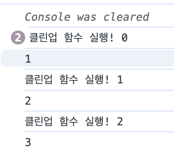
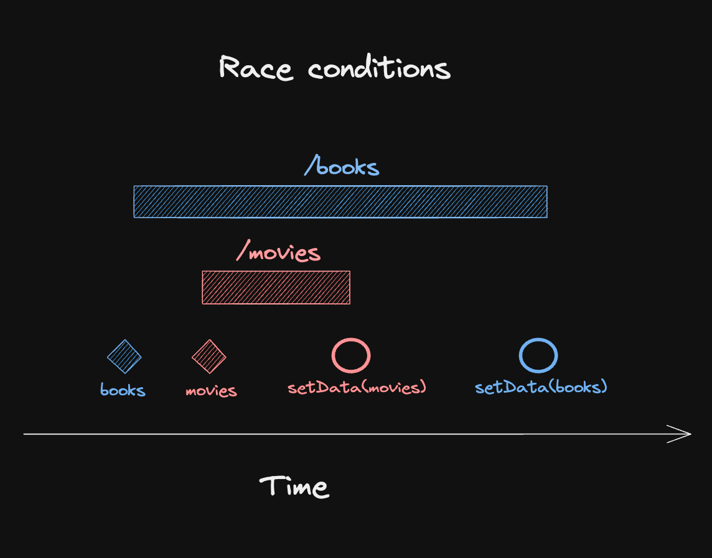
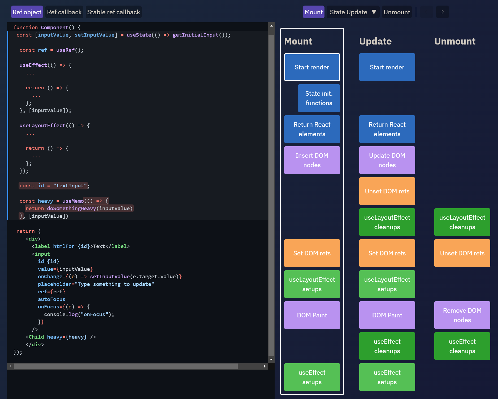

- 함수형 컴포넌트가 상태(state)를 사용하거나 클래스형 컴포넌트의 생명주기 메서드를 대체하기 위해 훅(hook)이 추가되었음

## useState()

- 함수형 컴포넌트 내부에서 상태를 관리할 수 있게 해줌

```tsx
export default function App() {
  const [, triggerRender] = useState();

  let state = "hello";

  console.log("Rendering!");

  const handleClickButton = () => {
    state = "hi";
    triggerRender(undefined);
  };

  return (
    <div className="App">
      <h1>{state}</h1>
      <button onClick={handleClickButton}>hi</button>
    </div>
  );
}
```

- `triggerRender()`를 호출하여 렌더링을 일으키지만 매번 `state`는 “hello”로 초기화되어 “hi”가 렌더링되지 않음
  - 렌더링이 일어날 때마다 함수가 다시 실행된다는데 왜 콘솔에 “Rendering”이 찍히지 않는 것인가…..
  - [CodeSandbox](https://codesandbox.io/p/sandbox/usestate-rerendering-v82dlr?layout=%7B%22sidebarPanel%22%3A%22EXPLORER%22%2C%22rootPanelGroup%22%3A%7B%22direction%22%3A%22horizontal%22%2C%22contentType%22%3A%22UNKNOWN%22%2C%22type%22%3A%22PANEL_GROUP%22%2C%22id%22%3A%22ROOT_LAYOUT%22%2C%22panels%22%3A%5B%7B%22type%22%3A%22PANEL_GROUP%22%2C%22contentType%22%3A%22UNKNOWN%22%2C%22direction%22%3A%22vertical%22%2C%22id%22%3A%22cm02wynik00063b6jn45bpjxb%22%2C%22sizes%22%3A%5B100%2C0%5D%2C%22panels%22%3A%5B%7B%22type%22%3A%22PANEL_GROUP%22%2C%22contentType%22%3A%22EDITOR%22%2C%22direction%22%3A%22horizontal%22%2C%22id%22%3A%22EDITOR%22%2C%22panels%22%3A%5B%7B%22type%22%3A%22PANEL%22%2C%22contentType%22%3A%22EDITOR%22%2C%22id%22%3A%22cm02wynik00023b6jt5co8rqa%22%7D%5D%7D%2C%7B%22type%22%3A%22PANEL_GROUP%22%2C%22contentType%22%3A%22SHELLS%22%2C%22direction%22%3A%22horizontal%22%2C%22id%22%3A%22SHELLS%22%2C%22panels%22%3A%5B%7B%22type%22%3A%22PANEL%22%2C%22contentType%22%3A%22SHELLS%22%2C%22id%22%3A%22cm02wynik00033b6jkg9wxd0r%22%7D%5D%2C%22sizes%22%3A%5B100%5D%7D%5D%7D%2C%7B%22type%22%3A%22PANEL_GROUP%22%2C%22contentType%22%3A%22DEVTOOLS%22%2C%22direction%22%3A%22vertical%22%2C%22id%22%3A%22DEVTOOLS%22%2C%22panels%22%3A%5B%7B%22type%22%3A%22PANEL%22%2C%22contentType%22%3A%22DEVTOOLS%22%2C%22id%22%3A%22cm02wynik00053b6jw489wkvm%22%7D%5D%2C%22sizes%22%3A%5B100%5D%7D%5D%2C%22sizes%22%3A%5B50%2C50%5D%7D%2C%22tabbedPanels%22%3A%7B%22cm02wynik00023b6jt5co8rqa%22%3A%7B%22tabs%22%3A%5B%7B%22id%22%3A%22cm02wynik00013b6j2d8xbh9k%22%2C%22mode%22%3A%22permanent%22%2C%22type%22%3A%22FILE%22%2C%22filepath%22%3A%22%2Fsrc%2Findex.js%22%7D%5D%2C%22id%22%3A%22cm02wynik00023b6jt5co8rqa%22%2C%22activeTabId%22%3A%22cm02wynik00013b6j2d8xbh9k%22%7D%2C%22cm02wynik00053b6jw489wkvm%22%3A%7B%22tabs%22%3A%5B%7B%22id%22%3A%22cm02wynik00043b6jm6ivzww2%22%2C%22mode%22%3A%22permanent%22%2C%22type%22%3A%22UNASSIGNED_PORT%22%2C%22port%22%3A0%2C%22path%22%3A%22%2F%22%7D%5D%2C%22id%22%3A%22cm02wynik00053b6jw489wkvm%22%2C%22activeTabId%22%3A%22cm02wynik00043b6jm6ivzww2%22%7D%2C%22cm02wynik00033b6jkg9wxd0r%22%3A%7B%22tabs%22%3A%5B%5D%2C%22id%22%3A%22cm02wynik00033b6jkg9wxd0r%22%7D%7D%2C%22showDevtools%22%3Atrue%2C%22showShells%22%3Afalse%2C%22showSidebar%22%3Atrue%2C%22sidebarPanelSize%22%3A15%7D)
  - 의문 해결
    리액트는 내부적인 최적화의 일환으로 기존 상태와 업데이트 되는 상태를 `is()` 메서드로 비교하여 차이가 없을 경우 렌더링(함수 컴포넌트 실행)을 수행하지 않는다!
    `{}`, `[]`와 같이 참조값이 달라질 경우 렌더링이 수행되고 콘솔에 “Rendering”이 찍히는 것을 확인할 수 있다.
    - https://github.com/facebook/react/blob/b53ea6ca05d2ccb9950b40b33f74dfee0421d872/packages/react-reconciler/src/ReactFiberHooks.js#L1335
    - https://d5br5.dev/blog/deep_dive/react_useState_source_code

### useState 구현해보기

```tsx
// 외부에 store가 존재한다
const global = {};
let index = 0;

function useState(initialState) {
  if (!global.states) {
    // 애플리케이션 전체의 states 배열 초기화
    global.states = [];
  }

  // states 정보 조회하여 현재 상태값이 있는지 확인, 없다면 초깃갑으로 설정
  const currentState = global.states[index] || initalState;
  global.states[index] = currentState;

  const setState = (function () {
    // 현재 index를 클로저로 가둬나서 이후에도 계속해서 동일한 index에 접근할 수 있도록 함
    let currentIndex = index;
    return function (value) {
      global.states[currentIndex] = value;
    };
  })();
  // useState 쓸 때마다 index 하나씩 추가, 이 index는 setState에서 사용
  // 즉, 하나의 state마다 index가 할당돼 있어 그 index가 배열의 값을 가리키고 필요할 때마다 그 값을 가져온다
  index = index + 1;

  return [currentState, setState];
}
```

- 실제 리액트 코드에서는 `useReducer()`를 통해 구현되어 있음

  - 정확히는 동일한 Update 구현체

  ```tsx
  function updateState<S>(
    initialState: (() => S) | S
  ): [S, Dispatch<BasicStateAction<S>>] {
    return updateReducer(basicStateReducer, initialState);
  }
  ```

  - 실제 `useState()` 훅은 아래 흐름을 거쳐 개발자에게 전달된다고 합니다.

  ```tsx
  reconciler
  -> shared/ReactSharedInternal
  -> react/ReactSharedInternal
  -> react/ReactCurrentDispatcher
  -> react/ReactHooks
  -> react
  -> 개발자
  ```

### 게으른 초기화

- `useState()`의 인자로 함수를 전달하면 리액트는 초기화 중에만 함수를 호출하고 이후 리렌더링에서는 함수를 호출하지 않는다.

```tsx
// 매번 렌더링 과정에서 함수 호출
function TodoList() {
  const [todos, setTodos] = useState(createInitialTodos());
  // ...

// 초기화 과정에서만 함수 호출
function TodoList() {
  const [todos, setTodos] = useState(createInitialTodos);
  // ...
```

- 큰 배열을 만들거나 값비싼 계산의 결과로 초기값을 사용할 때는 함수 형태로 인자로 넘겨주자.
- https://react.dev/reference/react/useState#avoiding-recreating-the-initial-state

## useEffect()

- 컴포넌트의 여러 값(상태)들을 활용해 동기적으로 부수 효과(Side Effect)를 만드는 훅

### 클린업 함수의 목적

```tsx
import { useState, useEffect } from "react";

export default function App() {
  const [counter, setCounter] = useState(0);

  const handleClickButton = () => {
    setCounter((prev) => prev + 1);
  };

  useEffect(() => {
    const addMouseEvent = () => {
      console.log(counter);
    };

    window.addEventListener("click", addMouseEvent);

    return () => {
      console.log("클린업 함수 실행!", counter);
      window.removeEventListener("click", addMouseEvent);
    };
  }, [counter]);

  return (
    <div className="App">
      <h1>{counter}</h1>
      <button onClick={handleClickButton}>+</button>
    </div>
  );
}
```

- 실행결과
- [CodeSandbox](https://codesandbox.io/p/sandbox/useeffect-cleanup-function-t9rrfx?layout=%7B%22sidebarPanel%22%3A%22EXPLORER%22%2C%22rootPanelGroup%22%3A%7B%22direction%22%3A%22horizontal%22%2C%22contentType%22%3A%22UNKNOWN%22%2C%22type%22%3A%22PANEL_GROUP%22%2C%22id%22%3A%22ROOT_LAYOUT%22%2C%22panels%22%3A%5B%7B%22type%22%3A%22PANEL_GROUP%22%2C%22contentType%22%3A%22UNKNOWN%22%2C%22direction%22%3A%22vertical%22%2C%22id%22%3A%22cm030v2oj00063b6i0lq36dar%22%2C%22sizes%22%3A%5B100%2C0%5D%2C%22panels%22%3A%5B%7B%22type%22%3A%22PANEL_GROUP%22%2C%22contentType%22%3A%22EDITOR%22%2C%22direction%22%3A%22horizontal%22%2C%22id%22%3A%22EDITOR%22%2C%22panels%22%3A%5B%7B%22type%22%3A%22PANEL%22%2C%22contentType%22%3A%22EDITOR%22%2C%22id%22%3A%22cm030v2oj00023b6iyhmtprzm%22%7D%5D%7D%2C%7B%22type%22%3A%22PANEL_GROUP%22%2C%22contentType%22%3A%22SHELLS%22%2C%22direction%22%3A%22horizontal%22%2C%22id%22%3A%22SHELLS%22%2C%22panels%22%3A%5B%7B%22type%22%3A%22PANEL%22%2C%22contentType%22%3A%22SHELLS%22%2C%22id%22%3A%22cm030v2oj00033b6i5142m6xt%22%7D%5D%7D%5D%7D%2C%7B%22type%22%3A%22PANEL_GROUP%22%2C%22contentType%22%3A%22DEVTOOLS%22%2C%22direction%22%3A%22vertical%22%2C%22id%22%3A%22DEVTOOLS%22%2C%22panels%22%3A%5B%7B%22type%22%3A%22PANEL%22%2C%22contentType%22%3A%22DEVTOOLS%22%2C%22id%22%3A%22cm030v2oj00053b6imdmzguc6%22%7D%5D%7D%5D%2C%22sizes%22%3A%5B50%2C50%5D%7D%2C%22tabbedPanels%22%3A%7B%22cm030v2oj00023b6iyhmtprzm%22%3A%7B%22tabs%22%3A%5B%7B%22id%22%3A%22cm030v2oj00013b6ievmksh8e%22%2C%22mode%22%3A%22permanent%22%2C%22type%22%3A%22FILE%22%2C%22filepath%22%3A%22%2Fsrc%2Findex.js%22%7D%5D%2C%22id%22%3A%22cm030v2oj00023b6iyhmtprzm%22%2C%22activeTabId%22%3A%22cm030v2oj00013b6ievmksh8e%22%7D%2C%22cm030v2oj00053b6imdmzguc6%22%3A%7B%22tabs%22%3A%5B%7B%22id%22%3A%22cm030v2oj00043b6i80yeidpf%22%2C%22mode%22%3A%22permanent%22%2C%22type%22%3A%22UNASSIGNED_PORT%22%2C%22port%22%3A0%7D%5D%2C%22id%22%3A%22cm030v2oj00053b6imdmzguc6%22%2C%22activeTabId%22%3A%22cm030v2oj00043b6i80yeidpf%22%7D%2C%22cm030v2oj00033b6i5142m6xt%22%3A%7B%22tabs%22%3A%5B%5D%2C%22id%22%3A%22cm030v2oj00033b6i5142m6xt%22%7D%7D%2C%22showDevtools%22%3Atrue%2C%22showShells%22%3Atrue%2C%22showSidebar%22%3Atrue%2C%22sidebarPanelSize%22%3A15%7D)



- 클린업 함수는 새로운 상태를 기반으로 하는 렌더링 뒤에 실행되지만 변경된 상태를 읽는 것이 아니라 함수가 정의되었을 당시에 선언되었던 이전 상태를 보고 실행
- 즉, `useEffect()`는 콜백이 실행될 때마다 **이전의 클린업 함수가 존재하면 해당 클린업 함수를 실행하고 콜백을 실행**

> After every re-render with changed dependencies, React will first run the cleanup function (if you provided it) with the old values, and then run your setup function with the new values. After your component is removed from the DOM, React will run your cleanup function.
>
> https://react.dev/reference/react/useEffect#parameters

### 의존성 배열이 없는 useEffect()

- 의존성 배열을 명시하지 않을 경우 `useEffect()`의 콜백이 매 렌더링마다 실행되는데 `useEffect()` 없이 사용하는 것(매 렌더링마다 함수가 실행)과 무엇이 다를까?

```tsx
// 1
function Component() {
  console.log("렌더링됨");
}

// 2
function Component() {
  useEffect(() => {
    console.log("렌더링됨");
  });
}
```

1. 서버 사이드 렌더링 관점에서 `useEffect()`는 **클라이언트 사이드에서 실행되는 것을 보장**하기 때문에 콜백에서 `window` 객체에 접근해도됨
2. `useEffect()`는 컴포넌트의 렌더링이 완료된 이후에 실행됨(렌더링 페이즈 → 커밋 페이즈 시작 -> `useLayoutEffect()` -> 커밋 페이즈 종료 -> 브라우저 페인팅 -> `useEffect()`)
   - 따라서 서버 사이드 렌더링 환경에서 1번 코드는 서버 측에서도 실행됨

### useEffect 구현해보기

```tsx
// 외부에 store가 존재한다
const global = {};
let index = 0;

function useEffect(callback, dependencies) {
  const hooks = global.hooks;

  // 이전 훅 정보를 확인
  let previousDependencies = hooks[index];

  // 이전 값이 있다면 얕은 비교로 비교해 변경이 있는지 확인
  // 이전 값이 없다면 변경이 일어난 것으로 간주
  let isDependenciesChanged = previousDependencies
    ? dependencies.some(
        (value, idx) => !Object.is(value, previousDependencies[idx])
      )
    : true;

  // 변경이 일어났다면 첫 번째 인수인 callback 함수를 실행
  if (isDependenciesChanged) {
    callback();

    // 다음 훅이 일어날 때를 대비하기 위해 index 추가? -> 이거 왜하는 거임..🤔
    // index++;

    // 현재 의존성을 훅에 다시 저장
    hooks[index] = dependencies;
  }
}
```

### useEffect 사용 시 주의할 점

- `useEffect()` 콜백에서 `fetch()`로 데이터 페칭을 수행할 경우

```tsx
function Bookmarks({ category }) {
  const [data, setData] = useState([]);
  const [error, setError] = useState();

  useEffect(() => {
    fetch(`${endpoint}/${category}`)
      .then((res) => res.json())
      .then((d) => setData(d))
      .catch((e) => setError(e));
  }, [category]);

  // Return JSX based on data and error state
}
```

- 어떤 문제가 발생할까요? 총 5개의 문제

  1. 경쟁 상태 → category를 `books`에서 `movies`로 변경하였는데 `movies`에 대한 응답이 먼저 도착하여 컴포넌트에 잘못된 데이터가 반영될 수 있음
     
  2. 로딩 상태 관리

  ```tsx
  function Bookmarks({ category }) {
    const [isLoading, setIsLoading] = useState(true);
    const [data, setData] = useState([]);
    const [error, setError] = useState();

    useEffect(() => {
      let ignore = false;
      setIsLoading(true);
      fetch(`${endpoint}/${category}`)
        .then((res) => res.json())
        .then((d) => {
          if (!ignore) {
            setData(d);
          }
        })
        .catch((e) => {
          if (!ignore) {
            setError(e);
          }
        })
        .finally(() => {
          if (!ignore) {
            setIsLoading(false);
          }
        });
      return () => {
        ignore = true;
      };
    }, [category]);

    // Return JSX based on data and error state
  }
  ```

  3. 비어있는 상태 관리의 어려움 → 빈 배열로 상태를 초기화 할 경우 **아직 데이터가 도착하지 않았을 경우**와 **데이터가 비어있는 경우**를 구분하기 어려움

  ```tsx
  function Bookmarks({ category }) {
    const [isLoading, setIsLoading] = useState(true)
    **const [data, setData] = useState()**
    const [error, setError] = useState()

    useEffect(() => {
      let ignore = false
      setIsLoading(true)
      fetch(`${endpoint}/${category}`)
        .then(res => res.json())
        .then(d => {
          if (!ignore) {
            setData(d)
          }
        })
        .catch(e => {
          if (!ignore) {
            setError(e)
          }
        })
        .finally(() => {
          if (!ignore) {
            setIsLoading(false)
          }
        })
        return () => {
          ignore = true
        }
    }, [category])

    // Return JSX based on data and error state
  }
  ```

  4. `data`와 `error`가 별개의 상태로 관리되어 동기화되지 않는 문제

  ```tsx
  data: dataFromCurrentCategory;
  error: errorFromPreviousCategory;
  ```

  5. `StrictMode`에서 `fetch()`가 두 번 호출되는 문제
     → TanStack Query를 사용하자

  ```tsx
  function Bookmarks({ category }) {
    const { isLoading, data, error } = useQuery({
      queryKey: ["bookmarks", category],
      queryFn: () =>
        fetch(`${endpoint}/${category}`).then((res) => {
          if (!res.ok) {
            throw new Error("Failed to fetch");
          }
          return res.json();
        }),
    });

    // Return JSX based on data and error state
  }
  ```

## useMemo

- 비용이 큰 연산의 결과를 저장해두고, 저장된 값을 반환하는 훅
- `useMemo()`로 컴포넌트로 메모이제이션 할 수 있지만 `React.memo`를 쓰는 것이 현명

```tsx
import { useMemo } from "react";

// 첫 번째 인수로 특정 값을 반환하는 생성 함수
// 두 번째 인수로 해당 함수가 의존하는 의존성 배열을 전달
// 의존성 배열의 값이 변경되었을 경우에만 생성 함수를 실행하여 메모이제이션
const memoizedValue = useMemo(() => expensiveComputation(a, b), [a, b]);
```

### useCallback

- 인수로 넘겨받은 콜백 함수 자체를 기억 (함수 참조값이 변경되지 않음)

```tsx
// 아래 두 함수의 동작은 동일
const handleClick1 = useCallback(() => {
  setCounter((prev) => prev + 1);
}, []);

const handleClick2 = useMemo(() => {
  return () => setCounter((prev) => prev + 1);
}, {});
```

## useRef()

- state와 동일하게 렌더링이 일어나도 변경 가능한 상태값을 저장
  - `useRef()`는 반환값의 `current` 프로퍼티로 값에 접근하고 변경할 수 있음
  - `useRef()`는 값이 변하더라도 렌더링을 발생시키지 않음
- Preact에서의 `useRef()` 구현

```tsx
// 값이 변경돼도 렌더링되면 안된다는 점, 실제 값은 객체로 감싸서 저장한다.
// current 값을 변경하여도 객체의 참조는 변경되지 않는다.
export function useRef(initialValue) {
  return useMemo(() => ({ current: initialValue }), []);
}
```

## useContext()

- props drilling 문제를 해결 → 하위 컴포넌트에서 자유롭게 원하는 값 사용 가능
- `useContext()` 훅을 사용하면 상위 컴포넌트에 선언된 `Context.Provider`에서 제공한 값을 사용할 수 있음
- 상위에 여러 개의 `Provider`가 있다면 가장 가까운 `Provider`의 값을 가져옴

```tsx
const Context = createContext<{ hello: string }>();

function ParentComponent() {
  return (
    <>
      <Context.Provider value={{ hello: "react" }}>
        <Context.Provider value={{ hello: "js" }}>
          <ChildComponent />
        </Context.Provider>
      </Context.Provider>
    </>
  );
}

function ChildComponent() {
  const value = useContext(Context);
  // react가 아닌 js가 반환
  return <>{value ? value.hello : ""}</>;
}
```

- `useContext()` 훅을 사용하는 컴포넌트는 내부적으로 `Provider`와 의존성을 갖게 됨

  - 이러한 점이 오히려 Compound Component Pattern 에서는 장점이 되는 것 같다.
  - [Compound Component Pattern](https://patterns-dev-kr.github.io/design-patterns/compound-pattern/)

  ```tsx
  const FlyOutContext = createContext();

  function FlyOut(props) {
    const [open, toggle] = useState(false);

    return (
      <FlyOutContext.Provider value={{ open, toggle }}>
        {props.children}
      </FlyOutContext.Provider>
    );
  }

  function Toggle() {
    const { open, toggle } = useContext(FlyOutContext);

    return (
      <div onClick={() => toggle(!open)}>
        <Icon />
      </div>
    );
  }

  function List({ children }) {
    const { open } = useContext(FlyOutContext);
    return open && <ul>{children}</ul>;
  }

  function Item({ children }) {
    return <li>{children}</li>;
  }

  FlyOut.Toggle = Toggle;
  FlyOut.List = List;
  FlyOut.Item = Item;
  ```

- Context API는 단순히 prop을 하위로 전달해줄 뿐 렌더링이 최적화되지는 않는다.

## useReducer()

- `useState()`와 비슷하지만 좀 더 복잡한 상태를 관리할 수 있음
- `useReducer()`의 반환값
  - `state`: 현재 `useReducer`가 가지고 있는 값
  - `dispatch`: `state`를 업데이트하는 함수, `setState`와 다르게 action을 받아서 처리한다.
- `useReducer()`의 인수
  - `reducer`: action을 받아서 새로운 `state`를 반환하는 함수
  - `initialState`: `state`의 초기값
  - `init`: 초기 `state`를 만들어주는 함수, lazy initialization을 할 때 사용한다.

```tsx
import { useReducer } from "react";

function reducer(state, action) {
  // 일반적으로 type 네이밍을 사용
  if (action.type === "incremented_age") {
    return {
      age: state.age + 1,
    };
  }
  throw Error("Unknown action.");
}

export default function Counter() {
  const [state, dispatch] = useReducer(reducer, { age: 42 });

  return (
    <>
      <button
        onClick={() => {
          dispatch({ type: "incremented_age" });
        }}
      >
        Increment age
      </button>
      <p>Hello! You are {state.age}.</p>
    </>
  );
}
```

- [XState](https://stately.ai/docs/xstate) 의 상태 관리 방식과도 유사해 보인다. (상태 기계 기반)
- https://tkdodo.eu/blog/introducing-x-state-store

```tsx
import { createMachine, assign, createActor } from "xstate";

const countMachine = createMachine({
  context: {
    count: 0,
  },
  on: {
    INC: {
      actions: assign({
        count: ({ context }) => context.count + 1,
      }),
    },
    DEC: {
      actions: assign({
        count: ({ context }) => context.count - 1,
      }),
    },
    SET: {
      actions: assign({
        count: ({ event }) => event.value,
      }),
    },
  },
});

const countActor = createActor(countMachine).start();

countActor.subscribe((state) => {
  console.log(state.context.count);
});

countActor.send({ type: "INC" });
// logs 1
countActor.send({ type: "DEC" });
// logs 0
countActor.send({ type: "SET", value: 10 });
// logs 10
```

## useImperativeHandle()

### forwardRef

- `ref`는 예약어이기 때문에 자식 컴포넌트에 전달할 때는 다른 이름으로 전달해야 함
- → `forwardRef`는 `ref`를 전달하는 방식에 일관성을 제공

### useImperativeHandle()

- 부모에게서 넘겨받은 `ref`를 원하는 대로 수정할 수 있는 훅
- → 부모 컴포넌트에서 노출되는 `ref` 값을 원하는 대로 조정할 수 있음

```jsx
const Input = forwardRef((props, ref) => {
  const inputRef = useRef();
  // ref의 동작을 원하는 대로 수정할 수 있음
  useImperativeHandle(
    ref,
    () => ({
      alert: () => alert(props.value),
    }),
    [props.value]
  );

  return <input ref={inputRef} {...props} />;
});

const App = () => {
  const inputRef = useRef();
  // inputRef에 추가한 alert 동작을 사용할 수 있음
  const handleClick = () => {
    inputRef.current.alert();
  };

  return (
    <div>
      <Input ref={inputRef} />
      <button onClick={handleClick}>click me!</button>
    </div>
  );
};
```

- 사용 사례 - https://github.com/yourssu/Handy-React/blob/develop/src/components/Chip/Chip.tsx#L55

```tsx
export const Chip = forwardRef<ChipRefPayloadType, ChipProps>(
    ({ children, role, size, selected, disabled = false, ...props }, ref) => {
      const id = useId();
      const elementRef = useRef<HTMLDivElement>(null);
      const [innerSelected, setInnerSelected] = useState(false);

      useImperativeHandle(ref, () => ({
        id: props.id ?? id,
        element: elementRef.current,
        setInnerSelected,
      }));

      ...
```

## useLayoutEffect()

- **모든 DOM 변경 이후 `useLayoutEffect()` 콜백 함수 실행이 동기적으로 발생** (커밋 페이즈는 동기적으로 실행되기 때문)
- DOM은 계산됐지만 화면에 반영되기 전에(브라우저 페인팅 이전) 하고 싶은 작업(애니메이션, 스크롤 제어 등)에 사용하면 좋음
- https://julesblom.com/writing/react-hook-component-timeline



## useDebugValue()

- 개발 과정에서 리액트 개발 도구에 디버깅하고 싶은 정보를 표시할 때 사용
- `useDebugValue()`는 다른 훅 내부에서만 동작하고, 컴포넌트 레벨에선 동작하지 않음

## 훅의 규칙

1. 최상위 레벨에서만 훅을 호출해야 한다.
   - 훅은 호출 순서에 따라 파이버 객체의 링크드 리스트로 관리되기 때문에 반복문이나 조건문 내에서 훅을 실행하면 동일한 순서로 훅이 호출되는 것을 보장받을 수 없고 훅이 정상적으로 동작하지 못한다.
   - https://emewjin.github.io/understanding-react-compiler/#훅-저장소
2. 훅을 호출할 수 있는 것은 함수 컴포넌트, 혹은 사용자 정의 훅이다.

## 사용자 정의 훅과 고차 컴포넌트

### 사용자 정의 훅(커스텀 훅)

- 서로 다른 컴포넌트 내부에서 같은 로직을 공유하고자 할 때 주로 사용 (컴포넌트 내 로직 추상화)
- 이름이 `use`로 시작해야 함
  - 사용자로 하여금 리액트 훅이라는 것을 바로 인식

### 고차 컴포넌트

- 컴포넌트 자체의 로직을 재사용하기 위한 방법
- 컴포넌트를 인자로 받아 새로운 컴포넌트를 반환하는 함수(e.g., `React.memo()`)

### 고차 컴포넌트 만들어보기

- 사용자 인증 정보에 따라 인증된 사용자에게는 개인화된 컴포넌트,
- 그렇지 않은 사용자에게는 공통 컴포넌트를 보여주자
- 커스텀 훅과 마찬가지로 `with`로 시작하는 이름을 사용해야 함 (컨벤션)
- 인자로 주입되는 컴포넌트의 `props`를 임의로 수정, 추가, 삭제하지 않아야 함

```tsx
interface LoginProps {
  loginRequired?: boolean;
}

function withLoginComponent<T>(Component: ComponentType<T>) {
  return function (props: T & LoginProps) {
    const { loginRequired, ...restProps } = props;

    if (loginRequired) {
      return <>로그인이 필요합니다.</>;
    }

    return <Component {...(restProps as T)} />;
  };
}

// 개인화된 컴포넌트를 withLoginComponent로 감싸서 구현
// 로그인 여부에 따른 렌더링 책임은 withLoginComponent에 위임
const Component = withLoginComponent((props: { value: string }) => {
  return <h3>{props.value}</h3>;
});

function App() {
  // 로그인 관련 정보 가져오기
  const isLogin = true;
  return <Component value="text" loginRequired={isLogin} />;
}
```

### 사용자 정의 훅과 고차 컴포넌트 중 무엇을 사용할까

- 리액트 훅으로만 공통 로직을 격리할 수 있다면 커스텀 훅을 사용
  - 커스텀 훅 자체로는 렌더링에 영향을 미치지 못하기 때문에 컴포넌트 내부에 미치는 영향을 최소화할 수 있다.
  - → 커스텀 훅에서 컴포넌트를 반환한다면?
    - https://github.com/yourssu/Handy-React/pull/138#discussion_r1702757190
- 함수 컴포넌트의 반환값, 렌더링의 결과물에도 영향을 미치는 공통 로직이라면 고차 컴포넌트를 사용

  - 로직과 렌더링 결과물(jsx)가 강하게 결합된 경우에 고차 컴포넌트를 사용

- 의문의 고수가 정리한 훅들

  ## **SuspenseList와 useTransition**

  고차 컴포넌트에 대해 배우면서 다들 에러바운더리 말고 서스펜스에 대해서도 떠올렸을 것이다. 숨쉴에 서스펜스를 적용하면서 기본적인 개념은 알고 있으니 이제는 SuspenseList와 useTransition에 대해 알아보자.

  ### **SuspenseList**

  SuspenseList는 여러 Suspense 컴포넌트를 그룹화하여 로딩 상태를 관리하는 컴포넌트이다.

  > SuspenseList는 그 아래에서 가장 가까운 Suspense 노드의 "공개 순서"를 조정합니다.

  ```jsx
  <SuspenseList revealOrder="forwards">
    <Suspense fallback={<div>Loading 1...</div>}>
      <DataComponent url="https://api.example.com/data1" />
    </Suspense>
    <Suspense fallback={<div>Loading 2...</div>}>
      <DataComponent url="https://api.example.com/data2" />
    </Suspense>
  </SuspenseList>
  ```

  revealOrder: suspending 컴포넌트들이 그려질 순서

  - forwards: 앞에 있는 컴포넌트가 suspending이 끝나야 다음 것을 보여줌 (앞->뒤)
  - backwards: 뒤에 있는 컴포넌트가 suspending이 끝나야 다음 것을 보여줌 (뒤->앞)
  - together: 한꺼번에 보여준다.

  ## **useTransition**

  useTransition은 React 18에서 도입된 훅 중 하나로, 동시성 모드(Concurrent Mode)에서 긴급하지 않은 상태 업데이트를 처리하는 데 유용합니다.

  ```jsx
  const [query, setQuery] = useState("");
  const [isPending, startTransition] = useTransition();

  const handleSearch = (e) => {
    const value = e.target.value;
    setQuery(value);

    // 긴급하지 않은 상태 업데이트를 시작합니다.
    startTransition(async () => {
      // 실제 API 호출
      try {
        const response = await fetch(
          `https://jsonplaceholder.typicode.com/posts?title_like=${value}`
        );
        if (!response.ok) {
          throw new Error("Network response was not ok");
        }
        const data = await response.json();
        setResults(data.map((post) => post.title));
      } catch (error) {
        console.error("Failed to fetch data:", error);
        setResults([]);
      }
    });
  };

  return (
    <div>
      <input type="text" value={query} onChange={handleSearch} />
      {isPending ? (
        <div>Loading...</div>
      ) : (
        <ul>
          {results.map((result, index) => (
            <li key={index}>{result}</li>
          ))}
        </ul>
      )}
    </div>
  );
  ```

  - isPending: 백그라운드 상태 업데이트가 진행 중인지를 나타내는 boolean 값.
  - startTransition: 긴급하지 않은 업데이트를 시작하는 함수.
    즉, 사용자 인터랙션에 집중할 수 있도록 긴급하지 않은 상태 업데이트를 뒤로 미루는 것이다. 예시에서는 비동기 작업 수행 이후의 처리를 startTransition으로 감싸서 처리한다. 입력 상태가 더 우선순위가 높게 처리되고, 비동기 이후 상태 갱신은 뒤로 미룸!

## 참고 자료

https://vercel.com/blog/how-react-18-improves-application-performance

https://ykss.netlify.app/translation/use_hook_in_react_and_its_use_cases/

https://www.youtube.com/watch?v=Hd1JeePasuw

https://d2.naver.com/helloworld/2922312

https://d2.naver.com/helloworld/2690975
