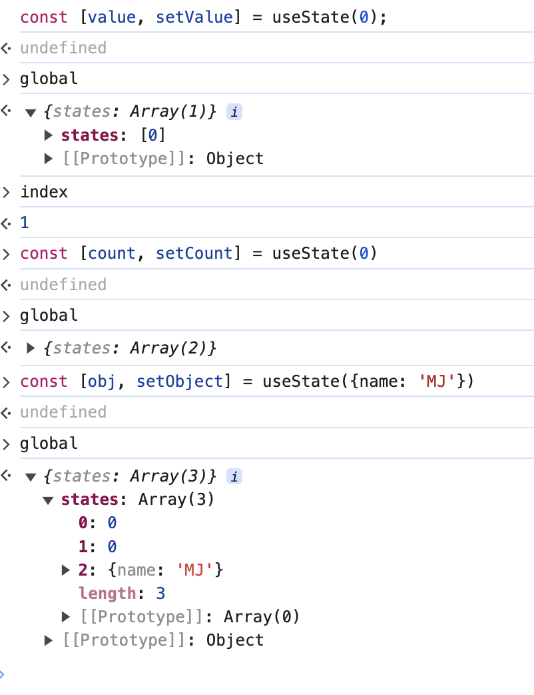
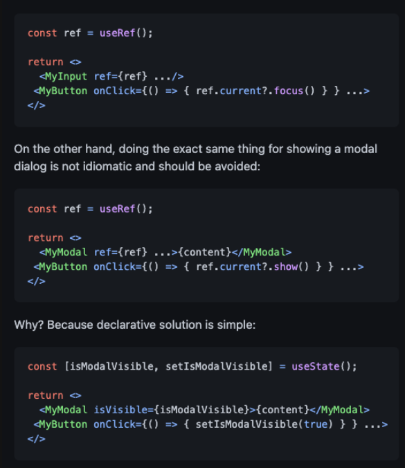

# 리액트 훅 깊게 살펴보기

함수형 컴포넌트에서는 클래스형 컴포넌트의 생명주기를 대체하는 등 다양한 작업을 위해 훅이라는 것을 사용한다.

<br/>

<details>
<summary>목차</summary>
<div>

- [리액트 훅 깊게 살펴보기](#리액트-훅-깊게-살펴보기)
  - [useState](#usestate)
    - [Preact useState 훔쳐보기](#preact-usestate-훔쳐보기)
      - [invokeOrReturn](#invokeorreturn)
    - [useReducer](#usereducer)
  - [useEffect](#useeffect)
    - [useEffect를 사용하면서 주의해야 할 점](#useeffect를-사용하면서-주의해야-할-점)
      - [eslint-disable-line react-hooks/exhaustive-deps 주석 피하기](#eslint-disable-line-react-hooksexhaustive-deps-주석-피하기)
      - [useEffect에 익명함수 사용하지 않기](#useeffect에-익명함수-사용하지-않기)
      - [불필요한 외부 함수를 만들지 마라](#불필요한-외부-함수를-만들지-마라)
    - [useMemo](#usememo)
    - [useCallback](#usecallback)
    - [useRef](#useref)
    - [useContext](#usecontext)
    - [useReducer](#usereducer-1)
    - [useImperativeHandle](#useimperativehandle)
      - [forwardRef](#forwardref)
      - [useImperativeHandle](#useimperativehandle-1)
      - [해당 아티클 요약](#해당-아티클-요약)
    - [useLayoutEffect](#uselayouteffect)
    - [useDebugValue](#usedebugvalue)
    - [훅의 규칙](#훅의-규칙)
  - [사용자 정의 훅과 고차 컴포넌트 중 무엇을 써야할까?](#사용자-정의-훅과-고차-컴포넌트-중-무엇을-써야할까)
    - [사용자 정의 훅](#사용자-정의-훅)
    - [고차 컴포넌트](#고차-컴포넌트)
      - [사용자 정의 훅과 고차 컴포넌트 중 무엇을 써야 할까?](#사용자-정의-훅과-고차-컴포넌트-중-무엇을-써야-할까)
    - [재밌는 퀴즈](#재밌는-퀴즈)
  - [부록](#부록)
    - [SuspenseList와 useTransition](#suspenselist와-usetransition)
      - [SuspenseList](#suspenselist)
      - [useTransition](#usetransition)

</div>
</details>

## useState

useState 사용하면 함수형 컴포넌트에서 상태를 관리할 수 있다.

```jsx
// 인자로는 state의 초기값을 넘겨준다.
// 1. 아무 것도 넘겨주지 않으면 undefined가 된다.
// 2. 함수를 넘겨주면 함수의 반환값이 초기값이 된다.
// 3. 객체를 넘겨주면 객체의 프로퍼티가 초기값이 된다.
const [state, setState] = useState(initialState);

// lazy initialize
// state가 처음 만들어질 때만 사용된다. 연산이 많이 들어가는 초기값을 설정할 때 사용
const [state, setState] = useState(() => {
  return initialState;
});
```

useState를 사용하지 않으면 함수형 컴포넌트에서 변수로 상태를 관리할 수 없다. (강제로 렌더링을 발생시켜도 함수 내부의 변수가 초기화되어 버린다)

아래는 useState를 대략적으로 흉내낸 코드이다. (실제로는 useReducer를 사용해 구현돼있다)

```tsx
// 외부에 store가 존재한다
const global = {};
let index = 0;

function useState(initialState) {
  if (!global.states) {
    // 애플리케이션 전체의 states 배열 초기화
    global.states = [];
  }

  // states 정보 조회하여 현재 상태값이 있는지 확인, 없다면 초깃갑으로 설정
  const currentState = global.states[index] || initalState;
  global.states[index] = currentState;

  const setState = (function () {
    // 현재 index를 클로저로 가둬나서 이후에도 계속해서 동일한 index에 접근할 수 있도록 함
    let currentIndex = index;
    return function (value) {
      global.states[currentIndex] = value;
    };
  })();
  // useState 쓸 때마다 index 하나씩 추가, 이 index는 setState에서 사용
  // 즉, 하나의 state마다 index가 할당돼 있어 그 index가 배열의 값을 가리키고 필요할 때마다 그 값을 가져온다
  index = index + 1;

  return [currentState, setState];
}
```



#### Preact useState 훔쳐보기

```tsx
export function useState(initialState) {
  currentHook = 1; // 현재 훅의 인덱스를 설정
  return useReducer(invokeOrReturn, initialState);
}
```

~~끝~~

##### invokeOrReturn

```tsx
function invokeOrReturn(arg, f) {
  return typeof f == "function" ? f(arg) : f;
}
```

두 번째 인자가 함수면 함수를 실행하고, 아니면 그대로 반환한다.

```tsx
// invokeOrReturn은
// 함수를 인자로 넘겼을 때, useReducer에서 arg에 prev를 전달하고,
// prev => prev + 1을 실행한다.
setState((prev) => prev + 1);
```

을 useReducer의 reducer로 사용한다.

#### useReducer

```tsx
export function useReducer(reducer, initialState, init) {
  const hookState = getHookState(currentIndex++, 2); // 훅 상태를 저장하는 오브젝트를 가져옴
  hookState._reducer = reducer; // 리듀서 함수 저장 (useState에서 넘어온 reducer, invokeOrReturn)
  if (!hookState._component) {
    // [state, setState와 같은 구조]
    hookState._value = [
      // init 함수가 제공됐으면 init 함수를 실행하고, 아니면 initialState를 그대로 사용

      !init ? invokeOrReturn(undefined, initialState) : init(initialState),
      // action에는 setState에서 넘어온 함수가 들어간다.
      (action) => {
        const currentValue = hookState._nextValue
          ? hookState._nextValue[0]
          : hookState._value[0];
        const nextValue = hookState._reducer(currentValue, action);
        // ...
      },
    ];
    // ...
  }
  // ...
  return hookState._nextValue || hookState._value;
}
```

## useEffect

useEffect는 컴포넌트의 여러 값들을 활용해 동기적으로 부수 효과를 만드는 매커니즘을 제공한다. (컴포넌트가 렌더링 된 후에 부수 효과를 일으키고 싶을 때 사용한다)

```tsx
// 의존성 배열의 값이 이전과 다르면 effect 함수가 실행된다.
// 얕은 비교를 통해 확인한다
useEffect(() => {
  // do something
}, [props, state]);

// 의존성 배열이 없으면 렌더링마다 실행이 필요하다고 판단해 실행된다.
useEffect(() => {
  // do something
});

const [count, setCount] = useState(0);
// 최초 실행때는 함수의 평가값을 생각해야 한다.
// 이후에는 의존성 배열의 값이 변할 때만 실행된다.
// 클린업 함수를 추가하지 않으면, 컴포넌트가 렌더링될 때마다 이벤트 리스너가 추가된다.
useEffect(() => {
  function add() {
    setCount(count + 1);
  }

  window.addEventListener("click", add);
  return () => {
    window.removeEventListener("click", add);
  };
}, [count]);
```

클린업 함수는 언마운트의 개념과는 조금 차이가 있다.
언마운트는 컴포넌트가 DOM에서 사라지는 것을 의미하는 용어이고, 클린업 함수는 함수 컴포넌트가 리렌더링됐을 때, 의존성 변화가 있었을 당시 이전의 값을 기준으로 실행돼, 이전의 상태를 청소하는 개념으로 보는 것이 옳다.

아래는 useEffect를 대략적으로 흉내낸 코드이다.

```tsx

```

> 온클릭은 어떻게?

### useEffect를 사용하면서 주의해야 할 점

#### eslint-disable-line react-hooks/exhaustive-deps 주석 피하기

```tsx
// log가 바뀌어도 useEffect가 실행되지 않는다.
function Component({ log }: { log: string }) {
  useEffect(() => {
    console.log(log);
  }, []); // eslint-disable-line react-hooks/exhaustive-deps
}
```

#### useEffect에 익명함수 사용하지 않기

```tsx
// useEffect의 책임을 좁힌다
useEffect(
  function logActiveUser() {
    logging(user.id);
  },
  [user.id]
);
```

#### 불필요한 외부 함수를 만들지 마라

useEffect 내부에서만 사용할 데이터를 컴포넌트의 내부에 정의해서 선언을 컴포넌트 렌더링 시점에 동작하게 하면 불필요한 의존성 배열이 생기고 관리하기 어려워진다.
useEffect 내부에서만 사용할 데이터는 useEffect 내부에 선언하자.

[공식문서에서 친절하게 알려주는 useEffect 사용법](https://react.dev/reference/react/useEffect#removing-unnecessary-object-dependencies)

### useMemo

useMemo는 비용이 큰 연산의 결과를 저장해두고, 저장된 값이 필요할 때 반환하는 훅이다.
의존성 배열이 변경됐을 때만 생성 함수를 실행한다.
생성 함수에는 ReactElement를 반환하는 함수를 넣을 수도 있다.

### useCallback

useCallback은 함수를 저장해두고, 저장된 함수가 필요할 때 반환하는 훅이다.
useCallback은 useMemo를 사용해서 구현할 수 있다.

```tsx
export function useCallback(callback, args) {
  // 메모이제이션하는 대상이 함수가 된다.
  return useMemo(() => callback, [...args]);
}
```

### useRef

useState와 동일하게 컴포넌트 내부에서 렌더링이 일어나도 변경 가능한 상태 값을 저장한다는 공통점이 있다.

차이점으로는

- useState는 상태값을 변경하면 컴포넌트가 리렌더링되지만 useRef는 리렌더링되지 않는다.
- useRef는 반환값이 current 프로퍼티에 저장된다.

useRef도 useMemo로 구현할 수 있다.

```tsx
// 값이 변경돼도 렌더링되면 안된다는 점, 실제 값은 객체로 감싸서 저장한다.
export function useRef(initialValue) {
  return useMemo(() => ({ current: initialValue }), []);
}
```

### useContext

React에서 Context는 명시적인 props 전달 없이 컴포넌트 트리 전체에 데이터를 제공하는 방법이다.

useContext는 Context 객체를 받아 가장 가까운 Provider의 값을 반환한다.
useContext를 사용하게 되면, Provider에 대한 의존성이 생기기 때문에 컴포넌트를 재사용할 수 없게 된다. 그리고 컴포넌트 트리의 전체에 렌더링을 일으키기 때문에 주의하여 사용해야 한다.

### useReducer

useState와 비슷하지만, 복잡한 상태 로직을 다룰 때 사용한다.
용어로는 다음과 같은 것들이 있다.

- state: 현재 useReducer가 가지고 있는 값
- dispatch: state를 업데이트하는 함수, setState와 다르게 action을 받아서 처리한다.
- reducer: action을 받아서 새로운 state를 반환하는 함수
- initialState: state의 초기값
- init: 초기 state를 만들어주는 함수, lazy initialization을 할 때 사용한다.

useReducer가 복잡해보이지만, 복잡한 형태의 state를 사전에 정의한 dispatch 함수를 통해 업데이트할 수 있어서 코드를 더 명확하게 만들 수 있다.

### useImperativeHandle

#### forwardRef

ref는 useRef에서 반환한 객체로, 주로 리액트 컴포넌트의 props인 ref에 넣어 HTMLElement에 접근하는 용도로 사용된다.
ref는 예약어이기 때문에 자식 컴포넌트에 전달할 때는 다른 이름으로 전달해야 한다.
forwardRef는 ref를 전달할 때에 일관성있게 사용할 수 있도록 도와준다.

#### useImperativeHandle

useImperativeHandle은 부모 컴포넌트에게 넘겨받은 ref를 조작할 수 있게 해준다.

```tsx
const Input = forwardRef((props, ref) => {
  const inputRef = useRef();
  useImperativeHandle(
    ref,
    () => ({
      focus: () => ({
        alert: () => alert(props.value),
      }),
    }),
    [props.value]
  );
  return <input ref={inputRef} {...props} />;
});

const App = () => {
  const inputRef = useRef();
  const handleClick = () => {
    inputRef.current.alert();
  };
  return (
    <div>
      <Input ref={inputRef} />
      <button onClick={handleClick}>click me!</button>
    </div>
  );
};
```

> 언제 사용하나요?

useImperativeHandle를 부모 컴포넌트에서 자식 컴포넌트로 비즈니스 로직 양도가 가능해집니다.
관심사 분리와 코드 스플리팅이 가능해짐!
하지만, ref를 사용한 명령형 방식은 리액트에서 좋지 않습니다.
[Why you should use refs sparingly in production](https://blog.logrocket.com/why-you-should-use-refs-sparingly-in-production/)

#### 해당 아티클 요약


리액트는 선언형 프로그래밍 패러다임을 채용했기 때문 코드 일관성이 맞지 않다.

### useLayoutEffect

useEffect와 함수 시그니처가 같으면서, useEffect보다 더 빨리 실행된다.
useLayoutEffect는 렌더링 직후 DOM 업데이트 직전에 실행된다.

DOM은 계산됐지만, 이것이 화면에 반영되기 전에 실행하고 싶은 작업이 있을 때 useLayoutEffect를 사용한다.

### useDebugValue

개발 과정에서 리액트 개발 도구에서 사용되고, 디버깅하고 싶은 정보를 제공할 때 사용한다.

useDebug는 커스텀 훅에서만 동작하고, 컴포넌트 레벨에선 동작하지 않는다.

### 훅의 규칙

1. 최상위에서만 훅을 호출해야 한다. (조건문, 반복문, 중첩된 함수 내부에서 호출하면 안된다)
2. 훅을 호출할 수 있는 것은 함수형 컴포넌트 또는 커스텀 훅이다.

## 사용자 정의 훅과 고차 컴포넌트 중 무엇을 써야할까?

### 사용자 정의 훅

서로 다른 컴포넌트 내부에서 같은 로직을 공유하고자 할 때 주로 사용되는 것이 바로 사용자 정의 훅이다.
컴포넌트 내에서 반복되는 로직들이 있다면 DRY원칙에 의해서 다시 작성하는 것이 아닌 사용자 정의 훅으로 만들어서 사용하는 것이 좋다.

### 고차 컴포넌트

고차 컴포넌트는 컴포넌트 자체의 로직을 재사용하기 위한 방법이다.
고차 컴포넌트는 고차 함수의 일종으로 컴포넌트를 인자로 받아서 새로운 컴포넌트를 반환하는 함수이다.

```tsx
function withLoggingComponent<T>(Component: React.ComponentType<T>) {
  return function (props: T) {
    console.log("rendering");
    return <Component {...props} />;
  };
}
```

고차 컴포넌트는 컴포넌트 전체를 감쌀 수 있다는 점에서 커스텀 훅보다 큰 영향력을 미친다.

#### 사용자 정의 훅과 고차 컴포넌트 중 무엇을 써야 할까?

단순하게 useEffect와 useState와 같이 React hook으로만 격리할 수 있다면 사용자 정의 훅을 사용하여 격리한다.
사용자 정의 훅 자체는 렌더링에 영향을 미치지 못하기 때문에 사용이 제한적이므로 반환하는 값을 바탕으로 무엇을 할지는 개발자에게 달려있다. (개발자가 훅을 원하는 방향으로 사용할 수 있다)

함수 컴포넌트의 반환값, 렌더링의 결과물에도 영향을 미치는 공통 로직일 때에는 고차 컴포넌트를 사용하는 것이 좋다.

### 재밌는 퀴즈

1. 다음 코드의 console 출력 순서는?

```tsx
const MyContext = createContext();

function ContextProvider({ children, text }) {
  return (
    <MyContext.Provider value={{ hello: text }}>{children}</MyContext.Provider>
  );
}

function useMyContext() {
  const context = useContext(MyContext);
  if (context === undefined) {
    throw new Error(
      "useMyContext는 ContextProvider 내부에서만 사용할 수 있습니다."
    );
  }
  return context;
}

function GrandChildComponent() {
  const { hello } = useMyContext();
  console.log("렌더링 GrandChildComponent");
  useEffect(() => {
    console.log("렌더링 GrandChildComponent in useEffect");
  });

  return <h3>{hello}</h3>;
}

function ChildComponent() {
  console.log("렌더링 ChildComponent");
  useEffect(() => {
    console.log("렌더링 ChildComponent in useEffect");
  });

  return <GrandChildComponent />;
}

function ParentComponent() {
  const [text, setText] = useState("");

  function handleChange(e) {
    setText(e.target.value);
  }

  console.log("렌더링 ParentComponent");
  useEffect(() => {
    console.log("렌더링 ParentComponent in useEffect");
  });

  return (
    <>
      <ContextProvider text="react">
        <input value={text} onChange={handleChange} />
        <ChildComponent />
      </ContextProvider>
    </>
  );
}
```

<details>
  <summary>정답</summary>
  <div>

```shell
렌더링 ParentComponent
렌더링 ChildComponent
렌더링 GrandChildComponent

렌더링 GrandChildComponent in useEffect
렌더링 ChildComponent in useEffect
렌더링 ParentComponent in useEffect
```

  </div>
</details>

</br>

2. 다음 코드는 어떤 문제가 있을까?

```tsx
const MyComponent = React.memo(({ style }) => {
  return <div style={style}>Hello, world!</div>;
});

const ParentComponent = () => {
  return <MyComponent style={{ marginTop: "1px" }} />;
};
```

<details>
  <summary>정답</summary>
  <div>

```markdown
ParentComponent가 렌더링될 때마다 새로운 style 객체가 생성되므로 MyComponent도 매번 리렌더링됩니다.
이를 해결하려면 style 객체를 재사용할 수 있도록 최상위 컴포넌트나 상위 스코프에서 정의해야 합니다.
```

  </div>
</details>

## 부록

### SuspenseList와 useTransition

고차 컴포넌트에 대해 배우면서 다들 에러바운더리 말고 서스펜스에 대해서도 떠올렸을 것이다.
숨쉴에 서스펜스를 적용하면서 기본적인 개념은 알고 있으니 이제는 SuspenseList와 useTransition에 대해 알아보자.

#### SuspenseList

SuspenseList는 여러 Suspense 컴포넌트를 그룹화하여 로딩 상태를 관리하는 컴포넌트이다.

> SuspenseList는 그 아래에서 가장 가까운 Suspense 노드의 "공개 순서"를 조정합니다.

```tsx
<SuspenseList revealOrder="forwards">
  <Suspense fallback={<div>Loading 1...</div>}>
    <DataComponent url="https://api.example.com/data1" />
  </Suspense>
  <Suspense fallback={<div>Loading 2...</div>}>
    <DataComponent url="https://api.example.com/data2" />
  </Suspense>
</SuspenseList>
```

evealOrder: suspending 컴포넌트들이 그려질 순서

- forwards: 앞에 있는 컴포넌트가 suspending이 끝나야 다음 것을 보여줌 (앞->뒤)
- backwards: 뒤에 있는 컴포넌트가 suspending이 끝나야 다음 것을 보여줌 (뒤->앞)
- together: 한꺼번에 보여준다.

#### useTransition

useTransition은 React 18에서 도입된 훅 중 하나로, 동시성 모드(Concurrent Mode)에서 긴급하지 않은 상태 업데이트를 처리하는 데 유용합니다.

```tsx
const [query, setQuery] = useState("");
const [isPending, startTransition] = useTransition();

const handleSearch = (e) => {
  const value = e.target.value;
  setQuery(value);

  // 긴급하지 않은 상태 업데이트를 시작합니다.
  startTransition(async () => {
    // 실제 API 호출
    try {
      const response = await fetch(
        `https://jsonplaceholder.typicode.com/posts?title_like=${value}`
      );
      if (!response.ok) {
        throw new Error("Network response was not ok");
      }
      const data = await response.json();
      setResults(data.map((post) => post.title));
    } catch (error) {
      console.error("Failed to fetch data:", error);
      setResults([]);
    }
  });
};

return (
  <div>
    <input type="text" value={query} onChange={handleSearch} />
    {isPending ? (
      <div>Loading...</div>
    ) : (
      <ul>
        {results.map((result, index) => (
          <li key={index}>{result}</li>
        ))}
      </ul>
    )}
  </div>
);
```

- isPending: 백그라운드 상태 업데이트가 진행 중인지를 나타내는 boolean 값.
- startTransition: 긴급하지 않은 업데이트를 시작하는 함수.

즉, 사용자 인터랙션에 집중할 수 있도록 긴급하지 않은 상태 업데이트를 뒤로 미루는 것이다.
예시에서는 비동기 작업 수행 이후의 처리를 startTransition으로 감싸서 처리한다.
입력 상태가 더 우선순위가 높게 처리되고, 비동기 이후 상태 갱신은 뒤로 미룸!

useDeferredValue도 있는데 직접 찾아보는 재미를 드리기 위해 정리하지 않음.
