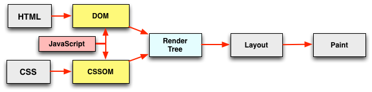
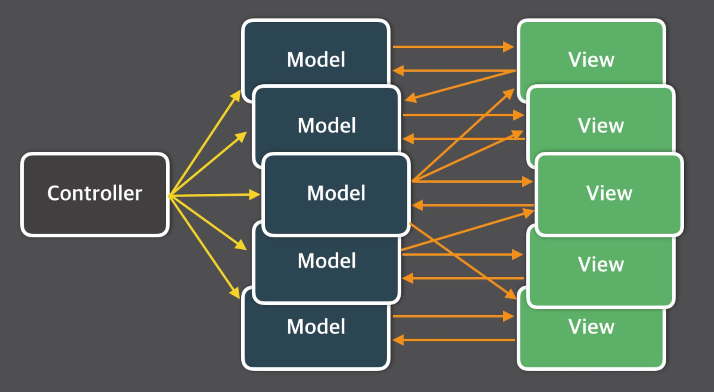
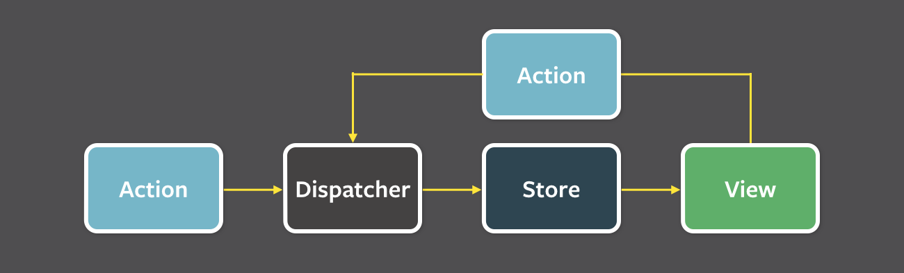
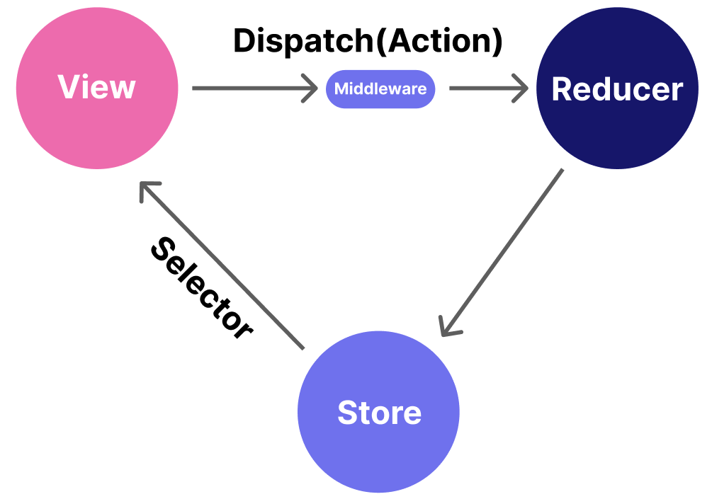
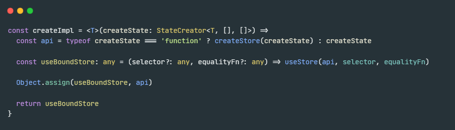
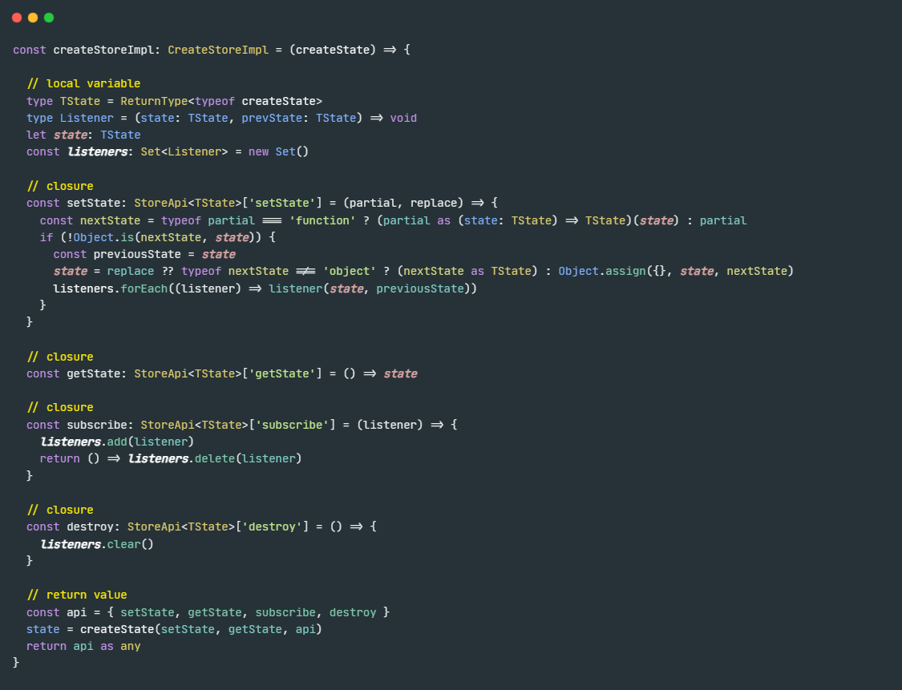
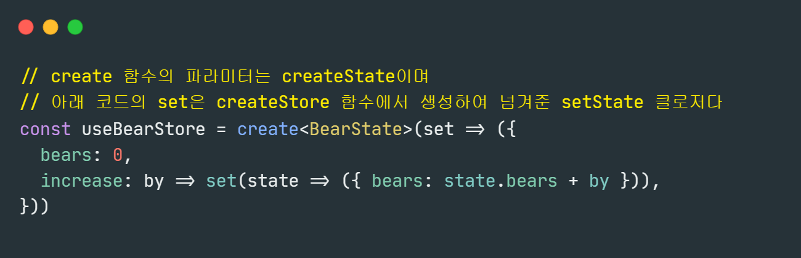
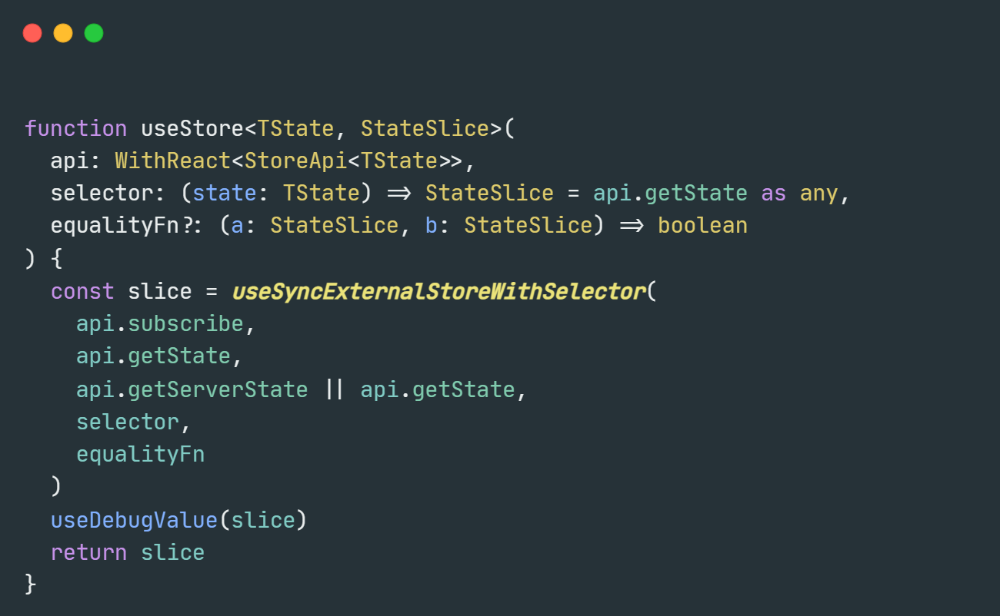
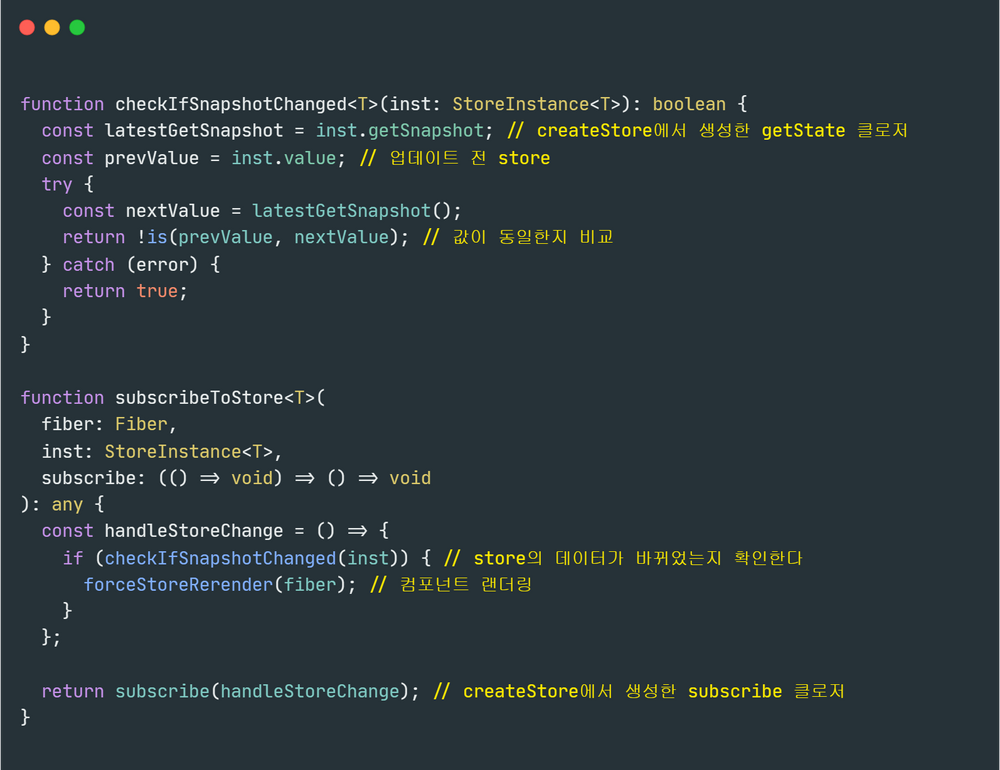
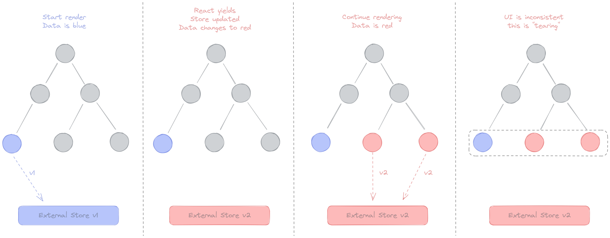

# 4&5장 SSR & 상태 관리 라이브러리

서버 사이드 렌더링과 상태 관리 라이브러리에 대해 알아보겠습니다.

## SPA (Single Page Application)

SPA란 렌더링과 라우팅을 서버가 아닌 브라우저의 자바스크립트로 처리하는 방식을 말합니다.

첫 페이지에서 데이터를 모두 불러온 이후에는 페이지 전환을 위한 모든 작업이 브라우저의 
```hitory.pushState```와 ```history.replaceState``` 함수를 통해 이루어집니다.

따라서 서버에서 HTML을 추가로 내려받지 않고 한 페이지 안에서 모든 작업이 이루어집니다.

여기서 **렌더링**과 **라우팅**에 대해 더 자세하게 알아보겠습니다.

### 렌더링 (Rendering)

렌더링은 관점에 따라 여러 의미를 가질 수 있습니다.

먼저 브라우저 관점에서의 렌더링은 웹 브라우저가 렌더링 엔진과 자바스크립트 엔진을 통해 HTML, CSS, JS를 읽어 화면을 그려주는 것으로 그 과정은 다음과 같습니다.
- HTML, CSS를 통하여 받아서 화면에 렌더링합니다.
- 이때, 브라우저는 HTML을 먼저 받아서 DOM 트리를 만들고, CSS를 받아서 CSSOM 트리를 만듭니다.
- JavaScript를 통해 DOM 트리와 CSSOM 트리를 조작할 수 있습니다.
- 이후, 두 트리를 결합하여 렌더 트리를 만들고, 이를 화면에 렌더링합니다.



그렇다면 React에서 렌더링은 어떤 것을 의미할까요?

[이 사이트](https://minjoo-space.tistory.com/68)를 참고해서 설명하자면
```root.render``` 함수는 컴포넌트가 어떻게 생겼는지 정의하고, 뷰의 구성과 작동 방식에 대한 정보를 지닌 객체를 반환합니다.
그 이후, 객체 정보를 이용해서 html 문자열을 만들어내고, 이를 DOM 요소에 주입합니다.

다만 뒤에 나올 CSR과 SSR에서 렌더링은 기능적으로 생각해보았을 때 단순히 HTML을 만들어내는 것을 의미하는 것 같습니다.

### 라우팅 (Routing)

라우팅은 사용자가 요청한 URL에 따라 서버가 다른 페이지를 보여주는 것을 말합니다.

MPA에서는 여러 개의 페이지를 준비해놨다가 요청에 들어오면 경로에 따라 적절한 페이지를 보내줍니다.

SPA에서는 우리가 다른 페이지로 이동하고 싶어서 요청해도 페이지가 하나밖에 없기 때문에 다른 페이지를 줄 수 없습니다.

따라서 javascript를 통해 화면을 변경하고 ```history.pushState```와 ```history.replaceState``` 함수를 통해 URL을 변경합니다.


그렇다면 SPA와 대비되는 개념인 MPA, 그리고 이와 관련해 자주 등장하는 CSR, SSR, SSG는 무엇일까요?

### MPA (Multi Page Application)

- 여러 개의 페이지를 가지고 있는 웹을 말합니다.

- 페이지 별로 해당 페이지에 필요한 HTML, CSS, JS을 다운 받아 매번 페이지를 새롭게 생성합니다.

- 외부의 CSS가 불러오기 전에 잠시 스타일이 적용되지 않은 웹 페이지가 나타나는 현상인 FOUC(Flash of Unstyled Content)이 발생할 수 있습니다.

### CSR (Client Side Rendering)

- 서버는 요청을 받으면 빈 HTML과 JS 파일을 보냅니다.
- 브라우저는 JS 파일을 받아서 렌더링을 진행합니다.

### SSR (Server Side Rendering)

- 서버는 요청을 받으면 렌더링된 HTML을 보냅니다.
- 브라우저는 받은 HTML을 그대로 화면에 렌더링합니다.
- 매 요청마다 렌더링이 발생합니다.

### SSG (Static Site Generation)

- SSR과 같으나 렌더링은 빌드 시에만 발생합니다.
- 빌드 시에 렌더링된 HTML을 저장해두고 요청이 들어오면 저장된 HTML을 보냅니다.


## SSR의 장점

1. SEO(Search Engine Optimization) : 검색 엔진 최적화

크롤러들은 CSR로 만든 페이지에 접근 했을 때 빈 페이지를 보게 됩니다.

요즘 크롤러들은 JS를 실행할 수 있다지만,

CSR로 만든 페이지는 렌더링이 늦어져서 SEO에 불리합니다.

2. 초기 로딩 속도 개선

View를 서버에서 렌더링하여 가져오기 때문에 첫 로딩이 매우 빠릅니다.

3. 보안에 유리

CSR은 데이터를 브라우저에서 불러오기 때문에 데이터 관련 정보가 노출될 수 있습니다.

SSR은 서버에서 데이터를 불러오기 때문에 데이터 관련 정보가 노출되지 않습니다.

## React로 SSR에 도달하기

결국 SSR의 궁극적인 목적은 어떤 라이브러리/프레임워크를 쓰건 간에

서버 측에서 정적인 HTML 파일을 rendering 할 수 있으면 되는 것입니다.

React는 리액트 애플리케이션을 서버에서 렌더링할 수 있는 API를 제공합니다.

`react-dom/server` 에서는 작성한 컴포넌트를 HTML로 변환하는 여러 함수를 제공합니다.

단 이러한 함수들 에선 `useEffect` 등의 훅과 이벤트 핸들러는 결과물에 포함되지 않습니다.

클라이언트에서 실행되는 자바스크립트 코드는 별도로 브라우저에 제공되어야 합니다.

- renderToString
- renderToStaticMarkup
- renderToNodeStream
- renderToStaticNodeStream

`renderToString`은 리액트에서만 사용하는 추가적인 DOM 속성이 추가됩니다.

`renderToStaticMarkup`은 `renderToString`과 비슷하지만 리액트 전용 DOM 속성이 추가되지 않습니다.

`renderToNodeStream`과 `renderToStaticNodeStream`은 컴포넌트를 렌더링한 결과를 Node.js `Readable Stream`으로 반환합니다.

여기서 Stream이란 데이터를 일정한 크기로 나눠서 전송하는 것을 말합니다.

또한 `renderToNodeStream`, `renderToStaticNodeStream`은 오직 서버 측에서만 사용할 수 있습니다.

하지만 이들은 현재 React 버전에서 사용하기에 문제가 있습니다.

|                    | 문제                                                            |
|--------------------|---------------------------------------------------------------|
| renderToString     | 만약 suspense 컴포넌트라면, renderToString은 즉시 HTML을 fallback으로 보냅니다. |
| renderToNodeStream | 모든 Suspense boundaries가 완료될 때까지 대기, 모든 출력값을 버퍼링               |

여기서 ‘출력이 버퍼링 된다’ 는 의미는,

받아 올 데이터를 잘개 쪼개서 가져오는 스트리밍의 이점을 살리지 못하고,

출력을 모아서 한번에 가져온다는 의미입니다.

React 18부터는 이러한 문제점을 해결하기 위해 새로운 API를 제공합니다.

바로 ```renderToReadableStream```과 ```renderToPipeableStream``` 입니다.

아래 방법들은 Suspense도 지원하며, 출력이 버퍼링되지 않고 스트리밍됩니다.

- ```renderToReadableStream```: `Readable Stream`이 resolved 된 `Promise`를 리턴해줌 ⇒ Node.js에서 사용하기 힘듦
- renderToPipeableStream: Node.js 파이프라인으로 리턴해 줌 ⇒ 브라우저에서 사용 불가

결국 “뭘 써야하나?” 를 요약하면 아래와 같습니다.

- Suspense X 데이터 크기 작음 ⇒ renderToString
- Suspense 또는 스트리밍이 필요하다
  - 대부분의 경우 ⇒ renderToReadableStream
  - html 코드를 Node 환경에서 써야한다 ⇒ renderToPipeableStream

### hydrate

`hydrate`는 `수분을 공급하다`라는 뜻으로, `react-dom/server`에서 생성된 HTML 콘텐츠가 있는 브라우저 DOM 노드 안에 React 컴포넌트를 표시할 수 있게 해줍니다.

쉽게 얘기해서 서버에서 렌더링된 HTML에 이벤트나 핸들러를 적용하는 것입니다.

### render와의 차이점

`render`는 `hydrate` + HTML 요소에 해당 컴포넌트를 렌더링하는 작업까지 추가된 것입니다.

따라서 `hydrate`는 서버에서 렌더링된 HTML이 있다는 가정하에 작업이 수행됩니다.

그런데 만약 리액트 관련 정보가 없는 HTML에 `hydrate`를 적용하면 어떻게 될까요?

`Warning: Expected server HTML to contain a matching <div> in <div>.` 라는 경고가 뜨게 됩니다.

이는 서버에서 렌더링된 HTML과 컴포넌트를 렌더링한 결과물이 일치하지 않는다는 의미입니다.

이러한 Warning에도 페이지는 정상적으로 작동합니다. 다만 이렇게 된다면 서버와 클라이언트에서 두 번 렌더링이 일어나게 되고, 이는 성능에 영향을 미칠 수 있습니다.

### React에서 SSR을 적용하면 SPA일까?

React에서 SSR을 적용하는 목적은 단지 `최초 HTML 페이지를 빠르게 그려주기`라는 것입니다.

따라서 React에서 SSR을 적용하더라도 그 이후의 페이지 전환은 CSR로 이루어집니다.

그렇다면 React에서 SSR을 적용하더라도 SPA로 볼 수 있을까요? 

리액트 프레임워크인 Next.js에 대한 [아티클](https://www.code-insights.dev/posts/nextjs-spa-or-mpa)에서는 Next.js를 단순한 

SPA로 보기에는 무리가 있다고 합니다. Next.js는 PESPA(Progressively Enhanced Single Page Apps)에 속해있다고 이 글에서는 주장합니다.

### PESPA (Progressively Enhanced Single Page Apps)

[이 아티클](https://www.epicweb.dev/the-webs-next-transition)에서는 PESPA에 대해 다음과 같이 설명합니다.

- SPA와 MPA의 장점을 모두 가진 단일 아키텍처입니다.
- 클라이언트 측 JavaScript 없이도 작동하는 애플리케이션이 필요합니다. (MPA의 단순한 사고 모델)
- PESPA는 브라우저의 기본 동작을 에뮬레이션하여 클라이언트와 서버 사이에서 동일한 행동을 보장합니다.

설명이 굉장히 어렵게 되어있는데 아티클을 더 자세하게 읽어보겠습니다...

## 상태 관리 라이브러리

### 상태?

상태 관리 라이브러리를 알아보기에 앞서 '상태'가 무엇인지 정확히 알고 넘어가야할 필요가 있습니다.

상태란 어떠한 의미를 지닌 '값'으로서 지속적으로 변경될 수 있는 값입니다.

예시로는 다음과 같은 것들이 있습니다. 

- UI: 버튼이 클릭되었는지, 모달이 열렸는지 등
- URL: query parameters는 사용자의 라우팅에 따라 변경되는 상태로서 간주할 수 있다.
- form: 로딩 중인지, 제출됐는지, 접근이 불가능한지, 값이 유효한지 등의 상태가 있다.
- 데이터: 서버에서 받아온 데이터, 로컬에서 관리하는 데이터 등

이러한 상태에 따라 다양한 요소들이 각 상태에 맞는 UI를 보여주어야 합니다. 이러한 상태를 어디에 둘 것인지, 

제한 범위는 어떻게 할 것인지, 상태의 변화는 어떻게 감지할 것인지 등을 관리하는 것을 상태 관리라고 합니다.

### 리액트의 상태 관리

리액트는 단순히 UI 렌더링을 위한 라이브러리이기 때문에 상태 관리를 위한 기능을 제공하지 않습니다. 하지만 상태 관리의 필요성은 있습니다.

따라서 리액트 초기에는 상태 관리를 위한 다양한 방법이 존재 했습니다.

#### Flux 패턴

Flux 패턴이 등장하기 이전에는 MVC 패턴이 주로 사용되었습니다.



MVC 패턴은 Model, View, Controller로 구성되어 있습니다.

- Model: 데이터를 담당합니다.
- View: 사용자에게 보여지는 화면을 담당합니다.
- Controller: Model과 View를 연결하는 역할을 합니다.

이러한 MVC 패턴은 데이터의 흐름이 단방향이 아니라 양방향이기 때문에 데이터의 흐름을 추적하기 어렵습니다.

왜나하면 Model이 View를, View가 Model을 직접 변경할 수 있기 때문입니다.

또한 한 Controller가 여러 Model과 View를 관리할 수 있기 때문에 복잡도가 증가합니다.

이러한 문제점을 해결하기 위해 Facebook에서 Flux 패턴을 제안했습니다.



각 용어에 대해 먼저 알아 보겠습니다.

#### Action

Action이란 데이터를 변경하는 행위로서 Dispatcher에게 전달되는 객체를 말합니다. 

Action creator 메서드는 새로 발생한 Action의 타입(type)과 새로운 데이터(payload)를 묶어 Dispatcher에게 전달합니다.

```js
{
  type: 'SET_PROFILE',
  data: {
    'name': 'Harry',
    'age': 458
  }
}
```

#### Dispatcher

모든 데이터의 흐름을 관리하는 중앙 허브입니다. 

Store들이 등록해놓은 Action 타입마다의 콜백 함수들이 존재하고, 각 타입에 맞는 Store의 콜백 함수를 실행합니다. 

Store의 데이터를 조작하는 것은 오직 Dispatcher를 통해서만 가능합니다. 

또한 Store들 사이에 의존성이 있는 상황에서도 순서에 맞게 콜백 함수를 순차적으로 처리할 수 있도록 관리합니다.

#### Store

Store는 상태 저장소로서 상태와 상태를 변경할 수 있는 메서드를 가지고 있습니다. 

어떤 타입의 Action이 발생했는지에 따라 그에 맞는 데이터 변경을 수행하는 콜백 함수를 Dispatcher에 등록합니다. 

Dispatcher에서 콜백 함수를 실행하여 상태가 변경되면 View에게 데이터가 변경되었음을 알립니다.

#### View

View는 리액트 컴포넌트로 생각하면 됩니다. 

Store에서 View에게 상태가 변경되었음을 알려주면 최상위 View(Controller View)는 Store에서 데이터를 가져와 자식 View에게 내려보냅니다. 

새로운 데이터를 받은 View는 화면을 리렌더링합니다. 또한 사용자가 View에 어떤한 조작을 하면 그에 해당하는 Action을 생성합니다.

#### Example

```js
const initialState = {
  number: 0
};

function reducer(state, action) {
  switch (action.type) {
    case 'ADD':
      return {
        number: state.number + 1
      }
    default:
      return state;
  }
}
```

여기서 `reducer` 함수는 `store`의 역할을 합니다.

```js
function Counter() {
  const [state, dispatch] = useReducer(reducer, initialState)
  
  const onAdd = () => {
    dispatch({type: 'ADD'})
  }
  
  return (
    <div>
      <h1>{state.number}</h1>
      <button onClick={onAdd}>Add</button>
    </div>
  )
}
```

`Counter` 컴포넌트는 `view`의 역할을 합니다.

`useReducer`는 `store`의 역할을 합니다.

`dispatch`는 `dispatcher`의 역할을 합니다.

`{type: 'ADD'}`는 `action`의 역할을 합니다.

이러한 Flux 패턴은 단방향 데이터 바인딩을 기반으로 한 리액트와 궁합이 잘 맞았고, 이후 다양한 상태 관리 라이브러리가 등장하게 되었습니다.

### Redux

Redux는 Flux 패턴을 기반으로 만들어진 상태 관리 라이브러리입니다.

또한 Elm 아키텍처를 도입하여 만들어진 라이브러리입니다.

#### Elm 아키텍처

Elm 아키텍처는 Elm 언어의 아키텍처를 말합니다.

Elm 언어는 웹페이지를 선언적으로 작성하기 위한 언어입니다.


이 코드를 보면 `Model`, `View`, `Update`로 구성되어 있습니다.

- Model: 애플리케이션의 상태를 담당합니다.

- View: 상태를 기반으로 화면을 그려주는 역할을 합니다.

- Update: 사용자의 입력에 따라 상태를 변경하는 역할을 합니다.

Elm은 Flux와 마찬가지로 데이터 흐름을 세 가지로 분류하고 이를 단방향으로 강제해 상태를 관리하고자 하였습니다.

Redux는 이러한 Elm 아키텍처를 차용하여 만들어졌습니다.

다음으로 Redux에 대해 좀 더 자세히 알아보겠습니다.



Redux는 리액트 전용 상태 관리 라이브러리가 아닙니다.

따라서 React Tool Kit을 사용하여 리액트와 Redux를 연결해야 합니다.

또한 리액트 컨텍스트에 기반을 둔 라이브러리로 Provider 컴포넌트가 항상 최상위로 동작해야 한다.

Redux를 리액트에서 사용하는 방법에 대해 알아보겠습니다.

1. 먼저 state의 type을 정의합니다.

```ts
export type MyState = {
  today: Date;
};
```

2. 다음으로 action의 type을 정의합니다.

```ts
import type { Action } from "redux";

export type SetTodayAction = Action<"setToday"> & {
  today: Date;
};

export type MyActions = SetTodayAction;
```

3. 다음으로 초기 상태와 reducer를 정의합니다.

```ts
import type { AppState } from "./AppState";
import type { MyActions } from "./myActions";

const initialAppState = {
  today: new Date(),
};
export const rootReducer = (
  state: AppState = initialAppState,
  action: MyActions
) => {
  switch (action.type) {
		// Action에 적어둔 문자열로 구분
    case "setToday": {
      return { ...state, today: action.today };
    }
  }
  return state;
};
```

4. 다음으로 store를 훅으로 분리합니다. ```useMemo```를 이용합니다.

```ts
import { configureStore } from "@reduxjs/toolkit";
import { rootReducer } from "./rootReducer";
import { useMemo } from "react";

const initializeStore = () => {
  const store = configureStore({ reducer: rootReducer });
  return store;
};

export function useStore() {
  const store = useMemo(() => initializeStore(), []);
  return store;
}
```

5. 마지막으로 Provider 컴포넌트를 최상위에 위치시키고, store를 전달합니다.
```js
import {Provider as MyProvider} from 'react-redux';
import { useStore } from "./store";

export default function App() {
	const store = useStore();
  return (
    <MyProvider store={store}>
      <main>
		{/* 여기에 컴포넌트 추가^^ */}
      </main>
    </MyProvider>
  );
}
```

스토어에 저장된 상태를 가져오기 위해서는 `useSelector` 훅을 사용합니다.

```js
import { useSelector } from "react-redux";
import { AppState } from "../store";
import { Div, Subtitle, Title } from "../components";

export default function ReduxClock() {
  const today = useSelector<AppState, Date>((state) => state.today);

  return (
    <Div className="flex flex-col item-center justify-center mt-16">
      <Title className="text-5xl">Redux Clock</Title>
      <Title className="mt-4 text-3xl">{today.toLocaleTimeString()}</Title>
      <Subtitle className="mt-4 text-2xl">
        {today.toLocaleDateString()}
      </Subtitle>
    </Div>
  );
}
```

스토어에 저장된 상태를 변경하기 위해서는 `useDispatch` 훅을 사용합니다.

```js
const dispatch = useDispatch();
dispatch({ type: "$myActionType", myState: $newState });
```

이러한 Redux는 마냥 편하기만 한 것은 아니였습니다.

Redux의 사용은 복잡하고, 불필요한 보일러플레이트 코드가 많다는 단점이 있습니다.

단순히 상태 주입을 위해서 Redux를 사용하는 것은 굉장히 불편합니다.

따라서 대안으로 Context API를 사용할 수 있습니다.

### Context API

부모 컴포넌트의 상태를 자식 컴포넌트에서도 사용하려면 어떻게 해야할까요?

바로 `props`를 통해 전달하는 것입니다.

하지만 부모 컴포넌트와 자식 컴포넌트 사이의 거리가 멀다면?

자식 컴포넌트가 여러개라면?

흔히 `Prop Drilling`이라고 불리는 문제가 발생합니다.

이러한 문제를 해결하기 위해 React 16.3부터 Context API가 등장했습니다.

Context API의 사용법을 알아보겠습니다.

1. createContext 메서드를 사용하여 context를 생성한다.
```js
export const themeContext = createContext(전달할 데이터의 초기값);
```

2. 생성한 context를 대상 컴포넌트에 값을 내려주기 위해서 Provider로 대상 컴포넌트를 감싼다.
3. Provider의 프로퍼티인 value에 전달할 데이터를 넣는다.
```js
export default function App() {
  return (
    <themeContext.Provider value={전달 데이터}>
      <Theme />
    </themeContext.Provider>
  )
}
```

4. useContext 훅을 이용해 context를 사용한다.
```js
function Theme() {
  const theme = useContext(themeContext);
  return <div>{theme}</div> // Provider에서 value로 전달한 데이터 출력
}
```

이러한 Context API를 사용하면 Prop Drilling 없이 하위 컴포넌트에 상태를 주입할 수 있습니다.

하지만 주의할 점은 Context API는 상태 관리를 도와주는 것이 아니므로 상태가 복잡하거나 미들웨어가 필요한 경우에는 적합하지 않습니다.

### React Hooks을 사용한 상태관리

리액트 16.8 버전에서 훅이 도입되면서 새로운 방식의 상태 관리 라이브러리가 등장했습니다.

React Query와 SWR이 그 예시로, 외부에서 데이터를 불러오는 fetch를 관리하는 데 특화된 라이브러리입니다.

SWR을 예시로 살펴보겠습니다.

SWR은 Stale-While-Revalidate의 약자로, React 컴포넌트에서 사용할 수 있는 훅 형태의 SWR 라이브러리입니다.

SWR을 사용하면 간편하게 데이터를 가져오고, 캐시 하여 이전 데이터를 재사용하며, 신선한 데이터를 가져와서 사용자 경험을 향상할 수 있다고 합니다.

SWR을 사용하기 위해서는 다음과 같은 방법을 사용합니다.

1. 먼저 fetcher 함수를 정의합니다.

```js
const fetcher = (url) => fetch(url).then((res) => res.json());
```

2. 다음으로 useSWR 훅을 사용하여 데이터를 가져옵니다.

```js
import useSWR from 'swr';

const MyComponent = () => {
  const { data, error } = useSWR('/transaction', fetcher);

  if (error) {
    return <div>Error while fetching data</div>;
  }

  if (!data) {
    return <div>Loading...</div>;
  }

  return <div>Transaction: {data}</div>;
};
```

데이터가 로딩 중인지, 오류가 발생했는지, 아니면 데이터를 표시할 준비가 되었는지를 확인하고 해당 상태에 따라 적절한 UI를 렌더링 하며 사용하면 됩니다.

이뿐만 아니라, SWR에서 제공하는 옵션들을 사용하면 더 섬세하게 컨트롤이 가능합니다.
- `revalidateOnReconnect`: 네트워크 연결이 복구될 때 데이터를 다시 가져올지 여부를 설정한다.
- `revalidateOnMount`: SWR 훅이 마운트 될 때 데이터를 다시 가져올지 여부를 설정한다.
- `revalidateOnFocus`: 페이지가 포커스를 얻을 때 데이터를 다시 가져올지 여부를 설정
- `refreshInterval`: 데이터를 자동으로 갱신하는 간격을 설정한다.
- `errorRetryCount`: 에러 발생 시 자동 재시도를 수행할 최대 횟수를 설정한다.

이 외 옵션들도 많이 있기 때문에 상황에 따라 사용하면 섬세하고 간단하게 데이터를 가져오고 관리할 수 있는 강력한 도구로써 사용할 수 있습니다.

이러한 라이브러리는 우리가 알고있는 일반적인 형태와는 다르지만, 서버의 데이터를 상태로서 관리하는 작업을 쉽게 할 수 있습니다.

이후로도 Recoil, Zustand, Valtio 등 다양한 상태 관리 라이브러리가 등장하고 있습니다.

이러한 라이브러리들은 리액트와의 연동을 전제로 작동해 별도로 다른 라이브러리를 사용할 필요가 없습니다.

Zustand를 예시로 살펴보겠습니다.

```js
import { create } from 'zustand'

const useStore = create((set) => ({
  count: 1,
  inc: () => set((state) => ({ count: state.count + 1 })),
}))

function Counter() {
  const { count, inc } = useStore()
  return (
    <div>
      <span>{count}</span>
      <button onClick={inc}>one up</button>
    </div>
  )
}
```

보시면 매우 직관적이고 단순하는 것을 알 수 있습니다.

이러한 상태 관리 라이브러리의 가장 중요한 점이 무엇일까요?

바로 상태를 추적하고, 상태의 변화를 감지하는 것입니다. 그래야 상태의 변화에 따라 적절하게 re-rendering이 동작하겠죠?

이것을 어떻게 구현했는 지 [이 블로그](https://www.nextree.io/zustand/)를 참고하여 Zustand에 대해 면밀하게 살펴봅시다.



이 코드는 위의 예제에서 사용한 `create` 함수입니다.

`create` 함수는 내부적으로 `createState` 함수를 사용합니다. 

이 함수가 state의 생성 및 변경을 담당합니다.



`createStore` 함수는 `state`와 `listeners`를 두 개의 변수를 생성하고,

이 변수들을 참조하는 클로저 네 개를 만듭니다.

함수의 마지막 부분에서는 `createStore` 함수를 실행해 state의 초깃값을 설정하고 클로저 네 개를 반환합니다.

`createState`는 `create`에서 파라미터로 전달한 함수입니다.



Zustand는 클로저를 통해 상태를 관리한다는 사실을 알 수 있습니다.

하지만 아직도 이 코드는 상태의 변화를 감지하는 방법에 대해 알 수 없습니다.

그 역할은 바로 `useBoundStore` 훅에 있습니다.

`useBoundStore`는 `create` 함수에서 반환되는 함수로, 내부적으로 `useStore` 훅을 실행합니다.



`useSyncExternalStoreWithSelector`가 눈에 띄는데요,

이 훅은 React에서 제공하는 훅으로 컴포넌트가 `externel store`를 구독할 수 있도록 도와줍니다.



이러한 복잡한 함수를 사용하는 이유가 무엇일까요? 그 답은 React18의 `Concurrecncy`에 있습니다.

#### Tearing

Tearing은 시각적(UI) 불일치를 나타냅니다. UI가 동일한 상태에 대해 여러 형태를 나타냄을 의미합니다.

React 18 이전에는 이 문제가 발생하지 않았습니다만, 그러나 React 18 에서는 렌더링 중에 React가 일시 중지(suspend)됩니다.

즉 concurrent 렌더링이 이 문제를 유발할 수 있습니다.



이러한 문제를 방지하고자 나온 것이 `useSyncExternalStore` 입니다.

대부분의 external store를 사용하고, React 18 버전 이상에서 동작하는 상태 관리 라이브러리는 이러한 방식으로 동작합니다.

`useState`와 `useReducer`에 대해서는 3장에서 알아봤으니 생략하겠습니다.

그렇다면 `useSyncExternelStore`에 대해 더 자세히 알아보겠습니다.

그를 위해 `useState`의 상태를 바깥으로 분리하는 방법을 알아보겠습니다.

`useState`는 리액트가 만든 클로저 내부에서 관리되어 지역 상태로 생성되기 때문에 해당 컴포넌트에서만 사용할 수 있습니다.

`useState`가 리액트 클로저가 아닌 다른 자바스크립트 실행 문맥 내에서 관리되면 어떻게 될까요?

```tsx
export type State = { counter: number }

let state = State = {counter: 0}

export function get(): State {
    return state
}

type Initalizer<T> = T extends any ? T | ((prev: T) => T) : never

export function set<T>(nextState: Initalizer<T>) {
    state = typeof nextState === 'function' ? nextState(state) : nextState
}

function Counter() {
    const state = get()

    function handleClick() {
        set((prev: State) => ({counter: state.counter + 1}))
    }
    
    return (
        <>
            <h1>{state.counter}</h1>
            <button onClick={handleClick}>Increment</button>
        </>
    )
}
```

이러한 방식은 리액트에서 동작할까요?

정답은 '아니요' 입니다.

<details>
<summary>왜 인지  맞춰보시오.</summary>

왜냐하면 위에도 말했듯이 컴포넌트의 리렌더링을 발생시키는 코드가 어디에도 없기 때문입니다.

따라서 상태를 업데이트 하는 것 뿐만 아니라 상태가 업데이트됐을 때 이를 컴포넌트에 반영시키기 위한 리렌더링이 필요합니다.

리렌더링의 조건은 다음과 같습니다.

- `useState` 또는 `useReducer`의 반환값 중 두 번째 인수가 호출된다.
- 부모 함수가 리렌더링 되거나 해당 함수가 다시 실행돼야 합니다.

</details>

그렇다면 useState의 인수로 컴포넌트 밖에서 선언한 state를 넘겨주는 방식으로 코드를 변경해봅시다.

```tsx
function Counter1() {
    const [count, setCount] = useState(state)

    function handleClick() {
        set((prev: State) => {
            const newState = {counter: prev.counter + 1}
            setCount(newState)
            return newState
        })
    }

    return (
        <>
            <h1>{state.counter}</h1>
            <button onClick={handleClick}>Increment</button>
        </>
    )
}

function Counter2() {
    const [count, setCount] = useState(state)

    function handleClick() {
        set((prev: State) => {
            const newState = {counter: prev.counter + 1}
            setCount(newState)
            return newState
        })
    }

    return (
        <>
            <h1>{state.counter}</h1>
            <button onClick={handleClick}>Increment</button>
        </>
    )
}
```

이러한 방식은 언뜻 보기에는 괜찮아 보이나, 이는 좋은 방법이 아니며, 문제점 또한 가지고 있습니다.

일단 첫 번째로 상태를 중복해서 관리하기 때문에 비효율적입니다.

두 번째 이유는 맞춰보시죠 ㅎㅎ

<details>
<summary>열기</summary>

한 쪽에서 상태가 변경되면 다른 쪽에서 리렌더링이 발생하지 않습니다.

useState를 이용한 방식은 어디까지나 해당 컴포넌트 자체에서만 유효한 전략입니다.

따라서 이런 조건을 만족해야 합니다.

1. 외부에 상태가 존재해야 한다.
2. 상태를 사용하면 컴포넌트는 상태의 변화를 알아챌 수 있어야 하며, 상태가 변화될 때마다 리렌더링이 일어나야 한다.
3. 상태가 원시값이 아닌 객체인 경우에 그 객체에 내가 감지하지 않는 값이 변하면 리렌더링이 발생하면 안된다.

</details>

그러면 더 발전된 코드를 보겠습니다.

상태의 이름은 `store`로 정의하고, 
`store`의 값이 변경될때마다 알리는 callback 함수를 실행해야 하고,
이 callback을 등록할 `subscribe` 함수를 만들어야 합니다.

```ts
type Initalizer<T> = T extends any ? T | ((prev: T) => T) : never

type Store<State> = {
    get: () => State
    set: (nextState: Initalizer<State>) => State
    subscribe: (callback: () => void) => () => void
}
```

```ts
export const createStore = <State extends unknown>(
    initialState: Initalizer<State>
): Store<State> => {
    let state = typeof initialState === 'function' ? initialState() : initialState

    const callbacks = new Set<() => void>()

    const get = () => state

    const set = (nextState: State | ((prev: State) => State)) => {
        state = typeof nextState === 'function' ? (nextState as (prev: State) => State)(state) : nextState
        callbacks.forEach((callback) => callback())
        return state
    }
    
    const subscribe = (callback: () => void) => {
        callbacks.add(callback)
        return () => {
            callbacks.delete(callback)
        }
    }
    
    return {get, set, subscribe}

}
```

```ts
export const useStore = <State extends unknown>(store: Store<State>) => {
    const [state, setState] = useState<State>(() => store.get())

    useEffect(() => {
        return store.subscribe(() => {
            setState(store.get())
        })
    }, [store])

    return [state, store.set] as const
}
```
