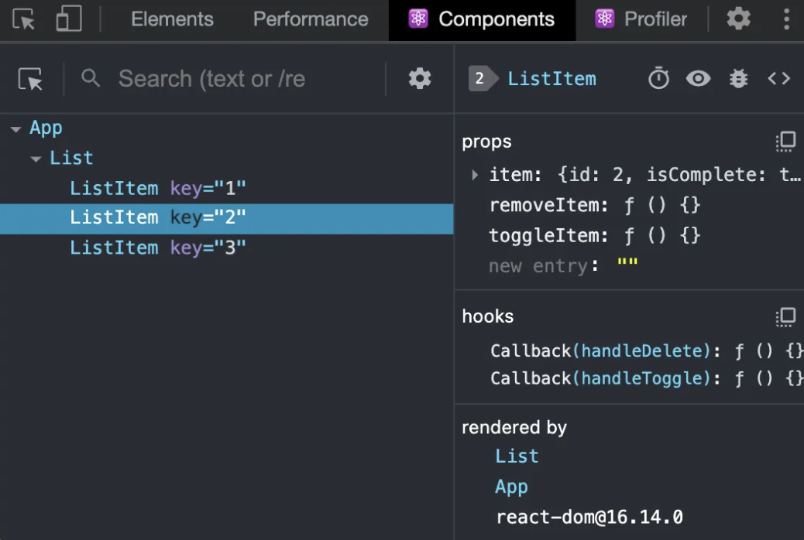
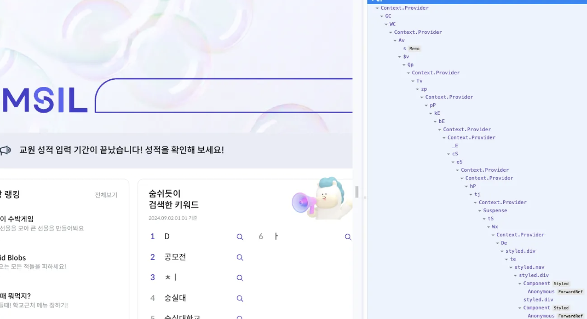

<details>
    <summary>목차</summary>

1. [React 개발 도구란?](#react-개발-도구란)
2. [프로파일러](#프로파일러)
3. [기타 기능들](#기타-기능들)
4. [예시 코드](#예시-코드)

</details>

## 리액트 개발 도구란?

https://react.dev/learn/react-developer-tools



우리는 `React`라는 라이브러리 위에서 구현을 하다보니, 내부적으로 어떤 문제를 알 수 없는 문제가 생깁니다. (Fiber 노드를 기준으로 만들어지는 `V-DOM`을 예상하는 것이 생각보다 쉽지 않습니다.)

`react-dev-tools`를 설치하면 예상되는 `V-DOM`과 노드들의 `memoizedState` 를 볼 수 있게 됩니다.



[soomsil.de](http://soomsil.de) 숨실 웹의 디버깅 모드

<aside>
💡

</aside>

- 정답

### 프로 파일러

`컴포넌트 메뉴`는 정적인 현재 렌더링 상황에서의 디버깅 도구 

`프로파일러`는 리액트가 렌더링하는 과정에서 발생하는 상황을 확인하기 위한 도구 

아래 코드는 text의 변경과 number의 변경이 연관이 없는데, 하나의 컴포넌트에서 핸들링해서 불필요한 리렌더링이 일어난다. → 코드 분리로 최적화 

useEffect가 매호출마다 발생함. → 의존성 배열이 없어서 상태가 바뀌면 다시 한 번 트리거됨. 

```tsx
import { useEffect, useState } from "react";

export default function CodeOne() {
  const [text, setText] = useState<string>("");
  const [number, setNumber] = useState<number>(0);

  type Data = {
    name: string;
    amount: number;
  };
  const [list, setList] = useState<Data[]>([]);

// 무슨 문제? 렌더링 될 때마다 setTimeout이 실행된다. 
  useEffect(() => {
    setTimeout(() => {
      console.log("surprise");
      setText("Hello World");
    }, 3000);
  }, []);

  function handleChangeText(e: React.ChangeEvent<HTMLInputElement>) {
    setText(e.target.value);
  }

  function handleChangeNumber(e: React.ChangeEvent<HTMLInputElement>) {
    setNumber(Number(e.target.value));
  }

  function handleSubmit() {
    setList([...list, { name: text, amount: number }]);
  }

  return (
    <div>
      <input type="text" value={text} onChange={handleChangeText} />
      <button type="button" onClick={handleSubmit}>Submit</button>

      <input type="number" value={number} onChange={handleChangeNumber} />

      <ul>
        {list.map((item, index) => (
        // key
          <li key={index}>
            {item.name} - {item.amount}원
          </li>
        ))}
      </ul>
    </div>
  );
}

```

렌더링 타임라인을 보기에는 프로파일러만한 것이 없습니다.


https://ko.react.dev/reference/react/Profiler

프로파일러 컴포넌트로도 디버깅이 가능 → 프로덕션 환경에선 자동으로 비활성화 


### 기타 기능들

- source code 조회
- props 조회
- console.log 조회
