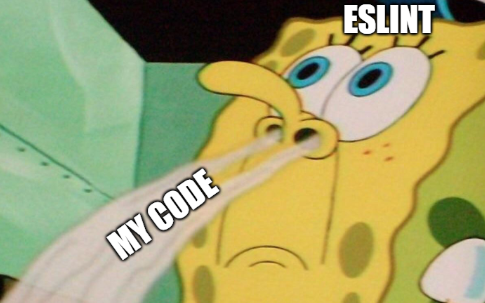

# 8장 - 좋은 리액트 코드 작성을 위한 환경 구축하기

담당자: Bori [Web FE Lead]
날짜: 2024년 9월 11일
상태: 완료

# 8.1 ESLint를 활용한 정적 코드 분석

## 8.1.1 ESLint 살펴보기

- ESLint란?
    
    코드 작성 시점에 문제의 여지가 있는 코드를 찾아주는 분석 도구
    
    코드를 직접 실행하지 않기 때문에 `정적` 분석 도구라고 함
    



- 어떻게 그게 됨 = `Abstract Syntax Tree`로 코드를 구조화하여 찾아낸다
    
    
    
    - 어휘 분석 = 토큰 자르기 + 의미 없는 공백, 주석 버리기 + 토큰 종류 구별하기
    - 구문 분석 = 문법적으로 올바른 코드인지 검사
    - 의미 분석 = 의미적으로 말이 되는 코드인지 검사
        - 구문 분석과 의미 분석의 차이 (C언어 기준)
            - `syntax error`: 선언하지 않은 변수 사용, 같은 이름 변수 중복 선언
            - `semantic error`: int형 인자 1개 받는 함수에 float형 인자 넘김
                
                ⬆️ 함수 호출문 자체에 문법적인 오류는 없으나 의미적으로 잘못됨
                
    
    ```jsx
    // https://stackoverflow.com/questions/16127985/what-is-javascript-ast-how-to-play-with-it
    function foo(d) { d += 3; return d+999; }
    function bar(d) { return d*100; }
    ```
    
    
    
    ](../../imgs/8장-Bori/image%203.png)
    
    [AST explorer](https://astexplorer.net/)
    

## 8.1.2 eslint-plugin과 eslint-config

**eslint-plugin**

특정 주제와 관련된 규칙을 제공

(예: eslint-plugin-react-hooks)

**eslint-config**

 eslint-plugin의 세트. 집합. 패키지.

(예: @yourssu/eslint-config)

<aside>
🔍 참고로 Vite로 React 프로젝트를 생성하면 아래는 자동으로 같이 설치됩니다

**- eslint
- eslint-plugin-react-hooks
- eslint-plugin-react-refresh**

</aside>

## 8.1.3 나만의 ESLint 규칙 만들기

- .eslintrc.js 내에서 특정 rule을 커스텀 할 수도 있고
    
    (대표적인 예가 import/order 사용할 때 순서 지정하려고 커스텀 하는 거!)
    
    ```jsx
     // import 순서 지정
     // (내장 모듈 - 외장 모듈 - 절대 경로 - 상위 경로 - 동일 경로 - 현재 경로 -> react 상위, @/** 하위)
        'import/order': [
          'error',
          {
            groups: ['builtin', 'external', 'internal', 'parent', 'sibling', 'index'],
            pathGroups: [
              {
                pattern: 'react',
                group: 'external',
                position: 'before',
              },
              {
                pattern: '@/**',
                group: 'internal',
                position: 'after',
              },
            ],
            pathGroupsExcludedImportTypes: ['react', 'react-dom'],
            'newlines-between': 'always',
            alphabetize: { order: 'asc' },
          },
        ],
    ```
    
- 진짜 새로 만들기도 가능함
    
    (근데 전 만들어본 적이 없어요 있으신 분? 공유 plz)
    

## 8.1.4 주의할 점

- eslint vs prettier 🥊
    
    코드 포맷팅을 담당하는 prettier와 충돌이 일어날 수 있음!
    
    `eslint-plugin-prettier`를 설치해서 충돌을 막자…라고 책에서 말하지만
    
    **공식 문서에서는 `eslint-config-prettier` 를 추천하고 있답니다 (쭌 최고)** 
    
- 특정 부분에서만 eslint를 끄고 싶다면 `eslint-disable-XXX` 주석을 활용하자
    
    하지만…….. 진짜 꺼도 될까요……? 10번 생각하고 끕시다………. 경고 뜨는 거 거슬려서 끄기 금지
    

- eslint 버전 충돌
    - eslint-config나 eslint-plugin이 지원하는 eslint 버전과
    - 내 프로젝트의 eslint 버전을 확인하자!

# 8.2 리액트 팀이 권장하는 리액트 테스트 라이브러리

## 8.2.1 React Testing Library란?

DOM testing library 기반 리액트 컴포넌트 테스트를 위한 라이브러리

→  브라우저를 직접 실행하지 않고도 컴포넌트가 의도대로 렌더링 되는지 확인할 수 있게 해줌

복잡한 환경 구축 X / 시간 단축 / 컴포넌트 외 리액트 구성요소 테스트 가능

- 어떻게 그게 되냐
    
    jsdom : 순수 javascript 환경에서 HTML을 사용할 수 있게 해주는 라이브러리
    

## 8.2.2 자바 스크립트 테스트의 기초 (일단 이거부터 보자)


테스트의 구성 요소: **테스트 할 코드**를 가져와서 + **액션**을 취하고 = **기대**와 일치하는지 확인

Node.js는 `assert`라는 테스트용 모듈을 제공한다!

```jsx
// 기대값과 실제값을 비교한다
assert.equal(actual, expected[, message])
```

](../../imgs/8장-Bori/image%204.png)

Node 22.6.0 기준으로 이런 함수들이 있음 - [Assert | Node.js v22.6.0 Documentation (nodejs.org)](https://nodejs.org/api/assert.html#assertequalactual-expected-message)

하지만 테스트 코드는 사람이 이해하기 쉽게 작성하는 것도 중요함! → 테스팅 프레임워크의 목적

```jsx
// 이거보다
assert.equal("(1,2)".substring(1,4), "1,2")

// 이게 딱 봤을 때 목적을 이해하기 쉬움
test("substring()으로 자르기", () => {
    const input = "(1,2)";
    const result = input.substring(1, 4);
    expect(result).toEqual("1,2");
});
```


소요 시간, 전체 결과 등 추가로 제공하는 정보들도 있음

<aside>
❔ 🤨 : import 안 했는데 jest method 사용이 왜 되는……..?

🤸‍♀️ : (미리 글로벌에 넣어뒀지롱)

</aside>

> In your test files, **Jest puts each of these methods and objects into the global environment.** You don't have to require or import anything to use them. However, if you prefer explicit imports, you can do `import {describe, expect, test} from '@jest/globals'`. - [Globals · Jest (jestjs.io)](https://jestjs.io/docs/api)
> 

## 8.2.3 리액트 컴포넌트 테스트 코드 작성하기

- 리액트 컴포넌트 코드의 기본
    1. 컴포넌트를 렌더링한다 (책에서는 `render` 메서드 사용)
    2. 특정 HTML 요소를 찾는다 (책에서는 `screen.method` 사용)

- 정적 컴포넌트
    
    <aside>
    🔍 **데이터셋**
    
    > `data-*` 전역 특성은 사용자 지정 데이터 특성(custom data attributes)이라는 특성 클래스를 형성함으로써 임의의 데이터를 스크립트로 HTML과 DOM 사이에서 교환할 수 있는 방법입니다. - [data-* - HTML: Hypertext Markup Language | MDN (mozilla.org)](https://developer.mozilla.org/ko/docs/Web/HTML/Global_attributes/data-*)
    > 
    
    HTML 요소와 관련된 임의의 정보를 추가할 때 사용하는 속성.
    
    `*` 부분은 반드시 [XML 이름 생성 규칙](https://www.w3.org/TR/REC-xml/#NT-Name)을 준수해야 한다
    
    **유어슈 코드로 데이터셋 이해하기 ([Handy-React / Chip.tsx](https://github.com/yourssu/Handy-React/blob/develop/src/components/Chip/Chip.tsx))**
    
    
    
    ```jsx
    const Chip = () => {
      const [innerSelected, setInnerSelected] = useState(false);
      
      return 
        <div
          **data-selected={innerSelected} // chip의 선택 상태를 나타내는 속성**
          onClick={() => setInnerSelected((prev) => !prev)}
        > ...
        </div>
    }
    
    /*
    * Chip 컴포넌트 밖에서도 **e.target.dataset.selected** 로 선택 상태를 알 수 있음
    * (e.target이 Chip이라는 게 보장된 상황에서)
    */
    ```
    
    - 만약 dataset을 안 쓰고 외부에서 상태 setter를 전달했다면?
        
        ```jsx
        const Chip = ({ setInnerSelected }: ChipProps) => {
          return 
            <div
              onClick={() => setInnerSelected((prev) => !prev)}
            > ...
            </div>
        }
        
        /*
        * 이런 구조였다면 외부에서 Chip 1개마다 상태를 만들어서 넣어줘야 함
        * (혹은 boolean array 타입 상태를 만들어서 매번 배열을 수정하거나)
        * 정말 끔찍하네요
        */
        ```
        
    </aside>
    
- 동적 컴포넌트
    1. 유저 이벤트는 `userEvent.method` / `fireEvent.method`로 흉내낸다
        
        하나는 라이브러리 설치해야 한다고 함 (엠제 피셜)
        
    2. 이벤트 이후 기댓값이 반영되었는지 확인한다
    
- 비동기 이벤트가 발생하는 컴포넌트
    
    서버 통신을 모킹할 때 Jest만으로는 한계가 있다 → MSW를 사용한 테스트를 제시
    
    서버 요청을 가로채서 내가 미리 작성한 응답을 제공하는 방식
    
    <aside>
    💭 **API 모킹을 하면 뭐가 좋을까**
    
    - API 요청이 들어있는 함수는 네트워크 에러/서버 응답에 영향을 받음
    - 하지만 네트워크 상태나 서버 동작 정확성(?)은 FE 테스트의 관심사가 아니다
    - 위 요소가 테스트 결과에 영향을 미치지 않도록 응답을 모킹하면서
        
        테스트 경계가 설정되고, 언제 실패하는지 파악하기 쉬워짐
        
    </aside>
    

## 8.2.4 사용자 정의 훅 테스트하기

- `react-hooks-testing-library` | https://testing-library.com/docs/react-testing-library/api/#renderhook
    
    `renderHook` 메서드를 사용해서 커스텀 훅을 불러온다 = 직접 wrapper component 안 써도 됨
    

- `renderHook` 구현 코드
    
    ```tsx
    // https://github.com/testing-library/react-hooks-testing-library/blob/1e01273374af4e48a0feb1f2233bf6c76d742167/src/dom/pure.ts
    function createDomRenderer<TProps, TResult>(...) {
      const container = document.createElement('div')
      const testHarness = createTestHarness(rendererProps, wrapper)
    
      return {
        **render(props?: TProps) {
          act(() => { ReactDOM.render(testHarness(props), container) })
        },
        ...
      }**
    }
    
    const renderHook = createRenderHook(createDomRenderer)
    ```
    
    1. `renderHook` 은 `createRenderHook` 함수에 의해 생성된다
    2. 이때 인자로 들어가는 `createDomRenderer`를 보면 `testHarness`함수의 반환값을 렌더링
    3. `testHarness`는 `createTestHarness` 함수에 의해 생성된다
    
    ```tsx
    // https://github.com/testing-library/react-hooks-testing-library/blob/main/src/helpers/createTestHarness.tsx
    function createTestHarness<TProps, TResult>(...) {
      **const TestComponent = ({ hookProps }: { hookProps?: TProps }) => {
        // coerce undefined into TProps, so it maintains the previous behaviour
        setValue(callback(hookProps as TProps))
        return null
      }**
    
      let resetErrorBoundary = () => {}
      const ErrorFallback = (...) => { ... }
    
      const testHarness = (props?: TProps) => {
        resetErrorBoundary()
    
        **let component = <TestComponent hookProps={props} />**
        if (Wrapper) {
          component = <Wrapper {...(props as TProps)}>{component}</Wrapper>
        }
        if (suspense) {
          component = <Suspense fallback={null}>{component}</Suspense>
        }
        **return <ErrorBoundary FallbackComponent={ErrorFallback}>{component}</ErrorBoundary>**
      }
    
      return testHarness
    }
    
    export { createTestHarness }
    ```
    
    1. `createTestHarness`를 가보니까 `TestComponent`를 만들고 있었음 진짜로
        
        작가님을 못 믿어서 찾아본 건 아님
        
    
- `renderHook` 사용 예제
    
    ```tsx
    import {renderHook} from '@testing-library/react'
    
    test('returns logged in user', () => {
      const {result} = renderHook(**() => useLoggedInUser()**) // 콜백으로 커스텀 훅 넣고
      expect(result.current).toEqual({name: 'Alice'}) // 결과 비교하는 예제
    })
    ```
    
    ```tsx
    // renderHook의 반환 값 살펴보기
    export interface RenderHookResult<Result, Props> {
      /**
       * 리렌더링 해야 할 때 사용 / 인자 props가 renderHook callback으로 전달된다
       */
      rerender: (props?: Props) => void
      /**
       * renderHook callback이 반환하는 최신 값에 대한 안정적인 참조
       */
      result: {
        /**
         * renderHook callback이 반환하는 값
         */
        current: Result
      }
      /**
       * 언마운트 해야 할 때 사용 / useEffect의 cleanup 테스트 할 때 쓰면 됨 
       */
      unmount: () => void
    }
    ```
    

## 8.2.5 테스트를 작성하기에 앞서 고려해야 할 점

- 테스트는 서비스에서 가장 핵심이 되는 부분부터 작성하기
- 테스트를 작성하는 이유에 대해 정리해보기
    
    > 단지 기능을 점검하기 위한 목적으로 테스트를 작성하는 것은 아니다. 테스트를 작성하는 과정을 통해 나의 코드에 대해 빠르게 피드백을 받을 수 있을 뿐만 아니라 학습 도구로도 활용할 수 있다. 이런 경험을 통해 테스트에 대해 어떤 유용함을 느꼈는지 알아본다.
    > 

## 8.2.6 그 밖에 해볼 만한 여러 가지 테스트

**유닛 테스트**

**개별** 함수/컴포넌트가 의도대로 동작하는지 테스트


**통합 테스트**

**여러 컴포넌트**가 올바르게 상호작용 하는지 테스트


**E2E 테스트**

실제 사용자 시나리오대로 **전체 프로세스**를 테스트

[playwright](https://playwright.dev/docs/intro/), [cypress](https://www.cypress.io/)쓰면 된다