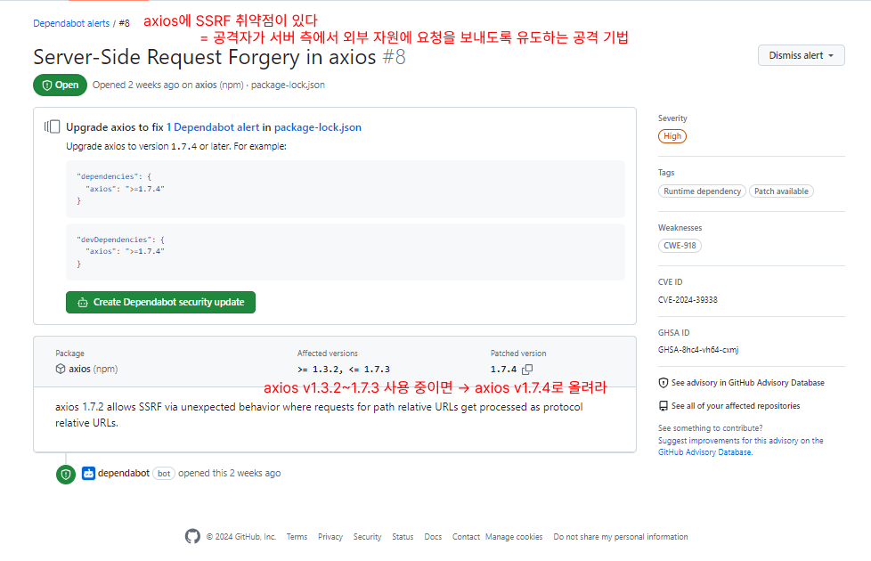

# 9.2장 모던 리액트 개발 도구로 개발 및 배포 환경 구축하기

담당자: Bori [Web FE Lead]
날짜: 2024년 9월 11일
상태: 완료

# 9.1 Next.js로 리액트 개발 환경 구축하기

## 9.1.1 cna 없이 하나씩 구축하기

1. `npm init` : package.json 생성하기
2. `npm i (library)` : 개발 환경 구축에 필요한 라이브러리 설치하기
3. `tsconfig.json` : 타입스크립트 설정 작성하기

## 9.1.2 tsconfig.json 작성하기

- `compilerOptions` - `skipLibCheck`
    
    
    

- `useUnknownInCatchVariables` : catch문이 잡은 변수는 unknown 타입으로 본다
    
    ```jsx
    // throw (표현식) 형태로 사용하기 때문에 항상 Error type이라고 보장할 수 없음
    throw "Error2"; 
    throw 42; 
    throw true; 
    ```
    

- `paths` : 경로에 별칭 지정해서 import문 가독성 높이기
    
    <aside>
    💭 **특수문자 접두사로 `@`을 쓰는 걸 지양해야 한다?**
    
    > 단 @의 사용은 자제하는 것이 좋다. 왜냐하면 @는 보통 @angular, @types와 같이 스코프 패키지에 널리 사용되기 때문이다. @는 네이밍에 따라 충돌할 여지가 있으므로 가급적 사용을 피한다. - 538p
    > 
    
    ```json
    "paths": {
      "@/*": ["src/*"], // import XXX from '@/...' 이니까 충돌은 안 나지 않나
      "@drawer/*": ["src/drawer/*"] // 이건 지양해야 하는 상황이 맞는듯
    },
    ```
    
    </aside>
    

## 9.1.3 next.config.json 작성하기

- `poweredByHeader` : `X-Powered-By` 헤더 제거
    
    <aside>
    🔍 **`X-Powered-By` 헤더가 뭔데 보안 취약점이라는 거야**
    
    해당 필드를 통해 웹 서버의 버전 정보가 전달됨 → 공격자에게 힌트를 제공하는 느낌
    
    (`X-*` 형식인 헤더는 비표준 헤더이며, 특정 기능/정보 전달용으로 개발자가 추가)
    
    ](../../imgs/9.2장-Bori/image%201.png)
    
    [HTTP Headers - OWASP Cheat Sheet Series](https://cheatsheetseries.owasp.org/cheatsheets/HTTP_Headers_Cheat_Sheet.html)
    
    </aside>
    

## 9.1.4 ESLint와 Prettier 설정하기

설치.. 세팅.. 그런 건 설명했으니 넘어가겠습니다 책 말고 [문서](https://nextjs.org/docs/app/building-your-application/configuring/eslint) 기준으로 정리했습니다

- lint 실행 옵션
    
    
    
    cna로 만들면 아래 내용 중 `strict` 옵션이 자동으로 적용됨
    
    
    
    .eslintrc.json가 비어있으면 스크립트를 실행했을 때 옵션 선택 프롬프트가 뜸
    
    | strict (cna default) | { “extends”: “next/core-web-vitals” } |
    | --- | --- |
    | base | { “extends” : “next” } |
    | cancel | (custom eslint config를 만들어 사용할 때만 선택하세요) |
- Next.js 관련 ESLint config 간 충돌을 막으려면 ([링크](https://nextjs.org/docs/app/building-your-application/configuring/eslint#additional-configurations))
    
    ```json
    // 다른 설정이 `next` 설정값을 덮어쓰지 않게 하기 위해 가장 마지막에 작성 
    {
      "extends": ["eslint:recommended", **"next"**]
    }
    ```
    

## 9.1.5 styled-components로 스타일 설정하기

tailwind css를 사용하는 예시는 [요아소비빠따정](https://github.com/yourssu-summerthon-3/yoasobi-bbaddajeong-front) 가서 구경하셔도 좋을듯

- Page Router ([Github 예시](https://github.com/vercel/next.js/tree/canary/examples/with-styled-components))
    
    <aside>
    ⚠️ 현재 Next.js에서는 추천하지 않는 패턴입니다!
    
    > We do not recommend using this pattern. **Instead, consider incrementally adopting the App Router**, which allows you to more easily fetch data for pages and layouts. - [Routing: Custom Document | Next.js (nextjs.org)](https://nextjs.org/docs/pages/building-your-application/routing/custom-document)
    > 
    </aside>
    
    <aside>
    🔍 **_document.tsx (4장 발표한 사람 자료 링크 걸어두기)**
    
    애플리케이션의 HTML을 초기화하는 곳. 무조건 서버에서 실행된다.
    
    여기서는 CSS-in-JS의 스타일을 모아서 HTML로 제공하는 역할을 담당한다.
    
    </aside>
    
    ```tsx
    // _document.tsx
    import type { DocumentContext, DocumentInitialProps } from "next/document";
    import Document from "next/document";
    import { ServerStyleSheet } from "styled-components";
    
    export default class MyDocument extends Document {
      static async getInitialProps(
        ctx: DocumentContext,
      ): Promise<DocumentInitialProps> {
        const sheet = new ServerStyleSheet();
        const originalRenderPage = ctx.renderPage;
    
        try {
          ctx.renderPage = () =>
            originalRenderPage({
              enhanceApp: (App) => (props) =>
                sheet.collectStyles(<App {...props} />), // 스타일 수집 
            });
    
          const initialProps = await Document.getInitialProps(ctx);
          return {
            ...initialProps,
            styles: [initialProps.styles, sheet.getStyleElement()], // 클라이언트에 전달 
          };
        } finally {
          sheet.seal();
        }
      }
    }
    ```
    
    |  | 반환값의 styles 타입 |
    | --- | --- |
    | 책 | JSX |
    | Next.js / canary | 배열 (2년 전에 배열로 바뀜)
    [chore: simplify `with-styled-components` by balazsorban44 · Pull Request #37237 · vercel/next.js (github.com)](https://github.com/vercel/next.js/pull/37237/files#diff-132e2dffc97a22e8c2cdca181aaa13064c01089a53adca591f779e3683bf6c0f) |
- App Router ([Github 예시](https://github.com/vercel/next-app-router-playground/blob/main/app/styling/styled-components/registry.tsx))
    - next.config.js 설정까지는 동일
    - styled-components v6+
        
        > For routes defined in the `app/` directory, in Next.js v13+, you'll need to put a styled-components registry in one of your layout files, as [described in Next.js docs](https://nextjs.org/docs/app/building-your-application/styling/css-in-js#styled-components). **Note that this depends on styled-components v6+.**  - [styled-components: Advanced Usage](https://styled-components.com/docs/advanced#server-side-rendering)
        > 
    - `_document.tsx` 말고 `registry.tsx` 생성 (스타일 수집 → HTML에 주입하는 건 같음)
        
        ```tsx
        // registry.tsx
        'use client'
         
        import React, { useState } from 'react'
        import { useServerInsertedHTML } from 'next/navigation'
        import { ServerStyleSheet, StyleSheetManager } from 'styled-components'
         
        export default function StyledComponentsRegistry({
          children,
        }: {
          children: React.ReactNode
        }) {
          const [styledComponentsStyleSheet] = useState(() => new ServerStyleSheet())
         
          useServerInsertedHTML(() => {
            const styles = styledComponentsStyleSheet.getStyleElement()
            styledComponentsStyleSheet.instance.clearTag()
            return <>{styles}</>
          })
         
          if (typeof window !== 'undefined') return <>{children}</>
         
          return (
            <StyleSheetManager sheet={styledComponentsStyleSheet.instance}>
              {children}
            </StyleSheetManager>
          )
        }
        ```
        
        ```tsx
        // layout.tsx
        import StyledComponentsRegistry from './lib/registry'
         
        export default function RootLayout({ children }: { children: React.ReactNode}) {
          return (
            <html>
              <body>
                <StyledComponentsRegistry>{children}</StyledComponentsRegistry>
              </body>
            </html>
          )
        }
        ```
        

## 9.1.6 애플리케이션 코드 작성

- `Next.js` 의 Page Router 에서는 폴더 구조 컨벤션을 지켜야 함
    
    (pages 디렉토리 하위에는 실제 페이지와 관련된 파일을 넣을 것)
    

# 9.2 깃허브 100% 활용하기

## 9.2.1 깃허브 액션으로 CI 환경 구축하기

- `CI`를 왜 해야 할까? (Continuous Integration, 지속적 통합)
    
    코드 변화가 생기면 테스트, 빌드, 취약점 분석 등을 수행해 정합성을 확인해야 함.
    
    이걸 매번 수동으로 할 수 없으니 지속적으로 위 작업을 실행해야 한다
    
- 어떤 툴을 이용해서 CI 환경을 구축할까? → GitHub Actions
    
    > **GitHub Actions는 빌드, 테스트 및 배포 파이프라인을 자동화할 수 있는 CI/CD(연속 통합 및 지속적인 업데이트) 플랫폼**입니다.  - https://docs.github.com/ko/actions/about-github-actions/understanding-github-actions
    > 
    
    
    
    모든 이벤트 종류는 https://docs.github.com/ko/actions/writing-workflows/choosing-when-your-workflow-runs/events-that-trigger-workflows
    
    
    
    `Event`가 발생하면 `Runner`에서 병렬적으로 `Job`을 수행한다. (`Job` 내부 `Step`은 순차 실행)
    

- 유어슈 코드로 yml 파일 이해하기
    
    <aside>
    🔍 저는 보통 안전빵으로 [YAMLlint - The YAML Validator](https://www.yamllint.com/) 에 한번 돌려봅니다
    
    </aside>
    
    ```yaml
    name: build-and-deploy // 액션의 이름
    
    on:
      push:
        branches: [main] // 'main' 브랜치에 push가 발생할 때마다 수행하겠다
    
    jobs:
      build: // job의 이름이 build
        runs-on: ubuntu-latest // 깃허브에서 제공하는 서버 환경에서 수행하겠다
        steps: // 순차적으로 수행될 단계들
          - name: Checkout source code
            uses: actions/checkout@v4 // 마지막 커밋 기준으로 checkout 한다
    
          - name: Install pnpm
            uses: pnpm/action-setup@v4 // pnpm을 설치한다
    
          - name: Set up Node.js
            uses: actions/setup-node@v4
            with:
              node-version: 18 
              cache: 'pnpm'
    
          - name: Install dependencies
            run: pnpm install // package.json에 따라 의존성 설치
    
          - name: Set Environment Variables
            run: | // 환경변수 파일 만들기
              echo "VITE_API_SOOMSIL_URL=$VITE_API_SOOMSIL_URL" >> .env.production
              echo "VITE_API_AUTH_URL=$VITE_API_AUTH_URL" >> .env.production
              echo "VITE_API_SEARCH_URL=$VITE_API_SEARCH_URL" >> .env.production
              echo "VITE_API_YLS_URL=$VITE_API_YLS_URL" >> .env.production
            env: // 이때, github secret에 있는 변수값을 가져다 씀
              VITE_API_SOOMSIL_URL: ${{ secrets.VITE_API_SOOMSIL_URL }}
              VITE_API_AUTH_URL: ${{ secrets.VITE_API_AUTH_URL }}
              VITE_API_SEARCH_URL: ${{ secrets.VITE_API_SEARCH_URL }}
              VITE_API_YLS_URL: ${{ secrets.VITE_API_YLS_URL }}
    
          - name: Build application
            run: pnpm run build // 빌드
    
          - name: Deploy to s3 // s3 버킷에 배포
            env:
              AWS_ACCESS_KEY_ID: ${{ secrets.AWS_ACCESS_KEY_ID }}
              AWS_SECRET_ACCESS_KEY: ${{ secrets.AWS_SECRET_ACCESS_KEY }}
            run: |
              aws s3 cp \
                --recursive \
                --region ap-northeast-2 \
                dist s3://soomsil.de
    
    ```
    

- 브랜치 보호 규칙으로 **액션이 성공할 때**만 머지 허용하는 것도 설정 가능

- 나만의 액션 만들기
    - 레포 A에 액션을 만들고 → 다른 사람이 가져다 쓸 수 있게 만들기
    - https://docs.github.com/ko/actions/sharing-automations/creating-actions/publishing-actions-in-github-marketplace도 하면 좋을듯
        
        
        
        만드는 건 마음대로지만 marketplace에 게시하는 건 아니란다………~
        

## 9.2.2 직접 작성하지 않고 유용한 액션과 깃허브 앱 가져다 쓰기

- https://github.com/marketplace?type= 에 가면 남이 만든 액션 갖다 쓸 수 있음
    
    ```yaml
    name: Auto Author Assign // 숨쉴에서 쓰고 있는 이 액션도
    
    ...
    
    jobs:
      assign-author:
        runs-on: ubuntu-latest
        steps:
          - uses: toshimaru/auto-author-assign@v1.6.2 // [남 액션](https://github.com/marketplace/actions/auto-author-assign) 쓰는 중
    ```
    

- 책에서 갖다 쓰기 좋다고 소개하는 액션
    - calibreapp/image-actions: 이미지 최적화
    - lirantal/is-website-vulnerable: 사이트 취약점 분석
    - lighthouse ci: 웹 성능 지표 측정

## 9.2.3 깃허브 denpendabot으로 보안 취약점 해결하기

- semantic versioning (https://semver.org/lang/ko/)
    
    > [Semantic Versioning](http://semver.org/)은 Github의 공동창업자인 [Tom Preston-Werner](http://tom.preston-werner.com/)가 위의 문제를 해결하기 위해  만든 제안입니다.  - https://spoqa.github.io/2012/12/18/semantic-versioning.html
    > 
    
    ```yaml
    주.부.수
    
    기존 버전과 호환되지 않게 API가 바뀌면 “주(主) 버전”을 올리고,
    기존 버전과 호환되면서 새로운 기능을 추가할 때는 “부(部) 버전”을 올리고,
    기존 버전과 호환되면서 버그를 수정한 것이라면 “수(修) 버전”을 올린다.
    ```
    
    - package.json 읽는 방법
        
        ```yaml
        // 1. 명시된 버전보다 **부 버전**이 높은 모든 버전과 호환된다
        "@radix-ui/react-dialog": "^1.0.5",
        
        // 2. 정확히 명시된 버전에만 의존한다
        "eslint": "8.2.0",
        
        // 3. 명시된 버전의 패치 버전까지만 호환된다
        "library": "~1.0.0"
        ```
        
        - 근데 설치될 때 3으로 설치되는 경우를 못 본듯? 왜지?

- dependency
    
    
    1. **dependencies (default)**
    
    실행 단계에 필요함
    
    1. **devDependencies
    (—save-dev, -D)**
    
    실행이랑은 관련 없지만
    
    개발할 때 필요함
    
    (그래서 배포에 포함 안 됨)
    
    1. **peerDependencies**
    
    라이브러리 개발할 때 주로 사용! 이 라이브러리를 사용하려면 peerDependencies에 명시된 환경이어야 함
    
    - 유어슈 코드로 의존성 이해하기
        
        ```json
        // axios는 네트워크 통신을 위한 라이브러리라 dependencies
        "dependencies": { "axios": "^1.6.2", ... }
        
        // husky는 코드 작성 규칙을 지켰는지 검증하기 위한 라이브러리니까 devDependencies
        "devDependencies": { "husky": "^9.0.11", ... }
        
        // Handy는 styled-components가 깔린 환경에서 올바르게 사용되므로 peerDependencies
        "peerDependencies": { "styled-components": "^6.0.7", ... }
        ```
        

- 다시 denpendabot으로 돌아갑시다
    - 의존성 관련 취약점을 발견하여 알려주는 깃허브 기능
        
        하지만 항상 모든 취약점이 실제 서비스의 보안 취약점으로 연결되는 것은 아니다!
        
    
    - 유어슈 코드로 취약점 이해하기
        
        
        
        soomsil-web에 있는 취약점 2개 중 하나 (2주 전에 생김)
        
         가보면 1.7.4에서 SSRF 취약점을 해결했음](../../imgs/9.2장-Bori/image%207.png)
        
        [Releases · axios/axios (github.com)](https://github.com/axios/axios/releases) 가보면 1.7.4에서 SSRF 취약점을 해결했음