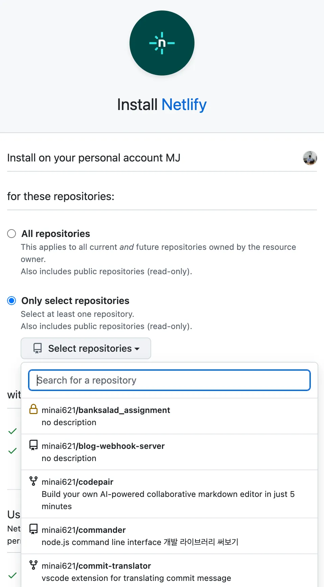

<details>
    <summary>목차</summary>

- [리액트 애플리케이션 배포하기](#리액트-애플리케이션-배포하기)
  - [Netlify](#netlify)
    - [추가로 알아두면 좋은 것](#추가로-알아두면-좋은-것)
  - [Vercel](#vercel)
  - [DigitalOcean](#digitalocean)
  - [직접 구축하기 (on-premise) with GPT, AWS](#직접-구축하기-on-premise-with-gpt-aws)
    - [1. **코드 저장소 설정**](#1-코드-저장소-설정)
    - [2. **CI 파이프라인 설정 (Continuous Integration)**](#2-ci-파이프라인-설정-continuous-integration)
    - [3. **CD 파이프라인 설정 (Continuous Deployment)**](#3-cd-파이프라인-설정-continuous-deployment)
    - [4. **자동화된 테스트 추가**](#4-자동화된-테스트-추가)
    - [5. **배포 환경 구성**](#5-배포-환경-구성)
    - [6. **모니터링 및 로깅 설정**](#6-모니터링-및-로깅-설정)
    - [7. **보안 설정**](#7-보안-설정)
    - [8. **최종 테스트 및 최적화**](#8-최종-테스트-및-최적화)

</details>

# 리액트 애플리케이션 배포하기

> 책에 작성된 버전의 클라우드들과 차이점이 있을 것 같아, 작성일 기준 24.09.11로 조사하여 수정했습니다.

아래와 같은 배포 클라우드 서비스를 이용하는 이유는

1. **자동화된 빌드 및 배포**: 코드가 저장소에 푸시될 때마다 자동으로 빌드 및 배포를 수행해줌.
2. **배포 환경 최적화:** CDN에 자동으로 올려주고, https와 같은 인증서 적용도 해줌.

## Netlify



vercel과 똑같이 내 레포지토리 혹은 조직의 레포지토리에 있는 특정 브랜치의 소스 코드를 업로드하여 배포가 가능함.

next.js 앱을 배포한다면 `netlify.toml` 파일을 루트 폴더에 만들고 아래와 같이 적어야 합니다.

> toml은 Tom’s Obvious, Minimal Language의 약자로 최소 설정 내용을 쓴다고 함.

```jsx
[[plugins]];
package = "@netlify/plugin-nextjs";
```

단 돈 19달러로 누릴 수 있는 기능들

- Starter features plus:
- Background Functions
- Password-protected sites
- 1TB bandwidth and 25k build minutes
- Audit logs with 7-day history
- Shared environment variables
- Support for organization-owned private Git repos
- Slack & email notifications
- Email support

### 추가로 알아두면 좋은 것

과거에 `netlify`에서 DDOS 방어 기능이 없었을 때, 사용자가 공격당했는데 5%라도 돈 내라고 한 사건이 있었음. 그래서 여론이 좋지 못했던 적이 있었으니 모두 자기가 사용하는 PaaS가 보안적으로 괜찮은지 확인해보고 사용하면 좋을 것 같습니당.

https://old.reddit.com/r/webdev/comments/1b14bty/netlify_just_sent_me_a_104k_bill_for_a_simple/

## Vercel

기본적인 사용 방법과 방식이 netlify와 크게 벗어나지 않음.

플랫폼(React, Next.js, Vite application)에 대한 가이드가 조금 더 있음. → netlify처럼 파일 만들지 않아도 됨.

| **특징**                      | **Vercel**                                                                        | **Netlify**                                                                                    |
| ----------------------------- | --------------------------------------------------------------------------------- | ---------------------------------------------------------------------------------------------- |
| **프레임워크 지원**           | Next.js에 최적화된 지원 및 깊이 있는 통합 제공.                                   | 다양한 정적 사이트 생성기와 프레임워크(React, Vue, Angular 등) 지원.                           |
| **서버리스 기능**             | Vercel Functions을 통해 API 라우트를 네이티브처럼 사용 가능.                      | Netlify Functions을 제공하며 AWS Lambda 기반의 서버리스 작업 지원.                             |
| **빌드 및 배포 속도**         | Next.js에 대해 최적화된 빌드 속도와 글로벌 Edge Network를 통한 빠른 배포.         | 효율적인 빌드 프로세스를 제공하며 빠른 배포 가능, 하지만 Next.js에 비해 최적화는 덜 됨.        |
| **CDN 및 에지 네트워크**      | 글로벌 Edge Network를 통해 매우 짧은 응답 시간과 최적화된 SSR, ISR 기능 제공.     | 글로벌 CDN을 통해 빠른 콘텐츠 제공, 정적 사이트와 애플리케이션에 최적화된 배포 환경 제공.      |
| **배포 환경 및 설정**         | Next.js와 강력한 통합 제공, 유연한 프로젝트 설정 및 환경 변수 관리 가능.          | 직관적인 UI로 다양한 배포 설정, 환경 변수 및 빌드 명령어 관리 가능.                            |
| **사용자 경험과 대시보드 UI** | 현대적이고 깔끔한 대시보드, 개발자 친화적인 인터페이스.                           | 사용자 친화적인 대시보드, 배포 파이프라인과 플러그인 설정이 용이함.                            |
| **커뮤니티와 생태계**         | Next.js 중심의 강력한 커뮤니티와 생태계, 최신 기능과 예제 지속 제공.              | 넓은 커뮤니티와 생태계, 다양한 정적 사이트 생성기 및 프레임워크에 대한 지원과 플러그인 시스템. |
| **가격 정책**                 | 무료 요금제 제공, 고급 기능(빌드 시간 증가, 고급 모니터링 등)은 유료 요금제 필요. | 무료 요금제 제공, 더 많은 빌드 시간, 팀 협업 기능, 우선 지원 등은 유료 요금제 필요.            |

## DigitalOcean

Github Student Pack에 크레딧이 있어 사용하면 좋다고 함.

> 위의 2개와 크게 다르진 않지만, UI/UX가 불편해보이네요…

---

## 직접 구축하기 (on-premise) with GPT, AWS

직접 배포 환경을 구축하려면 아래의 키워드들을 고민해야 해요.

`개발과 운영의 통합`, `작업 속도 향상`, `안정성`, `협업`, `자동화`, `보안`

**CI**가 새로운 소스코드의 빌드, 테스트, 병합까지를 의미 (레포지토리까지의 과정)

**CD**는 개발자의 변경 사항이 레포지토리를 넘어, 고객의 프로덕션(Production) 환경까지 릴리즈 되는 것을 의미 (배포까지의 과정)

### 1. **코드 저장소 설정**

- **사용 서비스**: AWS CodeCommit 또는 GitHub, GitLab 등
- **설명**: 먼저, 소스 코드를 관리할 버전 관리 시스템을 선택합니다. AWS CodeCommit은 Git 호환 코드 저장소를 제공하므로, 이를 사용해도 좋고, 외부의 GitHub나 GitLab과 연동할 수도 있습니다.
- **작업 내용**: 코드 저장소를 생성하고, 레포지토리에 애플리케이션 코드를 푸시합니다.

### 2. **CI 파이프라인 설정 (Continuous Integration)**

- **사용 서비스**: AWS CodeBuild
- **설명**: CI 단계에서는 새로운 코드가 푸시될 때마다 자동으로 빌드, 테스트, 코드 분석을 수행합니다. AWS CodeBuild는 이러한 과정을 자동화하는 데 사용됩니다.
- **작업 내용**:
  - CodeBuild 프로젝트 생성
  - 빌드 스펙 파일 (`buildspec.yml`) 작성 및 레포지토리에 추가
  - 빌드 환경(런타임, 빌드 명령어 등) 설정

### 3. **CD 파이프라인 설정 (Continuous Deployment)**

- **사용 서비스**: AWS CodePipeline, AWS CodeDeploy 또는 AWS Elastic Beanstalk
- **설명**: CD 단계에서는 빌드된 애플리케이션을 자동으로 배포합니다. AWS CodePipeline은 전체 CI/CD 워크플로우를 관리하고, CodeDeploy 또는 Elastic Beanstalk를 사용하여 배포를 자동화할 수 있습니다.
- **작업 내용**:
  - CodePipeline 생성: 단계별로 코드 소스, 빌드, 배포를 정의
  - 배포 전략 선택 (Blue/Green, Rolling, Canary 등)
  - 배포 환경 설정 (EC2, ECS, S3, Lambda 등)

### 4. **자동화된 테스트 추가**

- **사용 서비스**: AWS CodeBuild, AWS Device Farm (모바일 앱의 경우)
- **설명**: 배포 전에 코드 품질을 보장하기 위해 자동화된 테스트를 실행합니다. 테스트 결과에 따라 배포 여부를 결정할 수 있습니다.
- **작업 내용**:
  - CodeBuild 프로젝트 내에 테스트 단계 추가
  - 테스트 도구(예: Jest, Selenium 등)와 통합
  - 실패 시 알림 또는 롤백 설정

### 5. **배포 환경 구성**

- **사용 서비스**: AWS Elastic Beanstalk, EC2, ECS, Lambda, S3 등
- **설명**: 애플리케이션의 유형에 따라 적합한 AWS 서비스를 선택하여 배포 환경을 구성합니다. 서버리스 환경이 필요하면 AWS Lambda, 컨테이너화된 배포가 필요하면 AWS ECS 등을 사용할 수 있습니다.
- **작업 내용**:
  - AWS 서비스 선택 및 인프라 구성
  - 네트워크 설정 (VPC, 서브넷, 보안 그룹 등)
  - Auto Scaling 및 로드 밸런싱 구성

### 6. **모니터링 및 로깅 설정**

- **사용 서비스**: AWS CloudWatch, AWS X-Ray, AWS CloudTrail
- **설명**: 애플리케이션의 상태와 성능을 모니터링하고, 배포와 관련된 이벤트를 로깅합니다. 문제 발생 시 빠르게 대응할 수 있도록 경고 및 알림 설정을 합니다.
- **작업 내용**:
  - CloudWatch 대시보드와 알람 설정
  - 애플리케이션 로깅 구성 (예: 로그 그룹 생성)
  - X-Ray를 통한 애플리케이션 성능 모니터링 (분산 추적)

### 7. **보안 설정**

- **사용 서비스**: AWS IAM, AWS Secrets Manager, AWS KMS
- **설명**: 보안을 강화하기 위해 IAM(Identity and Access Management)을 사용하여 사용자 및 애플리케이션의 접근 권한을 관리하고, Secrets Manager를 사용해 비밀 데이터를 안전하게 관리합니다.
- **작업 내용**:
  - IAM 역할 및 정책 생성
  - Secrets Manager에서 환경 변수 및 비밀 관리
  - KMS를 사용한 데이터 암호화 설정

### 8. **최종 테스트 및 최적화**

- **사용 서비스**: AWS CodePipeline, AWS CloudFormation
- **설명**: 전체 CI/CD 파이프라인을 테스트하고 최적화합니다. CloudFormation을 사용하여 인프라 구성을 코드로 관리하고, 파이프라인의 각 단계를 최적화합니다.
- **작업 내용**:
  - 전체 워크플로우 테스트 및 조정
  - CloudFormation 템플릿 작성 및 스택 생성
  - 성능 최적화 및 리소스 모니터링
