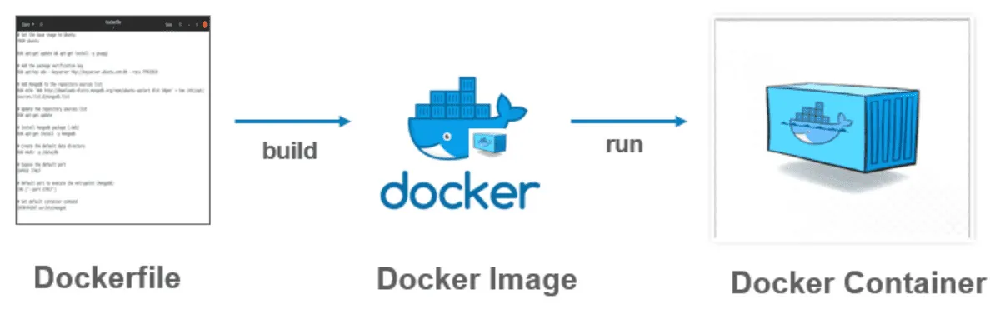
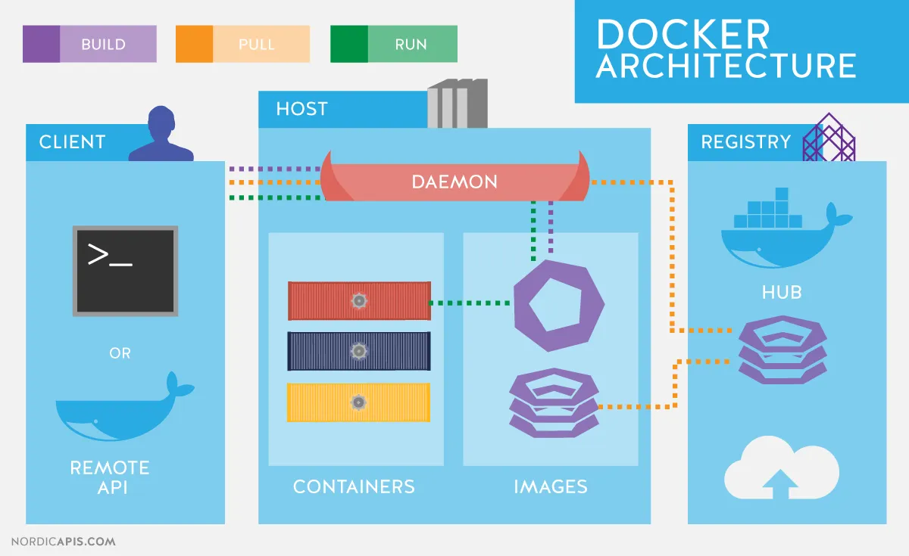

<details>
<summary>목차</summary>

- [리액트 애플리케이션 도커라이즈하기](#리액트-애플리케이션-도커라이즈하기)
  - [도커 용어](#도커-용어)
  - [자주 쓰는 도커 cli 명령어](#자주-쓰는-도커-cli-명령어)
  - [CRA 환경 도커라이징](#cra-환경-도커라이징)
  - [참고하면 좋은 블로그 글](#참고하면-좋은-블로그-글)

</details>

# 리액트 애플리케이션 도커라이즈하기

<aside>
💡 도커란?

도커는 개발자가 모던 애플리케이션을 구축, 공유, 실행하는 것을 도와줄 수 있도록 설계된 플랫폼이다. 도커는 지루한 설정 과정을 대신해 주므로 코드를 작성하는 일에만 집중할 수 있다.

</aside>

Docker를 사용하면 개발, 테스트, 운영 환경을 일관되게 유지할 수 있습니다.

- 각 컨테이너는 `자체 파일 시스템`, `네트워크`, `프로세스 공간`을 가지고 있음!
- Docker 이미지는 애플리케이션과 모든 종속성을 패키징한 파일이라, 동일한 이미지를 개발, 테스트, 운영 환경에 배포하면 환경 간 일관성을 보장함!

개발자들은 동일한 Docker 이미지를 사용하여 앱을 실행할 수 있어 "It works on my machine" 문제를 해결하게 해줍니당.

`github action`만 해도 브랜치에 체크아웃하고, node version을 설정하고, node_modules를 설치하는 등 해야하는 작업들이 많음..

### 도커 용어

- 이미지: 컨테이너 템플릿
- 컨테이너: 이미지를 실행한 상태
- Dockerfile: 이미지의 설정 파일
- 태그: 이미지를 식별할 수 있는 레이블 값
- 레포지토리: 이미지를 모아두는 장소
- 레지스트리: 레포지토리에 접근할 수 있게 해주는 서비스, github 같은거!





### 자주 쓰는 도커 cli 명령어

모든 명령어는 docker를 붙여서 실행해주세요!

- build: 작성된 Dockerfile을 이미지로 빌드할 수 있게 해줌.
- push: 이미지나 레포지토리를 레지스트리에 업로드함.
- tag: 이미지에 태그를 생성함.
- run: 이미지를 기반으로 새로운 컨테이너를 생성함. (이미지 기반이기 때문에 build가 사전에 수행돼야 함)
- ps: 가동 중인 컨테이너를 확인
- rm: 이미지명으로 컨테이너를 삭제함.

### CRA 환경 도커라이징

```docker
# base image 설정 alpine은 매우 가벼운 linux
FROM node:18.12.0-alpine3.16 as build

# 작업할 폴더 설정
WORKDIR /app

# /app 폴더로 package 파일들 복사
COPY package.json ./package.json
COPY package-lock.json ./package-lock.json

#  npm ci는 package-lock.json 파일을 사용하여 정확한 버전의 종속성을 설치
RUN npm ci

# 설치된 의존성 복사
COPY . ./

# 실행
RUN npm run build

# Nginx 설정 추가
FROM nginx:latest as production
COPY --from=build /app/build /usr/share/nginx/html
COPY default.conf /etc/nginx/conf.d/default.conf
CMD ["nginx", "-g", "daemon off;"]
```

`nginx` 설정을 해줌으로써 필요한 파일만 서빙해 이미지 크기를 줄이는 멀티 스테이지 빌드 방식이 좋음.

이렇게 작성된 도커파일은 github처럼 레포지토리 만들어서 태그 붙이고, push 하여 여러 개발자들이 사용할 수 있게 이미지 배포가 가능하다!

이미지가 배포됐으면 개인 인스턴스에서 이미지를 내려받고 실행하면 독립된 환경에서 일관성있게 서비스 배포가 가능해집니다.

### 참고하면 좋은 블로그 글

docker-compose나 Volume / Bind Mount에 대해서 다뤄서 읽어보면 좋을 듯 합니다.

https://velog.io/@oneook/Docker로-React-개발-및-배포하기
